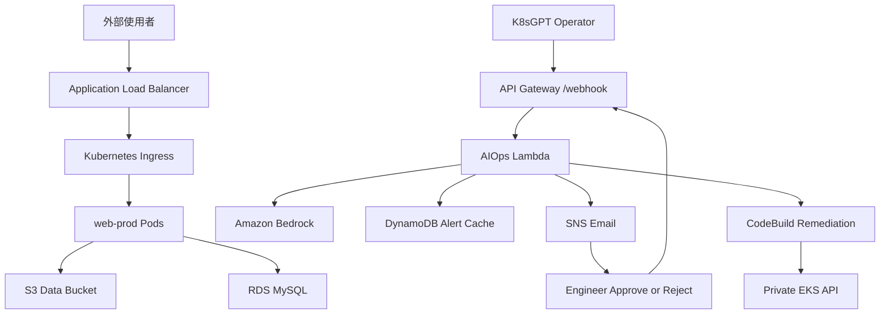
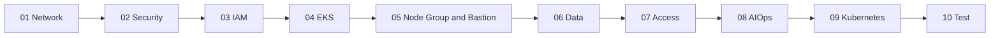
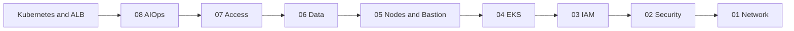

# AWS EKS AIOps 主控台手動建置與刪除流程

本文件是給 AWS 初學者使用的實作手冊。它把 `CloudFormation` 資料夾內 8 份 Stack 範本當成「資源設計圖」，但**不使用 CloudFormation 建立任何資源**。你會依序進入 VPC、EC2、IAM、EKS、RDS、S3、Lambda 等 AWS 服務的主控台，逐項手動建立、驗證並記錄資源 ID。

只有下列工作會在 Systems Manager Session Manager 的瀏覽器終端機內執行：

- 安裝 `kubectl`、Helm。
- 連線到 private-only EKS API。
- 安裝 AWS Load Balancer Controller 與 K8sGPT。
- 套用 Kubernetes YAML、測試及刪除 Kubernetes 資源。

> [!IMPORTANT]
> 全程不要進入 CloudFormation 建立 Stack。CloudFormation YAML 只用來核對名稱、參數、權限與依賴關係。

> [!CAUTION]
> 本專題包含持續計費資源：NAT Gateway、EKS 控制面、EC2、RDS、ALB、9 個 Interface Endpoint ENI，以及可能產生用量費的 Bedrock、Lambda、CodeBuild、DynamoDB、SNS 和 CloudWatch。測試完成後務必執行第 12 章的完整刪除流程。

## 0. 使用方式

1. 每次登入 AWS Console，先確認右上角區域是 `Asia Pacific (Mumbai) ap-south-1`。
2. AWS 主控台可能因語言或改版而有小幅差異。本文同時保留英文服務與欄位名稱，找不到時可直接用英文搜尋。
3. 每完成一個資源，立刻把 ID 或 ARN 填入第 3 章紀錄表。
4. 每章都先完成「建立後驗證」，再進入下一章。
5. 名稱請盡量完全照本文輸入，否則 IAM ARN、Lambda 環境變數及後續搜尋會對不上。

### 0.1 固定參數

| 參數 | 本專題值 |
|---|---|
| Region | `ap-south-1` |
| Project name | `eks-aiops-demo` |
| Project tag | `Project = nkc201-17` |
| VPC CIDR | `10.20.0.0/16` |
| EKS cluster | `eks-aiops-mumbai` |
| Kubernetes | `1.34`，建立當天仍須以 EKS Console 可選版本為準 |
| AWS Load Balancer Controller | Controller / Helm chart `3.4.0` |
| Node group | `app-nodegroup` |
| Database | MySQL 8.0、port `3306` |
| Bedrock model | `anthropic.claude-3-haiku-20240307-v1:0` |
| 測試 webhook token | `eks-aiops-webhook-secret-token` |

登入後點右上角帳號選單，複製 12 位數 AWS Account ID，填在這裡：

```text
ACCOUNT_ID = __________________________
ENGINEER_EMAIL = ______________________
```

> [!WARNING]
> Webhook token 是原 Stack 08 程式中的固定測試值，只適合短期專題環境。正式環境應改用 API Gateway Authorizer、Secrets Manager 或其他可輪替的驗證機制。

## 1. 專案目標與建置地圖

本專題模擬電商網站在促銷期間發生 Kubernetes 異常。K8sGPT 將異常送至 API Gateway；Lambda 使用 Amazon Bedrock 產生繁體中文診斷與受限制的修復建議，透過 SNS 寄給工程師。工程師核准後，CodeBuild 才會從 VPC 私有網路連進 EKS 執行白名單內的 `kubectl` 修復命令。



### 1.1 Stack 與 AWS 服務對照

| 章節 | 參考範本 | 手動進入的 AWS 服務 | 主要資源 |
|---|---|---|---|
| 01 | `01-network-stack.yaml` | VPC | VPC、9 Subnets、IGW、NAT、Route Tables |
| 02 | `02-security-stack.yaml` | EC2 / Security Groups | ALB、Cluster、Node、RDS Security Groups |
| 03 | `03-iam-stack.yaml` | IAM | 7 個 IAM Roles 與權限策略 |
| 04 | `04-eks-cluster-stack.yaml` | EKS | Private EKS Cluster、Add-ons、Logging |
| 05 | `05-nodegroup-stack.yaml` | EC2、EKS、IAM | Launch Template、Managed Node Group、SSM Bastion |
| 06 | `06-data-stack.yaml` | S3、Secrets Manager、RDS | Bucket、Secret、DB Subnet Group、MySQL |
| 07 | `07-access-stack.yaml` | EKS | Access Entries、Access Policies、Pod Identity |
| 08 | `08-aiops-stack.yaml` | Bedrock、SNS、DynamoDB、CodeBuild、Lambda、API Gateway、VPC | AIOps 流程與 PrivateLink Endpoints |



### 1.2 已同步修正到 CloudFormation 的設計

1. Stack 05 已加入 EC2 Launch Template，將 Stack 02 的 Node SG 與 EKS 自動建立的 Cluster SG 一起掛到 Worker Nodes；手動建立時也採相同配置。
2. Stack 03 已固定 AWS Load Balancer Controller `v3.4.0` 官方 IAM policy；Helm 安裝也固定 chart `3.4.0`，再透過 EKS Pod Identity 授權。
3. `Kubernetes/web-prod-app.yaml` 已改為 SG placeholder，必須透過 `deploy-web-prod.sh` 注入 Stack 02 的 ALB SG ID 後部署。

## 2. AWS 官方設計依據

本文整理日期為 2026-06-24；實際建立當天仍應以連結中的 AWS 最新文件，以及 Console 顯示的區域支援、版本與價格為準。

| 主題 | AWS 官方文件 |
|---|---|
| 架構總則 | [AWS Well-Architected Framework](https://docs.aws.amazon.com/wellarchitected/latest/framework/welcome.html) |
| 安全 | [Security Pillar](https://docs.aws.amazon.com/wellarchitected/latest/security-pillar/welcome.html) |
| 可靠性 | [Reliability Pillar](https://docs.aws.amazon.com/wellarchitected/latest/reliability-pillar/welcome.html) |
| 成本 | [Cost Optimization Pillar](https://docs.aws.amazon.com/wellarchitected/latest/cost-optimization-pillar/welcome.html) |
| VPC | [Create a VPC](https://docs.aws.amazon.com/vpc/latest/userguide/create-vpc.html)、[NAT Gateway](https://docs.aws.amazon.com/vpc/latest/userguide/vpc-nat-gateway.html) |
| EKS 版本 | [Kubernetes version lifecycle on EKS](https://docs.aws.amazon.com/eks/latest/userguide/kubernetes-versions.html) |
| EKS Endpoint | [Configure cluster API server endpoint access](https://docs.aws.amazon.com/eks/latest/userguide/config-cluster-endpoint.html) |
| Managed Nodes | [Managed node groups](https://docs.aws.amazon.com/eks/latest/userguide/managed-node-groups.html)、[Launch templates](https://docs.aws.amazon.com/eks/latest/userguide/launch-templates.html) |
| EKS Access | [Access entries](https://docs.aws.amazon.com/eks/latest/userguide/access-entries.html) |
| Pod 權限 | [EKS Pod Identity](https://docs.aws.amazon.com/eks/latest/userguide/pod-identities.html) |
| EKS Add-ons | [Amazon EKS add-ons](https://docs.aws.amazon.com/eks/latest/userguide/eks-add-ons.html) |
| SSM | [AWS Systems Manager Session Manager](https://docs.aws.amazon.com/systems-manager/latest/userguide/session-manager.html) |
| CodeBuild VPC | [Use CodeBuild with Amazon VPC](https://docs.aws.amazon.com/codebuild/latest/userguide/vpc-support.html) |
| PrivateLink | [What is AWS PrivateLink?](https://docs.aws.amazon.com/vpc/latest/privatelink/what-is-privatelink.html) |
| Bedrock | [Model access](https://docs.aws.amazon.com/bedrock/latest/userguide/model-access.html)、[Regional availability](https://docs.aws.amazon.com/bedrock/latest/userguide/models-region-compatibility.html) |
| SNS Email | [SNS email subscriptions](https://docs.aws.amazon.com/sns/latest/dg/sns-email-notifications.html) |
| 刪除 | [Empty an S3 bucket](https://docs.aws.amazon.com/AmazonS3/latest/userguide/empty-bucket.html)、[Delete an RDS instance](https://docs.aws.amazon.com/AmazonRDS/latest/UserGuide/USER_DeleteInstance.html) |
| ALB Controller | [AWS Load Balancer Controller](https://kubernetes-sigs.github.io/aws-load-balancer-controller/latest/) |
| K8sGPT | [K8sGPT Documentation](https://docs.k8sgpt.ai/) |

本架構對應 Well-Architected 的核心原則如下：

- **Least privilege**：Pod、Lambda、CodeBuild、Bastion 各用不同 IAM Role。
- **Private by default**：EKS API、Worker Nodes、Bastion、RDS 放在私有 Subnet。
- **Human approval**：AI 只提出白名單修復建議，工程師核准後才執行。
- **Auditability**：EKS audit/authenticator logs、Lambda logs、API access logs、CodeBuild logs 都保留操作軌跡。
- **Cost awareness**：測試採 Single NAT、2 個 `t3.medium`、Single-AZ `db.t3.micro`，展示後反向刪除。

## 3. 建置前準備與資源紀錄表

### 3.1 帳號與成本保護

- [ ] 使用具備 VPC、EC2、IAM、EKS、RDS、S3、Secrets Manager、SNS、DynamoDB、Lambda、API Gateway、CodeBuild、CloudWatch、Systems Manager、Bedrock 操作權限的帳號。
- [ ] 帳號已啟用 MFA。
- [ ] 右上角 Region 已選 `ap-south-1`。
- [ ] Billing Console 已建立小額 AWS Budget 與 Email 通知。
- [ ] 已確認 EKS、NAT Gateway、RDS、Interface Endpoint 在 Mumbai 的價格。
- [ ] 預留連續數小時完成建置與測試，避免資源閒置過夜。

> [!TIP]
> 測試環境建議使用一個 NAT Gateway。完全不建 NAT 必須額外準備 ECR、S3、SSM、EC2 Messages 等 VPC endpoints，且 CodeBuild 原設計仍要從網際網路下載 `kubectl`，不符合目前 Stack 的內容。

### 3.2 全域 Tags

只要主控台提供 Tags，加入：

| Key | Value |
|---|---|
| `Project` | `nkc201-17` |
| `Environment` | `test` |

### 3.3 手動 Outputs 紀錄表

CloudFormation 原本會自動傳遞 Outputs；現在要自行記錄。

| 章節 | 值 | 實際 ID、ARN 或名稱 |
|---|---|---|
| 00 | Account ID |  |
| 01 | VPC ID |  |
| 01 | Public Subnet A / B / C IDs |  |
| 01 | Private App Subnet A / B / C IDs |  |
| 01 | Private Data Subnet A / B / C IDs |  |
| 01 | NAT Gateway ID / EIP Allocation ID |  |
| 02 | ALB Security Group ID |  |
| 02 | EKS custom Cluster Security Group ID |  |
| 02 | EKS Node Security Group ID |  |
| 02 | RDS Security Group ID |  |
| 03 | EKS Cluster Role ARN |  |
| 03 | EKS Node Role ARN |  |
| 03 | ALB Controller Role ARN |  |
| 03 | ALB Controller Managed Policy ARN |  |
| 03 | App S3 Role ARN |  |
| 03 | K8sGPT Role ARN |  |
| 03 | Engineer Role ARN |  |
| 03 | CodeBuild Role ARN |  |
| 04 | EKS Cluster ARN / Endpoint |  |
| 04 | EKS 自動建立的 Cluster Security Group ID |  |
| 05 | Launch Template ID |  |
| 05 | Bastion Instance ID |  |
| 06 | S3 Bucket Name |  |
| 06 | Secrets Manager Secret ARN |  |
| 06 | RDS Endpoint |  |
| 07 | Access Entry ARNs |  |
| 08 | SNS Topic ARN |  |
| 08 | DynamoDB Table ARN |  |
| 08 | CodeBuild Project ARN |  |
| 08 | Lambda Function ARN |  |
| 08 | API Gateway Endpoint |  |

# 章節 01. Network Stack：手動建立 VPC 網路

參考：`CloudFormation/nkc201-17-01-network-stack.yaml`

## 01-1. 本章結果

你會建立 1 個 VPC、3 個 Public Subnets、3 個 Private App Subnets、3 個隔離的 Private Data Subnets、1 個 Internet Gateway、1 個 NAT Gateway，以及 5 張 Route Tables。

### 01-1-1. 網段表

| Name | AZ | CIDR | Public IPv4 | 用途 |
|---|---|---|---|---|
| `eks-aiops-demo-public-subnet-a-1` | `ap-south-1a` | `10.20.0.0/24` | Enable | ALB、NAT |
| `eks-aiops-demo-public-subnet-b-2` | `ap-south-1b` | `10.20.1.0/24` | Enable | ALB |
| `eks-aiops-demo-public-subnet-c-3` | `ap-south-1c` | `10.20.2.0/24` | Enable | ALB |
| `eks-aiops-demo-private-app-subnet-a-4` | `ap-south-1a` | `10.20.10.0/24` | Disable | EKS、Bastion、Lambda、CodeBuild |
| `eks-aiops-demo-private-app-subnet-b-5` | `ap-south-1b` | `10.20.11.0/24` | Disable | EKS、Lambda、CodeBuild |
| `eks-aiops-demo-private-app-subnet-c-6` | `ap-south-1c` | `10.20.12.0/24` | Disable | EKS、Lambda、CodeBuild |
| `eks-aiops-demo-private-data-subnet-a-7` | `ap-south-1a` | `10.20.20.0/24` | Disable | RDS |
| `eks-aiops-demo-private-data-subnet-b-8` | `ap-south-1b` | `10.20.21.0/24` | Disable | RDS |
| `eks-aiops-demo-private-data-subnet-c-9` | `ap-south-1c` | `10.20.22.0/24` | Disable | RDS |

## 01-2. 建立 VPC

1. AWS Console 搜尋並開啟 `VPC`。
2. 左側選 `Your VPCs`。
3. 點 `Create VPC`。
4. `Resources to create` 選 **VPC only**，不要讓精靈代建其他資源。
5. 填入：

| 欄位 | 值 |
|---|---|
| Name tag | `eks-aiops-demo-vpc` |
| IPv4 CIDR manual input | `10.20.0.0/16` |
| IPv6 CIDR block | `No IPv6 CIDR block` |
| Tenancy | `Default` |

6. 加入 tag `Project = nkc201-17`。
7. 點 `Create VPC`。
8. 開啟剛建立的 VPC，選 `Actions` → `Edit VPC settings`。
9. 確認 `Enable DNS resolution` 與 `Enable DNS hostnames` 都已勾選，儲存。
10. 記錄 VPC ID。

## 01-3. 建立並掛載 Internet Gateway

1. VPC 左側選 `Internet gateways`。
2. 點 `Create internet gateway`。
3. Name 填 `eks-aiops-demo-igw`，加入 Project tag，建立。
4. 建立後點 `Actions` → `Attach to a VPC`。
5. 選 `eks-aiops-demo-vpc`，點 `Attach internet gateway`。

## 01-4. 建立 9 個 Subnets

1. VPC 左側選 `Subnets` → `Create subnet`。
2. VPC 選 `eks-aiops-demo-vpc`。
3. 依 01-1-1 表格逐一填入 Name、Availability Zone、IPv4 CIDR。
4. 可用 `Add new subnet` 在同一頁加入多個；確認沒有 CIDR 重疊後點 `Create subnet`。
5. 建立後逐一開啟 3 個 Public Subnets：
   `Actions` → `Edit subnet settings` → 勾選 `Enable auto-assign public IPv4 address` → Save。
6. 6 個 Private Subnets 保持自動指派 Public IPv4 關閉。

### 01-4-1. 加入 EKS Subnet Tags

進入每個 Subnet 的 `Tags` 分頁，點 `Manage tags`。

Public A、B、C 都加入：

| Key | Value |
|---|---|
| `kubernetes.io/role/elb` | `1` |
| `kubernetes.io/cluster/eks-aiops-mumbai` | `shared` |
| `Project` | `nkc201-17` |

Private App A、B、C 都加入：

| Key | Value |
|---|---|
| `kubernetes.io/role/internal-elb` | `1` |
| `kubernetes.io/cluster/eks-aiops-mumbai` | `shared` |
| `Project` | `nkc201-17` |

Private Data A、B、C 只需 `Project = nkc201-17`。

## 01-5. 建立 Single NAT Gateway

1. VPC 左側選 `NAT gateways` → `Create NAT gateway`。
2. Name 填 `eks-aiops-demo-nat-a`。
3. Subnet 選 `eks-aiops-demo-public-subnet-a-1`。
4. Connectivity type 選 `Public`。
5. Elastic IP allocation ID 按 `Allocate Elastic IP`。
6. 加入 Project tag，點 `Create NAT gateway`。
7. 等待狀態成為 `Available`，記錄 NAT Gateway ID 與 EIP Allocation ID。

> [!NOTE]
> 原範本支援 `None`、`Single`、`MultiAZ`。本文採測試建議 `Single`：三個 App Route Tables 都指向 AZ-a 的同一個 NAT。這會降低可用性並可能產生跨 AZ 流量費，但符合短期測試省費目的。

## 01-6. 建立 Route Tables

在 VPC 左側選 `Route tables`，依下表建立 5 張。每次點 `Create route table`，VPC 都選本專題 VPC。

| Route Table Name | 額外 Route | Subnet associations |
|---|---|---|
| `eks-aiops-demo-public-rt` | `0.0.0.0/0` → Internet Gateway | Public A、B、C |
| `eks-aiops-demo-private-app-rt-a` | `0.0.0.0/0` → NAT Gateway A | Private App A |
| `eks-aiops-demo-private-app-rt-b` | `0.0.0.0/0` → NAT Gateway A | Private App B |
| `eks-aiops-demo-private-app-rt-c` | `0.0.0.0/0` → NAT Gateway A | Private App C |
| `eks-aiops-demo-private-data-rt` | 無 Internet default route | Private Data A、B、C |

每張 Route Table 的操作方式：

1. 建立後開啟 Route Table。
2. `Routes` 分頁 → `Edit routes` → `Add route`。
3. Destination 填 `0.0.0.0/0`；Public 選 Internet Gateway，App 選 NAT Gateway。
4. 儲存。
5. `Subnet associations` → `Edit subnet associations`。
6. 勾選表格指定的 Subnet，儲存。
7. 加入 Project tag。

Data Route Table 只保留自動建立的 `10.20.0.0/16 → local`，不要加 NAT 或 IGW route。

## 01-7. 建立後驗證

- [ ] VPC DNS resolution 與 DNS hostnames 都是 Enabled。
- [ ] IGW 狀態為 Attached。
- [ ] NAT Gateway 為 Available，且位於 Public Subnet A。
- [ ] 3 個 Public Subnets 都關聯 Public Route Table。
- [ ] 3 個 Private App Subnets 分別關聯自己的 App Route Table，且 default route 指向 NAT A。
- [ ] 3 個 Private Data Subnets 都關聯 Data Route Table，沒有 `0.0.0.0/0`。
- [ ] Public / Private App 的 Kubernetes tags 完整。
- [ ] 9 個 Subnet IDs 已填入紀錄表。

# 章節 02. Security Stack：手動建立安全群組

參考：`CloudFormation/nkc201-17-02-security-stack.yaml`

## 02-1. 建立 4 個 Security Groups

1. AWS Console 搜尋 `EC2`。
2. 左側 `Network & Security` → `Security Groups`。
3. 點 `Create security group`。
4. VPC 一律選 `eks-aiops-demo-vpc`。
5. 先依下表建立 4 個空白 SG；Outbound 保留預設 `All traffic → 0.0.0.0/0`。

| Name | Description |
|---|---|
| `eks-aiops-demo-alb-sg` | `Security Group for Application Load Balancer` |
| `eks-aiops-demo-eks-cluster-sg` | `Security Group for EKS Cluster Control Plane` |
| `eks-aiops-demo-eks-node-sg` | `Security Group for EKS Worker Nodes` |
| `eks-aiops-demo-rds-sg` | `Security Group for RDS MySQL` |

每個 SG 加入 `Project = nkc201-17`，並把 4 個 SG ID 記入紀錄表。

## 02-2. 設定 ALB SG Inbound Rules

開啟 `eks-aiops-demo-alb-sg` → `Inbound rules` → `Edit inbound rules`：

| Type | Protocol | Port | Source | Description |
|---|---|---:|---|---|
| HTTP | TCP | 80 | `0.0.0.0/0` | `Allow HTTP from internet` |
| HTTPS | TCP | 443 | `0.0.0.0/0` | `Allow HTTPS from internet` |

測試 YAML 只有 HTTP listener。443 規則是依原 Stack 保留；未設定 ACM 憑證前不會自動產生 HTTPS listener。

## 02-3. 設定 Node SG Inbound Rules

開啟 `eks-aiops-demo-eks-node-sg` → `Edit inbound rules`：

| Type | Port | Source | Description |
|---|---:|---|---|
| All traffic | All | `eks-aiops-demo-eks-node-sg` 自己 | `Node and pod internal traffic` |
| Custom TCP | `30000-32767` | `eks-aiops-demo-alb-sg` | `ALB to NodePort` |
| Custom TCP | `80` | `eks-aiops-demo-alb-sg` | `ALB to pod HTTP` |
| HTTPS | `443` | `eks-aiops-demo-eks-cluster-sg` | `Control plane to nodes` |
| Custom TCP | `1025-65535` | `eks-aiops-demo-eks-cluster-sg` | `Control plane to pods` |

Source 欄位選 `Custom`，輸入 SG 名稱或 `sg-...`，不要填 VPC CIDR。

## 02-4. 設定 Cluster SG Inbound Rule

開啟 `eks-aiops-demo-eks-cluster-sg`：

| Type | Port | Source | Description |
|---|---:|---|---|
| HTTPS | `443` | `eks-aiops-demo-eks-node-sg` | `Nodes and bastion to EKS API` |

## 02-5. 設定 RDS SG Inbound Rule

開啟 `eks-aiops-demo-rds-sg`：

| Type | Port | Source | Description |
|---|---:|---|---|
| MySQL/Aurora | `3306` | `eks-aiops-demo-eks-node-sg` | `MySQL only from EKS nodes` |

## 02-6. 建立後驗證

- [ ] 沒有任何 SG 開放 SSH `22`。
- [ ] RDS 沒有 `0.0.0.0/0` inbound。
- [ ] Node self-reference 是 SG 自己，不是 `10.20.0.0/16`。
- [ ] Cluster 與 Node 的 443 規則方向正確。
- [ ] 4 個 SG ID 已記錄。

# 章節 03. IAM Stack：手動建立角色與最小權限

參考：`CloudFormation/nkc201-17-03-iam-stack.yaml`

本章會建立 7 個 IAM Roles。JSON 中的 `ACCOUNT_ID` 必須替換成你的 12 位數帳號 ID，不能保留尖括號或空格。

## 03-1. EKS Cluster Role

1. AWS Console 搜尋 `IAM`。
2. 左側 `Roles` → `Create role`。
3. Trusted entity type 選 `AWS service`。
4. Service / use case 選 `EKS` → `EKS - Cluster`。
5. 確認權限包含 `AmazonEKSClusterPolicy`。
6. Role name 填 `eks-aiops-demo-eks-cluster-role`。
7. 加入 Project tag，建立。
8. 開啟角色，複製 ARN 到紀錄表。

## 03-2. EKS Node Role

1. `Roles` → `Create role` → `AWS service`。
2. Use case 選 `EC2`；信任主體必須是 `ec2.amazonaws.com`。
3. 搜尋並勾選：
   - `AmazonEKSWorkerNodePolicy`
   - `AmazonEKS_CNI_Policy`
   - `AmazonEC2ContainerRegistryReadOnly`
   - `AmazonSSMManagedInstanceCore`
4. Role name 填 `eks-aiops-demo-eks-node-role`，加入 Project tag，建立。
5. 記錄 Role ARN。

> [!NOTE]
> IAM Console 用 EC2 use case 建立角色時會處理 EC2 instance profile。EKS Managed Node Group 實際使用的是 Role ARN；原範本的獨立 `EksNodeInstanceProfile` Output 並未被後續資源使用。

> [!TIP]
> 本節為了忠實對應原 Stack，將 `AmazonEKS_CNI_Policy` 放在 Node Role。正式環境可依 EKS IAM 最小權限建議，另外替 `aws-node` 建立 Pod Identity Role，再從 Node Role 移除此 policy。

## 03-3. AWS Load Balancer Controller Policy 與 Role

### 03-3-1. 建立 v3.4.0 官方 Policy

1. 開啟 Controller `v3.4.0` 的 [官方 iam_policy.json](https://raw.githubusercontent.com/kubernetes-sigs/aws-load-balancer-controller/v3.4.0/docs/install/iam_policy.json)。
2. 確認網址包含 tag `v3.4.0`，不要使用會變動的 `main`。
3. 回到 IAM → `Policies` → `Create policy`。
4. 選 `JSON`，清除預設內容，貼上官方完整 JSON。
5. 點 `Next`，Policy name 填 `eks-aiops-demo-alb-controller-policy`。
6. 加入 Project tag，建立。

### 03-3-2. 建立 Pod Identity Role

1. IAM → `Roles` → `Create role`。
2. Trusted entity type 選 `Custom trust policy`。
3. 貼上：

```json
{
  "Version": "2012-10-17",
  "Statement": [
    {
      "Effect": "Allow",
      "Principal": { "Service": "pods.eks.amazonaws.com" },
      "Action": ["sts:AssumeRole", "sts:TagSession"]
    }
  ]
}
```

4. 權限搜尋並勾選剛建立的 `eks-aiops-demo-alb-controller-policy`。
5. Role name 填 `eks-aiops-demo-alb-controller-role`，加入 Project tag，建立。
6. 記錄 ARN。

## 03-4. App S3 Pod Identity Role

1. 使用 03-3-2 相同的 `pods.eks.amazonaws.com` trust policy 建立角色。
2. Role name 填 `eks-aiops-demo-app-s3-role`。
3. 建立後進入角色 → `Add permissions` → `Create inline policy` → `JSON`。
4. 將兩處 `ACCOUNT_ID` 換成實際帳號 ID 後貼上：

```json
{
  "Version": "2012-10-17",
  "Statement": [
    {
      "Effect": "Allow",
      "Action": ["s3:ListBucket", "s3:GetBucketLocation"],
      "Resource": "arn:aws:s3:::eks-aiops-demo-ACCOUNT_ID-data-bucket"
    },
    {
      "Effect": "Allow",
      "Action": ["s3:GetObject", "s3:PutObject", "s3:DeleteObject"],
      "Resource": "arn:aws:s3:::eks-aiops-demo-ACCOUNT_ID-data-bucket/*"
    }
  ]
}
```

5. Policy name 填 `PodS3AccessPolicy`，建立並記錄 Role ARN。

## 03-5. K8sGPT AI Pod Identity Role

1. 使用相同 Pod Identity trust policy 建立 `eks-aiops-demo-k8sgpt-ai-role`。
2. 新增 inline policy，替換所有 `ACCOUNT_ID`：

```json
{
  "Version": "2012-10-17",
  "Statement": [
    {
      "Effect": "Allow",
      "Action": ["bedrock:InvokeModel", "bedrock:InvokeModelWithResponseStream"],
      "Resource": "arn:aws:bedrock:*::foundation-model/*"
    },
    {
      "Effect": "Allow",
      "Action": "sns:Publish",
      "Resource": "arn:aws:sns:ap-south-1:ACCOUNT_ID:eks-aiops-demo-alerts-topic"
    },
    {
      "Effect": "Allow",
      "Action": ["s3:ListBucket", "s3:GetObject", "s3:PutObject"],
      "Resource": [
        "arn:aws:s3:::eks-aiops-demo-ACCOUNT_ID-data-bucket",
        "arn:aws:s3:::eks-aiops-demo-ACCOUNT_ID-data-bucket/*"
      ]
    },
    {
      "Effect": "Allow",
      "Action": "secretsmanager:GetSecretValue",
      "Resource": "arn:aws:secretsmanager:ap-south-1:ACCOUNT_ID:secret:eks-aiops-demo-rds-secret-*"
    }
  ]
}
```

3. Policy name 填 `K8sGptAIAccessPolicy`，建立並記錄 Role ARN。

## 03-6. Engineer Role

1. IAM → `Roles` → `Create role` → `Custom trust policy`。
2. 替換 `ACCOUNT_ID` 後貼上：

```json
{
  "Version": "2012-10-17",
  "Statement": [
    {
      "Effect": "Allow",
      "Principal": { "AWS": "arn:aws:iam::ACCOUNT_ID:root" },
      "Action": "sts:AssumeRole"
    }
  ]
}
```

3. 不先選 managed policy，Role name 填 `eks-aiops-demo-engineer-role`，建立。
4. 新增 inline policy：

```json
{
  "Version": "2012-10-17",
  "Statement": [
    {
      "Effect": "Allow",
      "Action": [
        "eks:DescribeCluster",
        "eks:ListClusters",
        "eks:ListNodegroups",
        "eks:DescribeNodegroup",
        "eks:ListUpdates",
        "eks:DescribeUpdate",
        "eks:AccessKubernetesApi"
      ],
      "Resource": "*"
    }
  ]
}
```

5. Policy name 填 `EKSReadWriteAccess`，記錄 Role ARN。

> [!NOTE]
> IAM policy 只允許呼叫 EKS API；真正的 Kubernetes namespace 權限會在第 07 章用 EKS Access Entry 授予。

## 03-7. CodeBuild Role

1. IAM → `Roles` → `Create role`。
2. Trusted entity type 選 `AWS service`，Use case 選 `CodeBuild`。
3. Role name 填 `eks-aiops-demo-codebuild-role`，建立。
4. 進入 `Trust relationships` → `Edit trust policy`，替換 `ACCOUNT_ID` 後改成：

```json
{
  "Version": "2012-10-17",
  "Statement": [
    {
      "Effect": "Allow",
      "Principal": { "Service": "codebuild.amazonaws.com" },
      "Action": "sts:AssumeRole",
      "Condition": {
        "ArnLike": {
          "aws:SourceArn": "arn:aws:codebuild:ap-south-1:ACCOUNT_ID:project/eks-aiops-demo-*"
        }
      }
    }
  ]
}
```

5. 新增 inline policy，替換 `ACCOUNT_ID`：

```json
{
  "Version": "2012-10-17",
  "Statement": [
    {
      "Effect": "Allow",
      "Action": ["logs:CreateLogGroup", "logs:CreateLogStream", "logs:PutLogEvents"],
      "Resource": "arn:aws:logs:*:*:*"
    },
    {
      "Effect": "Allow",
      "Action": ["s3:GetObject", "s3:GetObjectVersion", "s3:PutObject"],
      "Resource": [
        "arn:aws:s3:::eks-aiops-demo-ACCOUNT_ID-data-bucket",
        "arn:aws:s3:::eks-aiops-demo-ACCOUNT_ID-data-bucket/*"
      ]
    },
    {
      "Effect": "Allow",
      "Action": "eks:DescribeCluster",
      "Resource": "*"
    },
    {
      "Effect": "Allow",
      "Action": [
        "ec2:CreateNetworkInterface",
        "ec2:DescribeDhcpOptions",
        "ec2:DescribeNetworkInterfaces",
        "ec2:DeleteNetworkInterface",
        "ec2:DescribeSubnets",
        "ec2:DescribeSecurityGroups",
        "ec2:DescribeVpcs"
      ],
      "Resource": "*"
    },
    {
      "Effect": "Allow",
      "Action": "ec2:CreateNetworkInterfacePermission",
      "Resource": "arn:aws:ec2:ap-south-1:ACCOUNT_ID:network-interface/*",
      "Condition": {
        "StringEquals": { "ec2:AuthorizedService": "codebuild.amazonaws.com" }
      }
    }
  ]
}
```

6. Policy name 填 `CodeBuildBasePolicy`，記錄 Role ARN。

## 03-8. 建立後驗證

| Role | Trusted principal | 必要權限 |
|---|---|---|
| EKS Cluster | `eks.amazonaws.com` | `AmazonEKSClusterPolicy` |
| EKS Node | `ec2.amazonaws.com` | EKS worker、CNI、ECR read、SSM |
| ALB Controller | `pods.eks.amazonaws.com` | 官方 Controller policy |
| App S3 | `pods.eks.amazonaws.com` | 專案 Bucket only |
| K8sGPT | `pods.eks.amazonaws.com` | Bedrock、專案 SNS/S3/Secret |
| Engineer | 同帳號 root | EKS describe/access API |
| CodeBuild | `codebuild.amazonaws.com` | Logs、EKS describe、VPC ENI |

- [ ] 7 個 Role 名稱正確。
- [ ] Pod Identity Roles 的 trust action 同時有 `AssumeRole` 與 `TagSession`。
- [ ] JSON 中已沒有字串 `ACCOUNT_ID`。
- [ ] 7 個 Role ARN 已記錄。

# 章節 04. EKS Cluster Stack：手動建立私有叢集

參考：`CloudFormation/nkc201-17-04-eks-cluster-stack.yaml`

## 04-1. 建立前檢查

- [ ] 3 個 Private App Subnet IDs 已記錄。
- [ ] `eks-aiops-demo-eks-cluster-sg` ID 已記錄。
- [ ] `eks-aiops-demo-eks-cluster-role` ARN 已記錄。
- [ ] EKS Console 建立頁仍提供 Kubernetes `1.34`。

> [!IMPORTANT]
> 不要開啟 EKS Auto Mode。本專題依原 Stack 使用標準 EKS、Managed Node Group、VPC CNI 與自行安裝的 AWS Load Balancer Controller。

## 04-2. 建立 EKS Cluster

1. AWS Console 搜尋 `Elastic Kubernetes Service` 或 `EKS`。
2. 左側選 `Clusters` → `Create cluster`。
3. 若看到 Auto Mode 選項，選 `Custom configuration` 或關閉 `Use EKS Auto Mode`。
4. `Configure cluster` 填入：

| 欄位 | 值 |
|---|---|
| Name | `eks-aiops-mumbai` |
| Kubernetes version | `1.34` |
| Cluster service role | `eks-aiops-demo-eks-cluster-role` |

5. `Cluster access` / `Authentication mode` 選 `EKS API and ConfigMap`，對應 Stack 的 `API_AND_CONFIG_MAP`。
6. 不啟用 Kubernetes secrets 的自訂 KMS key，沿用 Stack 預設。
7. 點 `Next` 進入 Networking：

| 欄位 | 選擇 |
|---|---|
| VPC | `eks-aiops-demo-vpc` |
| Subnets | 只選 Private App A、B、C |
| Security groups | `eks-aiops-demo-eks-cluster-sg` |
| Cluster endpoint access | `Private` / 關閉 Public、啟用 Private |

8. 不要選 Public、Private combined。此專題的 API Server 必須是 private-only。
9. `Control plane logging` 只勾選：
   - `Audit`
   - `Authenticator`
10. Add-ons 畫面選擇：
   - `vpc-cni`
   - `kube-proxy`
   - `eks-pod-identity-agent`
11. 如果 Console 強制或預設同時建立 `coredns`，可以保留；沒有 Node 時它暫時 Pending 是正常的。第 05 章會再次檢查。
12. Add-on version 選標示為與 Kubernetes 1.34 相容的建議版本，不要自行選不相容版本。
13. Review 確認 endpoint 是 Private，按 `Create`。
14. 建立約需 10 至 20 分鐘。等待 Cluster status 成為 `Active`。

## 04-3. 記錄 EKS 自動建立的 Security Group

EKS 除了你指定的 custom Cluster SG，還會建立自己的 Cluster Security Group。

1. EKS → Clusters → `eks-aiops-mumbai`。
2. 開啟 `Networking` 分頁。
3. 找到 `Cluster security group`，名稱通常像 `eks-cluster-sg-eks-aiops-mumbai-...`。
4. 記錄其 `sg-...` ID；第 05 章 Launch Template 會使用。
5. 同頁記錄 Cluster endpoint 與 Cluster ARN。

## 04-4. 驗證 Add-ons 與 Logs

1. Cluster → `Add-ons`，確認 `vpc-cni`、`kube-proxy`、`eks-pod-identity-agent` 為 `Active`。
2. `coredns` 若尚未 Active，等 Node Group 建立後再處理。
3. Cluster → `Observability`，確認 Audit 與 Authenticator logging 已啟用。
4. CloudWatch → `Log groups` 應看到 `/aws/eks/eks-aiops-mumbai/cluster`。

> [!NOTE]
> 你現在的電腦無法直接 `kubectl` 連到 private endpoint。這是預期的安全結果，不是錯誤。第 05 章建立 Bastion 後，才從 VPC 內透過 Session Manager 操作。

## 04-5. 常見錯誤

| 現象 | 檢查方式 |
|---|---|
| Role 無法選 | EKS Cluster Role 的 trust 是否為 `eks.amazonaws.com`，是否附加 `AmazonEKSClusterPolicy` |
| Subnet 無法選 | Region、VPC 是否正確，Subnet 是否都在 `ap-south-1` |
| Cluster 建立失敗 | EKS → Cluster events、CloudTrail，檢查 IAM 與 Subnet IP 空間 |
| 選不到 1.34 | 先查看官方 EKS version lifecycle；不要擅自換版而不修改 kubectl、CodeBuild 與 add-on 相容版本 |

# 章節 05. Node Group Stack：手動建立節點與 SSM Bastion

參考：`CloudFormation/nkc201-17-05-nodegroup-stack.yaml`

## 05-1. 建立 EC2 Launch Template

手動建立與修正後的 Stack 05 採相同做法，讓 Worker Nodes 同時擁有 Node SG 與 EKS 自動產生的 Cluster SG。

1. AWS Console 搜尋 `EC2`。
2. 左側 `Instances` → `Launch Templates` → `Create launch template`。
3. 填入：

| 欄位 | 值 |
|---|---|
| Launch template name | `eks-aiops-demo-node-lt` |
| Template version description | `EKS AL2023 nodes with project SGs` |
| Auto Scaling guidance | 可勾選 |

4. `Application and OS Images` 不選 AMI。EKS Node Group 會依 AMI type 選 EKS optimized AL2023 AMI。
5. `Instance type` 留空，稍後在 Node Group 選 `t3.medium`。
6. `Key pair` 選 `Don't include in launch template`。
7. `Network settings`：
   - 不指定 Subnet。
   - Security groups 同時選：
     - `eks-aiops-demo-eks-node-sg`
     - 第 04 章記錄的 EKS 自動建立 Cluster SG
8. `Configure storage` 新增 root volume：
   - Device name：`/dev/xvda`
   - Size：`20 GiB`
   - Volume type：`gp3`
   - Encrypted：Enabled
   - Delete on termination：Enabled
9. `Advanced details`：
   - 不指定 IAM instance profile。
   - 不填 User data。
10. 加入 resource tag：`Project = nkc201-17`。
11. 點 `Create launch template`，記錄 Launch Template ID。

> [!CAUTION]
> Launch Template 不可指定 Subnet，也不要填另一個 IAM instance profile；這些由 EKS Managed Node Group 管理。若指定自訂 SG，EKS 不會再替你補 SG，所以本文明確加入兩個 SG。

## 05-2. 建立 EKS Managed Node Group

1. EKS → Clusters → `eks-aiops-mumbai`。
2. `Compute` 分頁 → `Add node group`。
3. Node group configuration：

| 欄位 | 值 |
|---|---|
| Name | `app-nodegroup` |
| Node IAM role | `eks-aiops-demo-eks-node-role` |
| Launch template | `eks-aiops-demo-node-lt` |
| Launch template version | `Default` 或 `1` |

4. 加入 Kubernetes labels：

| Key | Value |
|---|---|
| `role` | `worker` |
| `project` | `nkc201-17` |

5. 加入 AWS tags：

| Key | Value |
|---|---|
| `Name` | `eks-aiops-demo-node` |
| `Project` | `nkc201-17` |

6. Node compute configuration：

| 欄位 | 值 |
|---|---|
| AMI type | `Amazon Linux 2023 x86_64 Standard` |
| Capacity type | `On-Demand` |
| Instance types | `t3.medium` |
| Desired size | `2` |
| Minimum size | `2` |
| Maximum size | `4` |

7. Node group network configuration：
   - Subnets 只選 Private App A、B、C。
   - 不啟用 SSH remote access。
8. Review 後點 `Create`。
9. 等待 Node group status 成為 `Active`。

## 05-3. 確認 CoreDNS

1. EKS Cluster → `Add-ons`。
2. 若已有 `coredns`，確認 status 變成 `Active`。
3. 若沒有，點 `Get more add-ons` / `Create EKS add-on`。
4. 選 `CoreDNS`，版本選 EKS Console 建議且相容 1.34 的版本。
5. Conflict resolution 選 `Overwrite`，建立並等到 Active。

## 05-4. 建立 Bastion IAM Role

1. IAM → `Roles` → `Create role`。
2. Trusted entity 選 `AWS service` → `EC2`。
3. 附加 `AmazonSSMManagedInstanceCore`。
4. Role name 填 `eks-aiops-demo-bastion-role`，加入 Project tag，建立。
5. 開啟角色 → `Add permissions` → `Create inline policy`。
6. 把 `ACCOUNT_ID` 替換後貼上：

```json
{
  "Version": "2012-10-17",
  "Statement": [
    {
      "Effect": "Allow",
      "Action": "sts:AssumeRole",
      "Resource": "arn:aws:iam::ACCOUNT_ID:role/eks-aiops-demo-engineer-role"
    }
  ]
}
```

7. Policy name 填 `AllowAssumeEngineerRole`，建立。

## 05-5. 建立 Private SSM Bastion

1. EC2 → `Instances` → `Launch instances`。
2. Name 填 `eks-aiops-demo-bastion`。
3. AMI 選最新 `Amazon Linux 2023 AMI`、x86_64。
4. Instance type 選 `t3.micro`。
5. Key pair 選 `Proceed without a key pair`。本機不使用 SSH。
6. `Network settings` 點 Edit：

| 欄位 | 值 |
|---|---|
| VPC | `eks-aiops-demo-vpc` |
| Subnet | `eks-aiops-demo-private-app-subnet-a-4` |
| Auto-assign public IP | Disable |
| Firewall | Select existing security group |
| Security group | `eks-aiops-demo-eks-node-sg` |

7. `Advanced details` → IAM instance profile 選 `eks-aiops-demo-bastion-role`。
8. Storage 保持測試用預設，確認 root volume 有加密。
9. 加入 Project tag，點 `Launch instance`。
10. 等待 Instance state `Running`、Status checks `2/2`。
11. 記錄 Instance ID。

## 05-6. 確認 Session Manager 可連線

1. EC2 選取 Bastion → `Connect`。
2. 切到 `Session Manager`。
3. `Connect` 按鈕應可使用。
4. 若顯示不在線，等待 3 至 5 分鐘後刷新。
5. 仍不可用時檢查：
   - Bastion role 有 `AmazonSSMManagedInstanceCore`。
   - Bastion 位於 Private App A。
   - Private App A 的 default route 指向 Available NAT Gateway。
   - SG outbound 允許 HTTPS。

## 05-7. Node Group 驗證

1. EKS → Cluster → Compute → `app-nodegroup` 為 Active。
2. EC2 → Instances，應有 2 台 Managed Node Group EC2，加上 1 台 Bastion。
3. 開啟任一 Worker Node → Security，確認同時具有：
   - `eks-aiops-demo-eks-node-sg`
   - EKS 自動建立的 Cluster SG
4. 不應有 Public IPv4。

# 章節 06. Data Stack：手動建立 S3、Secret 與 RDS

參考：`CloudFormation/nkc201-17-06-data-stack.yaml`

## 06-1. 建立 S3 Data Bucket

Bucket 名稱全球唯一，原範本用 Account ID 避免撞名：

```text
eks-aiops-demo-ACCOUNT_ID-data-bucket
```

1. AWS Console 搜尋 `S3` → `Buckets` → `Create bucket`。
2. AWS Region 選 `ap-south-1`。
3. Bucket name 填入替換 Account ID 後的完整名稱。
4. `Object Ownership` 保持 `ACLs disabled`。
5. `Block Public Access settings` 四項全部保持勾選。
6. `Bucket Versioning` 選 `Enable`。
7. Default encryption 選 `Server-side encryption with Amazon S3 managed keys (SSE-S3)`。
8. Bucket Key 不適用 SSE-S3。
9. 加入 Name=`eks-aiops-demo-data-bucket` 與 Project tag。
10. 點 `Create bucket`，記錄 Bucket name。

## 06-2. 建立 Secrets Manager Secret

1. AWS Console 搜尋 `Secrets Manager`。
2. 點 `Store a new secret`。
3. Secret type 選 `Other type of secret`。
4. 建立兩組 Key/value：

| Key | Value |
|---|---|
| `username` | `admin` |
| `password` | 使用主控台 Generate password，長度至少 16 |

5. 產生密碼時排除原範本指定字元：雙引號、`@`、`/`、反斜線、單引號與空白。
6. Encryption key 保持 `aws/secretsmanager`。
7. Secret name 填 `eks-aiops-demo-rds-secret`。
8. Description 填 `Database credentials for RDS MySQL`。
9. 不設定 automatic rotation，完成建立。
10. 記錄 Secret ARN。不要把密碼貼入 Obsidian 或程式碼。

## 06-3. 建立 RDS DB Subnet Group

1. AWS Console 搜尋 `RDS`。
2. 左側 `Subnet groups` → `Create DB subnet group`。
3. 填入：

| 欄位 | 值 |
|---|---|
| Name | `eks-aiops-demo-db-subnet-group` |
| Description | `Subnet group for RDS database` |
| VPC | `eks-aiops-demo-vpc` |

4. Availability Zones 選 `ap-south-1a`、`1b`、`1c`。
5. Subnets 只選 Private Data A、B、C，不要選 App 或 Public。
6. 加入 Project tag，建立。

## 06-4. 建立 RDS MySQL

先在 Secrets Manager 點 `Retrieve secret value`，暫時取得 username/password；只用來填 RDS 建立畫面，完成後關閉頁面。

1. RDS → `Databases` → `Create database`。
2. Creation method 選 `Standard create`。
3. Engine type 選 `MySQL`。
4. Engine version 選主控台提供的 MySQL `8.0.x` 最新穩定 minor 版本。
5. Template 選 `Dev/Test` 或 `Free tier`（若帳號符合）；接著仍逐項覆核。
6. Availability and durability 選 `Single DB instance`，不要 Multi-AZ。
7. Settings：

| 欄位 | 值 |
|---|---|
| DB instance identifier | `eks-aiops-demo-rds-db` |
| Master username | `admin` |
| Credentials management | Self managed |
| Master password | Secrets Manager 中的 password |

8. Instance configuration：Burstable classes → `db.t3.micro`。
9. Storage：

| 欄位 | 值 |
|---|---|
| Storage type | `General Purpose SSD (gp3)` |
| Allocated storage | `20 GiB` |
| Storage encryption | Enable，key `aws/rds` |
| Storage autoscaling | 關閉以貼近原 Stack；測試期間注意容量 |

10. Connectivity：

| 欄位 | 值 |
|---|---|
| Compute resource | Don't connect to an EC2 compute resource |
| VPC | `eks-aiops-demo-vpc` |
| DB subnet group | `eks-aiops-demo-db-subnet-group` |
| Public access | `No` |
| VPC security group | Choose existing → `eks-aiops-demo-rds-sg` |
| Availability Zone | No preference |
| Database port | `3306` |

11. Database authentication 保持 Password authentication。
12. Additional configuration：
   - Initial database name 可留空。
   - Automated backups：Enable。
   - Backup retention period：`7 days`。
   - Deletion protection：Disable，因為是可刪測試環境。
   - Performance Insights / Enhanced Monitoring 可關閉以降低測試複雜度與可能費用。
13. 檢查 Estimated monthly costs，點 `Create database`。
14. 等待狀態 `Available`，可能需 10 至 20 分鐘。
15. 開啟 Connectivity & security，記錄 Endpoint；Port 應為 `3306`。

> [!WARNING]
> RDS Console 不會自動把你先建立的任意 Secret 當成主密碼來源，因此建立時必須把同一組值手動填入。若後來在 RDS 改密碼，也要同步更新 Secret，否則應用程式取得的值會失效。

## 06-5. 建立後驗證

- [ ] S3 Block Public Access 四項皆 On。
- [ ] S3 Versioning Enabled、Default encryption SSE-S3。
- [ ] Secret 只有 `username`、`password`，未出現在任何公開文件。
- [ ] DB Subnet Group 只有 3 個 Private Data Subnets。
- [ ] RDS Publicly accessible = No、Multi-AZ = No、Encrypted = Yes。
- [ ] RDS SG 只有來自 Node SG 的 3306。
- [ ] Bucket name、Secret ARN、RDS endpoint 已記錄。

# 章節 07. Access Stack：手動設定 EKS Access 與 Pod Identity

參考：`CloudFormation/nkc201-17-07-access-stack.yaml`

## 07-1. 建立 Engineer Access Entry

1. EKS → Clusters → `eks-aiops-mumbai`。
2. 開啟 `Access` 分頁。
3. 在 `IAM access entries` 區塊點 `Create access entry`。
4. Principal ARN 選或貼入 `eks-aiops-demo-engineer-role` ARN。
5. Type 選 `Standard`，建立 Access Entry。
6. 開啟此 Entry → `Add access policy`。
7. 第 1 個 Policy：
   - Policy：`AmazonEKSAdminPolicy`
   - Access scope：`Kubernetes namespace`
   - Namespaces：`web-prod`、`aiops`
8. 再次 `Add access policy`：
   - Policy：`AmazonEKSViewPolicy`
   - Access scope：`Cluster`
9. 若頁面可填 Tags，加入 Name=`eks-aiops-demo-engineer-access`、Project tag。

## 07-2. 建立 CodeBuild Access Entry

1. 同一 Access 畫面點 `Create access entry`。
2. Principal ARN 選 `eks-aiops-demo-codebuild-role`。
3. Type 選 `Standard`。
4. Associate `AmazonEKSAdminPolicy`。
5. Access scope 選 Namespace，填 `web-prod`、`aiops`。
6. 不授予 Cluster-wide Admin。

> [!NOTE]
> Namespace 此時尚未建立仍可先設定名稱範圍。第 09 章建立 `web-prod`、`aiops` 後權限才會對那些 Namespace 生效。

## 07-3. 建立 3 個 Pod Identity Associations

在 EKS Cluster 的 `Access` 分頁找到 `Pod Identity associations`，每次點 `Create Pod Identity association`：

| Namespace | Service account | IAM Role |
|---|---|---|
| `kube-system` | `aws-load-balancer-controller` | `eks-aiops-demo-alb-controller-role` |
| `web-prod` | `web-app-sa` | `eks-aiops-demo-app-s3-role` |
| `aiops` | `k8sgpt-sa` | `eks-aiops-demo-k8sgpt-ai-role` |

建立方式：

1. IAM role 選指定 Role。
2. Kubernetes namespace 手動輸入表格值。
3. Kubernetes service account 手動輸入表格值。
4. 不填 Target role ARN。
5. 建立並重複三次。

若 Console 因 ServiceAccount 尚不存在而不讓建立，先記下這一步；第 09 章安裝元件建立 ServiceAccount 後立即回來補建。

## 07-4. 建立後驗證

- [ ] Authentication mode 是 `API_AND_CONFIG_MAP`。
- [ ] Engineer 有 namespace Admin + cluster Viewer。
- [ ] CodeBuild 只有 `web-prod`、`aiops` Admin。
- [ ] 3 個 Pod Identity Role 的 trust principal 都是 `pods.eks.amazonaws.com`。
- [ ] EKS Pod Identity Agent add-on 為 Active。
- [ ] 沒有為 Pod 建立長期 Access Key。

# 章節 08. AIOps Stack：手動建立告警、AI 與修復流程

參考：`CloudFormation/nkc201-17-08-aiops-stack.yaml`

## 08-0. Bedrock 模型相容性關卡

原 Stack 的 Lambda request body 使用 Anthropic Messages API 格式，IAM 也只允許 Claude 3 Haiku ARN，因此不要直接換成不同供應商模型。

1. AWS Console 搜尋 `Amazon Bedrock`，Region 確認 `ap-south-1`。
2. 開啟 `Model catalog`，搜尋 model ID：

```text
anthropic.claude-3-haiku-20240307-v1:0
```

3. 確認帳號可在 Mumbai 呼叫此模型。
4. Anthropic 首次使用若要求用途表單或 Marketplace 權限，先完成畫面要求。
5. 在 Playground 選相同模型送出簡短測試，確認沒有 AccessDenied。

> [!CAUTION]
> 若建立當天此 model ID 已不支援 `ap-south-1`、只能透過 inference profile 呼叫，或帳號無法存取，先停止第 08 章。更換模型時必須同步修改 Lambda 的 `BEDROCK_MODEL_ID`、IAM Resource ARN、Python request/response schema，以及 `k8sgpt-operator-config.yaml`，不能只改一個欄位。

## 08-1. 建立 VPC Endpoint Security Groups

EC2 → Security Groups，在專案 VPC 建立 3 個 SG：

| Name | Inbound | Source |
|---|---|---|
| `eks-aiops-demo-bedrock-endpoint-sg` | TCP 443 | `10.20.0.0/16` |
| `eks-aiops-demo-sts-endpoint-sg` | TCP 443 | `10.20.0.0/16` |
| `eks-aiops-demo-logs-endpoint-sg` | TCP 443 | `10.20.0.0/16` |

Outbound 保留 All traffic，加入 Project tag。

## 08-2. 建立 3 個 Interface VPC Endpoints

VPC → `Endpoints` → `Create endpoint`，逐一建立：

| Name | Service name 關鍵字 | SG |
|---|---|---|
| `eks-aiops-demo-bedrock-runtime-endpoint` | `com.amazonaws.ap-south-1.bedrock-runtime` | Bedrock endpoint SG |
| `eks-aiops-demo-sts-endpoint` | `com.amazonaws.ap-south-1.sts` | STS endpoint SG |
| `eks-aiops-demo-logs-endpoint` | `com.amazonaws.ap-south-1.logs` | Logs endpoint SG |

每一個 Endpoint 都設定：

1. Type / Service category 選 `AWS services`。
2. 搜尋完整 Service name，Type 必須是 `Interface`。
3. VPC 選 `eks-aiops-demo-vpc`。
4. `Enable DNS name` / `Private DNS` 保持勾選。
5. Subnets 分別在 `ap-south-1a`、`1b`、`1c` 選 Private App A、B、C。
6. Security group 先移除 default SG，再選表格對應 Endpoint SG。
7. Policy 選 `Full access`，符合原 Stack；正式環境可再縮小 endpoint policy。
8. 加入 Project tag，建立並等到 `Available`。

> [!WARNING]
> 3 個 Interface Endpoints × 3 AZ 會建立 9 個計費的 endpoint ENIs。這是原 Stack 的高可用配置，也是測試時很容易忘記刪除的成本來源。

## 08-3. 建立 SNS Topic 與 Email Subscription

1. AWS Console 搜尋 `Simple Notification Service` / `SNS`。
2. 左側 `Topics` → `Create topic`。
3. Type 選 `Standard`。
4. Name 填 `eks-aiops-demo-alerts-topic`，建立。
5. 記錄 Topic ARN。
6. 開啟 Topic → `Create subscription`。
7. Protocol 選 `Email`。
8. Endpoint 填你的工程師 Email，建立。
9. 立刻到信箱打開 `AWS Notification - Subscription Confirmation`，點 `Confirm subscription`。
10. 回 SNS 刷新，確認 Status 為 `Confirmed`。

## 08-4. 建立 DynamoDB Alert Cache

1. AWS Console 搜尋 `DynamoDB`。
2. 左側 `Tables` → `Create table`。
3. Table name：`eks-aiops-demo-alert-cache`。
4. Partition key：`AlertHash`，Type `String`。
5. Sort key 留空。
6. Table settings 選 `Customize settings`。
7. Capacity mode 選 `On-demand` / `Pay-per-request`。
8. Encryption 保持 AWS owned key，加入 Project tag，建立。
9. Table Active 後，開啟 `Additional settings` / `Time to Live (TTL)`。
10. 點 `Turn on`，TTL attribute name 填 `ExpiryTime`，確認開啟。
11. 記錄 Table ARN。

## 08-5. 建立 CodeBuild Remediation Project

1. AWS Console 搜尋 `CodeBuild`。
2. `Build projects` → `Create build project`。
3. Project configuration：

| 欄位 | 值 |
|---|---|
| Project name | `eks-aiops-demo-remediation` |
| Description | `Runs in VPC to apply kubectl patches on Private EKS Cluster` |

4. Source：Provider 選 `No source`。
5. Environment：

| 欄位 | 值 |
|---|---|
| Provisioning model | On-demand |
| Environment image | Managed image |
| Compute | EC2 |
| Operating system | Amazon Linux |
| Runtime | Standard |
| Image | `aws/codebuild/amazonlinux2-x86_64-standard:5.0` |
| Compute type | `BUILD_GENERAL1_SMALL` |
| Privileged | 不勾選 |
| Service role | Existing service role |
| Role ARN | `eks-aiops-demo-codebuild-role` |

6. Additional configuration → Timeout 設 `10 minutes`。
7. Environment variables 加入：

| Name | Value | Type |
|---|---|---|
| `CLUSTER_NAME` | `eks-aiops-mumbai` | Plaintext |
| `REM_COMMAND` | `echo No command provided` | Plaintext |

8. VPC：

| 欄位 | 值 |
|---|---|
| VPC | `eks-aiops-demo-vpc` |
| Subnets | Private App A、B、C |
| Security groups | `eks-aiops-demo-eks-node-sg` |

9. Buildspec 選 `Insert build commands` / `Use a buildspec file` 的內嵌編輯器，貼上：

```yaml
version: 0.2
phases:
  install:
    commands:
      - echo "Installing kubectl v1.34.0..."
      - curl -LO "https://dl.k8s.io/release/v1.34.0/bin/linux/amd64/kubectl"
      - curl -LO "https://dl.k8s.io/release/v1.34.0/bin/linux/amd64/kubectl.sha256"
      - echo "$(cat kubectl.sha256)  kubectl" | sha256sum -c -
      - chmod +x kubectl
      - mv kubectl /usr/local/bin/
  pre_build:
    commands:
      - echo "Configuring connection to Private EKS..."
      - aws eks update-kubeconfig --region $AWS_DEFAULT_REGION --name $CLUSTER_NAME
  build:
    commands:
      - echo "Applying remediation command safely..."
      - $REM_COMMAND
```

10. Artifacts 選 `No artifacts`。
11. Logs 勾選 CloudWatch Logs，建立 Project。
12. 記錄 Project ARN。

> [!NOTE]
> CodeBuild 位於 Private App Subnets，透過 NAT 下載 kubectl，並透過 private EKS endpoint 執行命令。第 07 章 Access Entry 才是它取得 Kubernetes namespace 權限的地方。

## 08-6. 建立 Lambda Execution Role

1. IAM → Roles → `Create role`。
2. Trusted entity 選 `AWS service` → `Lambda`。
3. 附加 managed policy `AWSLambdaVPCAccessExecutionRole`。
4. Role name：`eks-aiops-demo-lambda-aiops-role`，加入 Project tag，建立。
5. 開啟角色 → Create inline policy → JSON。
6. 替換全部 `ACCOUNT_ID` 後貼上：

```json
{
  "Version": "2012-10-17",
  "Statement": [
    {
      "Effect": "Allow",
      "Action": ["bedrock:InvokeModel", "bedrock:InvokeModelWithResponseStream"],
      "Resource": "arn:aws:bedrock:ap-south-1::foundation-model/anthropic.claude-3-haiku-*-v1:0"
    },
    {
      "Effect": "Allow",
      "Action": "sns:Publish",
      "Resource": "arn:aws:sns:ap-south-1:ACCOUNT_ID:eks-aiops-demo-alerts-topic"
    },
    {
      "Effect": "Allow",
      "Action": ["dynamodb:GetItem", "dynamodb:PutItem", "dynamodb:UpdateItem"],
      "Resource": "arn:aws:dynamodb:ap-south-1:ACCOUNT_ID:table/eks-aiops-demo-alert-cache"
    },
    {
      "Effect": "Allow",
      "Action": "codebuild:StartBuild",
      "Resource": "arn:aws:codebuild:ap-south-1:ACCOUNT_ID:project/eks-aiops-demo-remediation"
    }
  ]
}
```

7. Policy name 填 `LambdaAIOpsPermissions`，建立。

## 08-7. 建立 Lambda Function

已從原 Stack 08 的 `ZipFile` 原樣抽出下列檔案，避免手動複製縮排錯誤：

- Source：[[manual-assets/index.py]]
- 可上傳 ZIP：[[manual-assets/aiops-handler.zip]]

1. AWS Console 搜尋 `Lambda` → `Functions` → `Create function`。
2. 選 `Author from scratch`。
3. Function name：`eks-aiops-demo-aiops-handler`。
4. Runtime：`Python 3.11`。
5. Architecture：`x86_64`。
6. Permissions → `Use an existing role` → `eks-aiops-demo-lambda-aiops-role`。
7. 建立 Function。
8. Code 分頁點 `Upload from` → `.zip file`。
9. 上傳工作區的 `manual-assets/aiops-handler.zip`，按 Save。
10. Runtime settings → Handler 確認為 `index.handler`。
11. Configuration → General configuration → Edit：

| 欄位 | 值 |
|---|---|
| Memory | `256 MB` |
| Timeout | `2 min 0 sec` |

12. Configuration → Concurrency → Edit，Reserved concurrency 填 `2`。
13. Configuration → Environment variables → Edit，加入：

| Key | Value |
|---|---|
| `DYNAMODB_TABLE` | `eks-aiops-demo-alert-cache` |
| `SNS_TOPIC_ARN` | 第 08-3 節記錄的完整 ARN |
| `CLUSTER_NAME` | `eks-aiops-mumbai` |
| `CODEBUILD_PROJECT` | `eks-aiops-demo-remediation` |
| `BEDROCK_MODEL_ID` | `anthropic.claude-3-haiku-20240307-v1:0` |

14. Configuration → VPC → Edit：
   - VPC：`eks-aiops-demo-vpc`
   - Subnets：Private App A、B、C
   - Security groups：`eks-aiops-demo-eks-node-sg`
15. Save，等待 VPC configuration 更新完成。
16. 記錄 Function ARN。

> [!NOTE]
> Lambda 在 VPC 後沒有 Public IP。Bedrock、STS、Logs 走 Interface Endpoints；SNS、DynamoDB、CodeBuild API 等未建立 endpoint 的流量會經 NAT Gateway。

## 08-8. 建立 API Gateway Access Log Group

1. AWS Console 搜尋 `CloudWatch`。
2. Logs → `Log groups` → `Create log group`。
3. Name：`/aws/apigateway/eks-aiops-demo-api-access-logs`。
4. Retention：`7 days`。
5. 建立並複製 Log Group ARN。

## 08-9. 建立 HTTP API Gateway

1. AWS Console 搜尋 `API Gateway`。
2. `HTTP API` 區塊點 `Build`。
3. API name：`eks-aiops-demo-api`。
4. Integration 加入 Lambda，Region 選 Mumbai，Function 選 `eks-aiops-demo-aiops-handler`。
5. 建立路由：

| Method | Resource path | Integration |
|---|---|---|
| `POST` | `/webhook` | AIOps Lambda |
| `ANY` | `/approve` | AIOps Lambda |
| `ANY` | `/reject` | AIOps Lambda |

6. Stage 使用 `$default`，Auto-deploy 開啟。
7. Review 後建立 API。透過 Console 加入 Lambda integration 時，API Gateway 通常會自動加入 Lambda invoke permission。
8. 開啟 API → `Stages` → `$default`。
9. 設定 Default route throttling：
   - Rate：`5 requests/second`
   - Burst：`10 requests`
   - Detailed metrics：Enabled
10. Access logging：
   - Destination 選 `/aws/apigateway/eks-aiops-demo-api-access-logs`
   - Log format 貼上：

```json
{"requestId":"$context.requestId", "ip":"$context.identity.sourceIp", "requestTime":"$context.requestTime", "httpMethod":"$context.httpMethod", "routeKey":"$context.routeKey", "status":"$context.status", "protocol":"$context.protocol", "responseLength":"$context.responseLength"}
```

11. Save，記錄 Invoke URL，格式類似：

```text
https://abc123.execute-api.ap-south-1.amazonaws.com
```

12. Lambda → Function → Configuration → Permissions → Resource-based policy，確認 Principal `apigateway.amazonaws.com` 有 `lambda:InvokeFunction`。

## 08-10. AIOps AWS 資源驗證

- [ ] Bedrock Playground 可呼叫指定 Claude 3 Haiku model ID。
- [ ] 3 個 Interface Endpoints 為 Available、Private DNS enabled。
- [ ] SNS email subscription 為 Confirmed。
- [ ] DynamoDB table Active、TTL `ExpiryTime` enabled。
- [ ] CodeBuild VPC、3 Subnets、Node SG、Role 都正確。
- [ ] Lambda State Active、Last update successful。
- [ ] Lambda 5 個環境變數無拼字錯誤。
- [ ] API 有 3 條 routes，Stage `$default` auto-deploy。
- [ ] SNS、DynamoDB、CodeBuild、Lambda、API 的 ARN/URL 已記錄。

# 章節 09. 透過 Session Manager 部署 EKS 內部資源

AWS 基礎設施已由主控台逐項建立；本章開始使用瀏覽器內的 SSM 終端機。因 EKS API 是 private-only，所有 `kubectl` 與 Helm 操作都從 Bastion 執行。

## 09-1. 開啟 Session Manager

1. AWS Console → EC2 → Instances。
2. 選 `eks-aiops-demo-bastion`。
3. 點 `Connect` → `Session Manager` → `Connect`。
4. 成功後會開啟 Linux shell。

另一條路徑是 Systems Manager → `Session Manager` → `Start session` → 選 Bastion。

## 09-2. 安裝 kubectl 1.34 與 Helm

先確認 AWS CLI：

```bash
aws --version
aws sts get-caller-identity
```

安裝與 Cluster minor version 相同的 kubectl：

```bash
cd /tmp
curl -LO "https://dl.k8s.io/release/v1.34.0/bin/linux/amd64/kubectl"
curl -LO "https://dl.k8s.io/release/v1.34.0/bin/linux/amd64/kubectl.sha256"
echo "$(cat kubectl.sha256)  kubectl" | sha256sum -c -
chmod +x kubectl
sudo mv kubectl /usr/local/bin/kubectl
kubectl version --client
```

Checksum 必須顯示 `kubectl: OK`。安裝 Helm：

```bash
curl https://raw.githubusercontent.com/helm/helm/main/scripts/get-helm-3 | bash
helm version
```

若下載失敗，先回第 01 章檢查 Private App A 的 NAT route。

## 09-3. 以 Engineer Role 連線 EKS

把 ARN 換成第 03 章記錄值：

```bash
ENGINEER_ROLE_ARN="arn:aws:iam::ACCOUNT_ID:role/eks-aiops-demo-engineer-role"
```

建立 kubeconfig：

```bash
aws eks update-kubeconfig \
  --region ap-south-1 \
  --name eks-aiops-mumbai \
  --assume-role-arn "$ENGINEER_ROLE_ARN" \
  --role-arn "$ENGINEER_ROLE_ARN"
```

驗證：

```bash
kubectl get nodes -o wide
kubectl get pods -A
kubectl get --raw=/readyz
```

預期看到 2 個 `Ready` Nodes，`/readyz` 回傳 `ok`。

## 09-4. 安裝 AWS Load Balancer Controller

1. 先回 EKS Console → Cluster → Access → Pod Identity associations，確認下列 Association 已存在：

```text
kube-system / aws-load-balancer-controller
→ eks-aiops-demo-alb-controller-role
```

2. 在 SSM terminal 設定 VPC ID：

```bash
VPC_ID="vpc-xxxxxxxxxxxxxxxxx"
```

3. 安裝官方 Helm chart：

```bash
helm repo add eks https://aws.github.io/eks-charts
helm repo update

helm upgrade --install aws-load-balancer-controller eks/aws-load-balancer-controller \
  --version 3.4.0 \
  --namespace kube-system \
  --set clusterName=eks-aiops-mumbai \
  --set region=ap-south-1 \
  --set vpcId="$VPC_ID" \
  --set serviceAccount.create=true \
  --set serviceAccount.name=aws-load-balancer-controller
```

4. 驗證：

```bash
kubectl -n kube-system rollout status deployment/aws-load-balancer-controller --timeout=5m
kubectl get deployment,pods,serviceaccount -n kube-system | grep aws-load-balancer-controller
```

5. 回 EKS Console 查看 Pod Identity Association status；ServiceAccount 建立後應能正確對應 Role。

## 09-5. 將 Kubernetes YAML 放到 Bastion

SSM 網頁終端機沒有一般檔案上傳按鈕。使用 `nano` 把兩個本機檔案內容貼到同一資料夾：

```bash
mkdir -p ~/eks-aiops-yaml
cd ~/eks-aiops-yaml
nano web-prod-app.yaml
```

從工作區 `Kubernetes/web-prod-app.yaml` 複製全部內容貼上並儲存。這是含有 `__ALB_SECURITY_GROUP_ID__` 的範本，不可直接 `kubectl apply`。

接著建立部署腳本：

```bash
nano deploy-web-prod.sh
```

從工作區 `Kubernetes/deploy-web-prod.sh` 複製全部內容貼上，按 `Ctrl+O`、Enter、`Ctrl+X`，再執行：

```bash
chmod +x deploy-web-prod.sh
```

> [!IMPORTANT]
> 部署腳本會先驗證 `sg-...` 格式，再將 Stack 02 的 ALB SG ID 注入 Ingress，產生 `web-prod-app.rendered.yaml`。這可避免 Controller 另建前端 SG，並確保第 02 章的 ALB-to-Node port 80 規則實際生效。

## 09-6. 部署 web-prod

```bash
cd ~/eks-aiops-yaml
ALB_SECURITY_GROUP_ID="sg-xxxxxxxxxxxxxxxxx"
./deploy-web-prod.sh "$ALB_SECURITY_GROUP_ID" apply
kubectl get pods,service,ingress -n web-prod
kubectl rollout status deployment/web-demo -n web-prod --timeout=5m
```

等待 Ingress 的 ADDRESS 出現：

```bash
kubectl get ingress web-demo-ingress -n web-prod -w
```

看到 ALB DNS 後按 `Ctrl+C`，在自己的瀏覽器開啟：

```text
http://<ALB-DNS-NAME>
```

AWS Console 驗證：

1. EC2 → `Load Balancers`，找到 Kubernetes 建立的 ALB。
2. Scheme 應為 `internet-facing`。
3. Security group 應為 `eks-aiops-demo-alb-sg`。
4. EC2 → `Target Groups` → Targets，3 個 Pod IP 應逐漸成為 `healthy`。

## 09-7. 安裝 K8sGPT Operator

```bash
helm repo add k8sgpt https://charts.k8sgpt.ai/
helm repo update

helm upgrade --install k8sgpt-operator k8sgpt/k8sgpt-operator \
  --namespace aiops \
  --create-namespace

kubectl get pods -n aiops
```

若第 07 章因 ServiceAccount 不存在而尚未建立 K8sGPT Pod Identity Association，現在回 EKS Console 補建：

```text
aiops / k8sgpt-sa → eks-aiops-demo-k8sgpt-ai-role
```

## 09-8. 建立 K8sGPT 設定

```bash
cd ~/eks-aiops-yaml
nano k8sgpt-operator-config.yaml
```

從本機 `Kubernetes/k8sgpt-operator-config.yaml` 貼上全部內容。找到 Secret 的 `url:`，**整行值**改成第 08 章 Invoke URL 加 route 與 token，例如：

```yaml
url: "https://abc123.execute-api.ap-south-1.amazonaws.com/webhook?token=eks-aiops-webhook-secret-token"
```

不要產生 `https://https://`，也不要漏掉 `/webhook` 或 query token。確認 model ID 與 Lambda 相同後儲存。

```bash
kubectl apply -f ~/eks-aiops-yaml/k8sgpt-operator-config.yaml
kubectl get serviceaccount,pods,k8sgpt -n aiops
kubectl describe k8sgpt k8sgpt-aiops -n aiops
```

## 09-9. Pod Identity 驗證

```bash
kubectl get serviceaccount aws-load-balancer-controller -n kube-system
kubectl get serviceaccount web-app-sa -n web-prod
kubectl get serviceaccount k8sgpt-sa -n aiops
kubectl get pods -n aiops
```

若 Pod 有 AWS 權限錯誤：

1. EKS Pod Identity Agent add-on 必須 Active。
2. Association 的 namespace/service account 拼字必須完全一致。
3. IAM Role trust 必須是 `pods.eks.amazonaws.com` 且含 `sts:TagSession`。
4. 刪除並重建受影響 Pod，讓它重新取得 credentials。

# 章節 10. 端到端 AIOps 測試

## 10-1. 先手動測試 Webhook

在 SSM terminal 設定 API URL：

```bash
API_ENDPOINT="https://abc123.execute-api.ap-south-1.amazonaws.com"
```

送出測試異常：

```bash
curl -i -X POST \
  "$API_ENDPOINT/webhook?token=eks-aiops-webhook-secret-token" \
  -H "Content-Type: application/json" \
  -d '{"name":"web-demo","namespace":"web-prod","error":"Test alert: deployment pods are unavailable"}'
```

預期：

1. HTTP status `200`。
2. Response body 有 `hash` 與 `command`。
3. DynamoDB table 出現一筆 `Status = PENDING` 的 Item。
4. 工程師收到 SNS Email，內含 AI 繁體中文診斷及 Approve / Reject links。
5. Lambda CloudWatch log 沒有 AccessDenied。

同一錯誤在 10 分鐘內再送一次，應回覆 throttled，表示 DynamoDB 去重生效。

## 10-2. 測試錯誤 Token

```bash
curl -i -X POST \
  "$API_ENDPOINT/webhook?token=wrong-token" \
  -H "Content-Type: application/json" \
  -d '{"name":"test","namespace":"web-prod","error":"Unauthorized test"}'
```

預期 HTTP `401`，且不應呼叫 Bedrock 或寄出 Email。

## 10-3. 測試 Reject 流程

1. 開啟 Email 的 Reject link。
2. GET 只顯示二次確認頁，不會直接改狀態。
3. 點確認拒絕後，DynamoDB Item 應變成 `REJECTED`。
4. 同一連結再次使用應被拒絕，不能重複處理。

## 10-4. 測試 Approve 與 CodeBuild

重新用不同 error 文字送出測試，取得新 Email：

1. 開啟 Approve link。
2. 先閱讀頁面顯示的 `kubectl` 指令。
3. 點確認執行。
4. CodeBuild → Build history，應出現新 Build。
5. 點入 Build logs，依序確認：
   - kubectl checksum pass。
   - `aws eks update-kubeconfig` 成功。
   - remediation command 成功。
6. DynamoDB Item 應有 `Status = APPROVED` 與 `BuildId`。

> [!CAUTION]
> 即使是測試，也要先讀懂修復指令再按核准。此程式已限制 namespace、action、replica 數與資源名稱，但 AI 建議仍可能不適合當下情境。

## 10-5. 注入 ImagePullBackOff

```bash
kubectl set image deployment/web-demo web-demo=nginx:this-tag-does-not-exist -n web-prod
kubectl get pods -n web-prod -w
```

觀察 K8sGPT 是否產生 Result、Webhook、Email。完成展示後復原：

```bash
kubectl set image deployment/web-demo web-demo=nginx:latest -n web-prod
kubectl rollout status deployment/web-demo -n web-prod --timeout=5m
```

## 10-6. 注入 Service 無 Endpoints

```bash
kubectl patch service web-demo-service -n web-prod \
  -p '{"spec":{"selector":{"app":"wrong-label"}}}'
kubectl get endpoints web-demo-service -n web-prod
```

預期 endpoints 為空。完成測試後復原：

```bash
kubectl patch service web-demo-service -n web-prod \
  -p '{"spec":{"selector":{"app":"web-prod"}}}'
kubectl get endpoints web-demo-service -n web-prod
```

## 10-7. 最終驗收表

- [ ] ALB 網址可開啟 Nginx 頁面。
- [ ] Worker Nodes 與 Pods Ready。
- [ ] K8sGPT CR 正常執行。
- [ ] Webhook 正確 token 回 200，錯誤 token 回 401。
- [ ] Bedrock 產生診斷。
- [ ] SNS Email 收得到。
- [ ] Reject 不會啟動 CodeBuild。
- [ ] Approve 會啟動 CodeBuild。
- [ ] CodeBuild 能連 private EKS API。
- [ ] DynamoDB 去重與一次性 token 生效。
- [ ] EKS、Lambda、API Gateway、CodeBuild logs 可查。

# 章節 11. 手動建置故障排除

## 11-1. SSM Bastion 無法 Connect

依序檢查：

1. EC2 Instance 是 Running、status checks 2/2。
2. IAM instance profile 是 `eks-aiops-demo-bastion-role`。
3. Role 有 `AmazonSSMManagedInstanceCore`。
4. Bastion 所在 Private App A Route Table 有 `0.0.0.0/0 → NAT Gateway`。
5. NAT Gateway 是 Available，Public A 有 `0.0.0.0/0 → IGW`。
6. Node SG outbound 允許 HTTPS。

## 11-2. Node Group 建立失敗或 Nodes NotReady

1. EKS → Node group → Health issues 查看錯誤碼。
2. Node Role trust 是 `ec2.amazonaws.com`，且四個 managed policies 都在。
3. Private App Subnets 有足夠 IP。
4. NAT 可讓節點拉 ECR / registry images。
5. Launch Template 沒指定 Subnet、AMI、User data 或 instance profile。
6. Worker EC2 同時掛有 Node SG 和 EKS 自動 Cluster SG。

## 11-3. kubectl 顯示 Unauthorized 或 AccessDenied

1. Bastion Role inline policy 是否允許 Assume Engineer Role。
2. Engineer Role trust 是否允許同帳號 principal Assume。
3. `aws eks update-kubeconfig` 的兩個 role ARN 是否正確。
4. EKS Access Entry principal 是否是 Engineer Role，不是 Bastion Role。
5. `kubectl get nodes` 需要 cluster Viewer；修改 Deployment 僅限 `web-prod`、`aiops`。

查看目前 kubeconfig：

```bash
kubectl config view --minify
aws sts get-caller-identity
```

## 11-4. ALB 沒出現或 Targets Unhealthy

```bash
kubectl logs -n kube-system deployment/aws-load-balancer-controller --tail=100
kubectl describe ingress web-demo-ingress -n web-prod
kubectl get endpoints web-demo-service -n web-prod
```

檢查：

- Public Subnets 有 `kubernetes.io/role/elb=1`。
- Ingress `scheme=internet-facing`、`target-type=ip`。
- Ingress 指定正確 ALB SG ID。
- Node SG 允許 ALB SG 到 port 80。
- ALB Controller Pod Identity association 與官方 IAM policy 正確。

## 11-5. Lambda 呼叫 Bedrock 失敗

CloudWatch → `/aws/lambda/eks-aiops-demo-aiops-handler` 查看：

| 錯誤 | 原因與處理 |
|---|---|
| `AccessDeniedException` | 模型存取、Marketplace 權限或 Lambda Role ARN 不符 |
| `ResourceNotFoundException` | Model ID 在 Mumbai 不存在或已變更 |
| `ValidationException` | 模型 API schema / inference profile 要求已變更 |
| Timeout | Bedrock endpoint、Private DNS、Endpoint SG 443 或 Lambda VPC 設定錯誤 |

不要只放大 IAM 到 `*`；先核對 model ID 與官方區域支援。

## 11-6. Lambda 無法寄 SNS 或寫 DynamoDB

1. Lambda Role inline policy 的 Region、Account ID、resource name。
2. Lambda 環境變數 ARN 是否完整。
3. SNS subscription 是否 Confirmed。
4. Lambda private subnet 是否有 NAT；目前沒有 SNS、DynamoDB interface/gateway endpoint。
5. Lambda CloudWatch Logs 中的實際 exception。

## 11-7. API Gateway 回 404、500

1. Routes 必須是 `POST /webhook`、`ANY /approve`、`ANY /reject`。
2. Stage 是 `$default` 且 Auto-deploy enabled。
3. Lambda resource-based policy 允許 API Gateway invoke。
4. Lambda event 使用 HTTP API payload v2.0；不要誤建 REST API。
5. 檢查 API access log 與 Lambda log 的同一 request ID。

## 11-8. CodeBuild 失敗

| Build 階段 | 常見原因 |
|---|---|
| DOWNLOAD_SOURCE | Source 不應設定 repository；本專題是 No source |
| INSTALL | NAT 不通，無法下載 kubectl |
| PRE_BUILD | CodeBuild Role 缺 `eks:DescribeCluster`、Cluster name 錯、private endpoint 不通 |
| BUILD Unauthorized | 第 07 章 CodeBuild Access Entry / namespace policy 缺失 |
| BUILD Forbidden | 修復命令超出 `web-prod`、`aiops` 權限範圍 |

## 11-9. RDS 無法連線

1. RDS 是 Available 且 endpoint/port 正確。
2. RDS SG inbound source 是 Node SG。
3. Worker Node 確實掛有 Node SG。
4. RDS 和 Nodes 位於同一 VPC。
5. Secret 與 RDS master password 是否仍同步。
6. 不要為了測試把 RDS 改成 Public 或開放 `0.0.0.0/0`。

# 章節 12. 完整手動刪除流程

刪除必須反向進行。先刪 Kubernetes Ingress，讓 Controller 有機會刪掉 ALB；再刪 AIOps、資料、EKS，最後才拆網路。



> [!IMPORTANT]
> 不要先刪 EKS Cluster。若 Controller 消失而 Ingress 還在，ALB、Target Group、Security Group 可能留下來持續計費，之後只能手動追查。

## 12-1. 刪除 Kubernetes、Ingress 與 ALB

先開 SSM Session，執行：

```bash
kubectl delete ingress web-demo-ingress -n web-prod
```

到 EC2 → Load Balancers 等待專案 ALB 消失；也確認 Target Group 被刪除。Controller 完成清理後再執行：

```bash
kubectl delete -f ~/eks-aiops-yaml/k8sgpt-operator-config.yaml --ignore-not-found
helm uninstall k8sgpt-operator -n aiops
kubectl delete -f ~/eks-aiops-yaml/web-prod-app.rendered.yaml --ignore-not-found
helm uninstall aws-load-balancer-controller -n kube-system
kubectl get all -n web-prod
kubectl get all -n aiops
```

如果 Namespace 還存在：

```bash
kubectl delete namespace web-prod aiops --ignore-not-found
```

- [ ] EC2 Load Balancers 沒有專案 ALB。
- [ ] EC2 Target Groups 沒有專案 target group。
- [ ] EC2 Security Groups 沒有 Controller 動態建立的 `k8s-...` SG。

## 12-2. 刪除 API Gateway、Lambda 與 CodeBuild

1. API Gateway → APIs → 選 `eks-aiops-demo-api` → `Delete` → 確認。
2. Lambda → Functions → 選 `eks-aiops-demo-aiops-handler` → Actions → Delete。
3. CodeBuild → Build projects → `eks-aiops-demo-remediation` → Delete。
4. CodeBuild → Build history，確認沒有仍在 Running 的 Build；有的話先 Stop。
5. CloudWatch → Log groups，刪除：
   - `/aws/apigateway/eks-aiops-demo-api-access-logs`
   - `/aws/lambda/eks-aiops-demo-aiops-handler`
   - `/aws/codebuild/eks-aiops-demo-remediation`

Lambda 與 CodeBuild 的 VPC ENI 可能需要數分鐘才自動消失，先繼續刪其他高成本資源，稍後再刪 SG/VPC。

## 12-3. 刪除 DynamoDB、SNS 與 VPC Endpoints

1. DynamoDB → Tables → `eks-aiops-demo-alert-cache` → Delete。
2. SNS → Topics → `eks-aiops-demo-alerts-topic` → Delete；Subscription 會隨 Topic 移除。
3. VPC → Endpoints，選取 Bedrock Runtime、STS、Logs 三個專案 Endpoints → Actions → Delete VPC endpoints。
4. 等三個 Endpoint 完全消失。
5. EC2 → Security Groups，刪除三個 endpoint SG。

> [!TIP]
> Interface Endpoints 與 NAT Gateway 是按小時計費重點；確認展示結束後可優先完成本節。

## 12-4. 刪除 EKS Access Entries 與 Pod Identity

EKS → Cluster → Access：

1. 刪除 3 個 Pod Identity Associations。
2. 刪除 Engineer Access Entry。
3. 刪除 CodeBuild Access Entry。

先不要刪 Cluster；第 12-7 節再處理。

## 12-5. 清空並刪除 S3

因 Versioning 已啟用，不能只刪目前可見 objects。

1. S3 → Buckets → 開啟專案 Bucket。
2. 點 `Empty`。
3. 輸入主控台要求的確認文字，執行 Empty。
4. Empty 會處理 objects、versions 與 delete markers；完成後回 Buckets。
5. 選取 Bucket → `Delete` → 輸入完整 Bucket name。

## 12-6. 刪除 RDS、Secret 與 DB Subnet Group

1. RDS → Databases → 選 `eks-aiops-demo-rds-db` → Actions → Delete。
2. 測試環境選：
   - 不建立 final snapshot。
   - 不保留 automated backups。
   - 勾選刪除確認。
3. 等 DB instance 從清單完全消失。
4. RDS → Subnet groups → 刪除 `eks-aiops-demo-db-subnet-group`。
5. Secrets Manager → `eks-aiops-demo-rds-secret` → Actions → Delete secret。
6. 選最短允許 recovery window（通常 7 天）並排程刪除；記下 scheduled deletion date。

> [!WARNING]
> 若資料有任何保留需求，先建立 snapshot 或匯出。本專題刪除流程以「純測試、不保留資料」為前提。

## 12-7. 刪除 Node Group、Bastion 與 EKS Cluster

1. EKS → Cluster → Compute → `app-nodegroup` → Delete。
2. 等 Node Group 完全刪除，確認 Worker EC2 都已 terminate。
3. EC2 → Instances → 選 Bastion → Instance state → Terminate instance。
4. 等 Bastion terminated。
5. EKS → Add-ons，刪除 `coredns`、`eks-pod-identity-agent`、`kube-proxy`、`vpc-cni`；若刪 Cluster 時主控台自動處理，也要確認最後沒有殘留。
6. EKS → Clusters → `eks-aiops-mumbai` → Delete cluster。
7. 輸入 Cluster name 確認，等它從清單消失。
8. EC2 → Launch Templates → 刪除 `eks-aiops-demo-node-lt`。
9. CloudWatch → Log groups → 刪除 `/aws/eks/eks-aiops-mumbai/cluster`。

## 12-8. 刪除 IAM Roles 與 Customer Managed Policy

IAM → Roles 逐一刪除：

- `eks-aiops-demo-lambda-aiops-role`
- `eks-aiops-demo-bastion-role`
- `eks-aiops-demo-codebuild-role`
- `eks-aiops-demo-engineer-role`
- `eks-aiops-demo-k8sgpt-ai-role`
- `eks-aiops-demo-app-s3-role`
- `eks-aiops-demo-alb-controller-role`
- `eks-aiops-demo-eks-node-role`
- `eks-aiops-demo-eks-cluster-role`

若不能刪：先刪 inline policies、detach managed policies，並確認沒有 instance profile 或服務仍使用。

最後到 IAM → Policies：

1. 找到 `eks-aiops-demo-alb-controller-policy`。
2. 確認已從所有角色 detach。
3. Delete policy。

AWS managed policies 不要刪除，只需從 Role detach。

## 12-9. 刪除 4 個專案 Security Groups

先確認下列資源都已消失：ALB、RDS、EKS、EC2、Lambda、CodeBuild、VPC Endpoints，以及相關 ENIs。

1. EC2 → Network Interfaces，依 VPC ID 篩選；等待 Lambda / Endpoint ENI 消失。
2. Security Groups 中先把四個專案 SG 的互相引用 inbound rules 全部移除。
3. 依序刪除：
   - `eks-aiops-demo-rds-sg`
   - `eks-aiops-demo-alb-sg`
   - `eks-aiops-demo-eks-node-sg`
   - `eks-aiops-demo-eks-cluster-sg`
4. EKS 自動建立的 Cluster SG 通常隨 Cluster 刪除；若仍存在且無 ENI，再手動刪除。

出現 `DependencyViolation` 時，不要強制亂刪。點 SG 的 Network interfaces / resource association，找出仍使用它的 ENI 或其他 SG rule。

## 12-10. 刪除 NAT、Routes、Subnets 與 VPC

1. VPC → NAT gateways → 選 `eks-aiops-demo-nat-a` → Actions → Delete NAT gateway。
2. 等狀態從 `Deleting` 到完全消失。
3. VPC → Elastic IPs → 選該 NAT 使用的 EIP → Actions → `Release Elastic IP addresses`。
4. VPC → Route tables：
   - 移除非 main Route Table 的 Subnet associations。
   - 刪除 Public RT、Private App RT A/B/C、Private Data RT。
5. VPC → Subnets → 刪除 9 個專案 Subnets。
6. VPC → Internet gateways → 選 `eks-aiops-demo-igw`。
7. Actions → `Detach from a VPC`，再 `Delete internet gateway`。
8. VPC → Your VPCs → 選 `eks-aiops-demo-vpc` → Actions → Delete VPC。
9. 主控台若列出 blocking resources，逐項回到對應服務清理後再刪。

## 12-11. 最後成本殘留檢查

在 `ap-south-1` 逐項搜尋 Project tag、`eks-aiops-demo` 與 VPC ID：

- [ ] EKS Clusters / Node groups：0
- [ ] EC2 Running / Stopped instances：0
- [ ] EC2 Load Balancers / Target Groups：0
- [ ] NAT Gateways：0
- [ ] Elastic IPs：沒有未使用 EIP
- [ ] VPC Endpoints：0
- [ ] RDS Databases / retained automated backups：0
- [ ] S3 Bucket：已刪除
- [ ] Lambda Functions：0
- [ ] CodeBuild Projects / running builds：0
- [ ] DynamoDB Tables：0
- [ ] SNS Topics：0
- [ ] API Gateway APIs：0
- [ ] CloudWatch 專案 Log Groups：0
- [ ] Secrets Manager：已排程刪除
- [ ] 專案 IAM Roles / customer managed policy：0
- [ ] 專案 VPC：已刪除

最後到 Billing and Cost Management → `Cost Explorer`，用 Service 與 Region 篩選。費用資料可能延遲數小時到一天，不會在刪除瞬間歸零。

# 章節 13. 學習順序與完成標準

建議不要只追求「畫面綠色」。每完成一章，試著回答它解決的問題：

| 章節 | 應能說明的觀念 |
|---|---|
| 01 | Public、Private App、isolated Data Subnet 的 route 差異 |
| 02 | Security Group reference 為何比 CIDR 更精準 |
| 03 | Trust policy 與 permissions policy 的差異 |
| 04 | EKS control plane、private endpoint、control plane logs |
| 05 | Managed Node Group、Launch Template、SSM 無 SSH 維運 |
| 06 | S3 versioning、Secret、RDS subnet group 與 private DB |
| 07 | AWS IAM access 與 Kubernetes namespace authorization |
| 08 | Event-driven AIOps、PrivateLink、人工核准與去重 |
| 09 | Helm、ServiceAccount、Pod Identity、Ingress Controller |
| 10 | 如何從 API、Lambda、DynamoDB、SNS、CodeBuild 串起證據 |
| 12 | 為何雲端資源必須按依賴反向刪除 |

本專題完成的判斷不是「資源都建出來」，而是你可以從主控台指出每個資源的用途、上下游依賴、權限來源、網路路徑、日誌位置與刪除方式。
