# AWS CloudFormation 主控台一鍵部署指南 (EKS AIOps 專題)

為了減少在 WSL 或 PowerShell 終端機執行 CLI 指令時可能遇到的語法、編碼與認證問題，建議您**直接使用 AWS Web 主控台 (AWS Console)** 進行 CloudFormation 部署。

本指南提供 8 個 Stack 的完整部署順序、需上傳的範本路徑，以及在主控台設定參數時的具體操作步驟。

---

## 🗺️ 部署前的準備工作
1. 登入 [AWS 管理主控台](https://aws.amazon.com/console/)。
2. 確認右上角的區域鎖定在 **孟買 (ap-south-1)**。
3. 進入 **CloudFormation** 服務頁面。

---

## 🥞 8 大 Stacks 順序部署指引

### 1️⃣ Stack 01: 網路基礎建設 (Network Stack)
* **範本檔案路徑**：`CloudFormation/nkc201-17-01-network-stack.yaml`
* **主控台操作步驟**：
  1. 點選 **Create stack** ➔ **With new resources (standard)**。
  2. 選擇 **Upload a template file**，上傳 [nkc201-17-01-network-stack.yaml](file:///c:/Users/USER/Desktop/專題資料/CloudFormation/nkc201-17-01-network-stack.yaml)。
  3. **Stack name** 輸入：`nkc201-17-01-network-stack`。
  4. **Parameters** 參數設定：
     - `ProjectName`: 保留預設 `eks-aiops-demo`
     - `NatGatewayMode`: 選擇 `Single`（單一 NAT，節省專題測試成本）
     - `VpcCidr`: 保留預設 `10.20.0.0/16`
  5. 連續點選 **Next**，最後點選 **Submit**。
  6. ⚠️ **等待狀態轉為 `CREATE_COMPLETE`** 後，點選該 Stack 的 **Outputs (輸出)** 標籤頁，後續步驟將頻繁複製裡面的值。
![[2026-06-26 12_37_03-Greenshot.png]]
1.選擇檔案上傳  2.選擇檔案  3.會建立在S3一個備份
![[2026-06-26 12_38_37-Greenshot.png]]
1.顯示COMPLETE  2.點選Outputs  3.先前stack內設定好輸出的值

---

### 2️⃣ Stack 02: 安全群組建設 (Security Stack)
* **範本檔案路徑**：`CloudFormation/nkc201-17-02-security-stack.yaml`
* **主控台操作步驟**：
  1. 點選 **Create stack** ➔ **With new resources**。
  2. 上傳 [nkc201-17-02-security-stack.yaml](file:///c:/Users/USER/Desktop/專題資料/CloudFormation/nkc201-17-02-security-stack.yaml)。
  3. **Stack name** 輸入：`nkc201-17-02-security-stack`。
  4. **Parameters** 參數設定：
     - `VpcId`: 貼上 Stack 01 Outputs 中的 `VpcId`。![[2026-06-26 12_45_31-Greenshot.png]]
  5. 點選 **Next** ➔ **Submit**，等待 `CREATE_COMPLETE`。

---

### 3️⃣ Stack 03: IAM 角色權限建設 (IAM Stack)
* **範本檔案路徑**：`CloudFormation/nkc201-17-03-iam-stack.yaml`
* **主控台操作步驟**：
  1. 點選 **Create stack** ➔ **With new resources**。
  2. 上傳 [nkc201-17-03-iam-stack.yaml](file:///c:/Users/USER/Desktop/專題資料/CloudFormation/nkc201-17-03-iam-stack.yaml)。
  3. **Stack name** 輸入：`nkc201-17-03-iam-stack`。
  4. **Parameters**：保留預設值。
  5. 點選 **Next** 來到最後確認頁面。
  6. ⚠️ **關鍵步驟**：在頁面最下方，勾選 **"I acknowledge that AWS CloudFormation might create IAM resources with custom names."** (確認允許建立 IAM 角色)，否則部署會失敗。![[2026-06-26 12_48_38-Greenshot.png]]
  7. 點選 **Submit**，等待 `CREATE_COMPLETE`。

---

### 4️⃣ Stack 04: EKS 叢集控制面 (EKS Cluster Stack)
* **範本檔案路徑**：`CloudFormation/nkc201-17-04-eks-cluster-stack.yaml`
* **主控台操作步驟**：
  1. 點選 **Create stack** ➔ **With new resources**。
  2. 上傳 [nkc201-17-04-eks-cluster-stack.yaml](file:///c:/Users/USER/Desktop/專題資料/CloudFormation/nkc201-17-04-eks-cluster-stack.yaml)。
  3. **Stack name** 輸入：`nkc201-17-04-eks-cluster-stack`。
  4. **Parameters** 參數設定：![[2026-06-26 12_57_59-Greenshot.png]]
     - `EksClusterRoleArn`: 貼上 Stack 03 Outputs 中的 `EksClusterRoleArn`。![[2026-06-26 12_54_43-Greenshot.png]]
     - `SecurityGroupIds`: 貼上 Stack 02 Outputs 中的 `EksClusterSecurityGroupId` (即 Cluster 與控制面專用 SG)。![[2026-06-26 12_55_42-Greenshot.png]]
     - `SubnetIds`: 貼上 Stack 01 Outputs 中的三個 Private App Subnets，以逗號分隔，例如：`subnet-11111,subnet-22222,subnet-33333`（分別對應 AId, BId, CId）。![[2026-06-26 12_56_37-Greenshot.png]]
  5. 點選 **Next** ➔ **Submit**。
  6. ☕ **注意**：EKS 控制面建立約需 **10-15 分鐘**，請耐心等候至 `CREATE_COMPLETE`。

---

### 5️⃣ Stack 05: 託管節點群組與跳板機 (Node Group Stack)
* **範本檔案路徑**：`CloudFormation/nkc201-17-05-nodegroup-stack.yaml`
* **主控台操作步驟**：
  1. 點選 **Create stack** ➔ **With new resources**。
  2. 上傳 [nkc201-17-05-nodegroup-stack.yaml](file:///c:/Users/USER/Desktop/專題資料/CloudFormation/nkc201-17-05-nodegroup-stack.yaml)。
  3. **Stack name** 輸入：`nkc201-17-05-nodegroup-stack`。
  4. **Parameters** 參數設定：![[2026-06-26 13_25_02-Greenshot.png]]
     - `ClusterName`: 保留預設 `eks-aiops-mumbai`。
     - `ClusterStackName`: 保留預設 `nkc201-17-04-eks-cluster-stack`。
     - `DesiredSize`: 保留預設 `2`。
     - `DiskSize`: 保留預設 `20`。
     - `IamStackName`: 保留預設 `nkc201-17-03-iam-stack`。
     - `InstanceTypes`: 保留預設 `t3.medium`。![[2026-06-26 13_19_37-Greenshot.png]]
     - `MaxSize`: 保留預設 `4`。
     - `MinSize`: 保留預設 `2`。
     - `NodeRoleArn`: 貼上 Stack 03 Outputs 中的 `EksNodeRoleArn`。![[2026-06-26 13_23_44-Greenshot.png]]
     - `ProjectName`: 保留預設 `eks-aiops-demo`。
     - `SecurityStackName`: 保留預設 `nkc201-17-02-security-stack`。
     - `SubnetIds`: 貼上 Stack 01 Outputs 中的三個 Private App Subnets (同 Stack 04，以逗號分隔)。
  5. 點選 **Next**，最後確認頁同樣勾選 **"I acknowledge that AWS CloudFormation might create IAM resources..."**（此 Stack 內含 BastionHost 角色）。![[2026-06-26 13_26_50-Greenshot.png]]
  6. 點選 **Submit**，等待 `CREATE_COMPLETE`。

---

### 6️⃣ Stack 06: 資料與儲存層 (Data Stack)
* **範本檔案路徑**：`CloudFormation/nkc201-17-06-data-stack.yaml`
* **主控台操作步驟**：
  1. 點選 **Create stack** ➔ **With new resources**。
  2. 上傳 [nkc201-17-06-data-stack.yaml](file:///c:/Users/USER/Desktop/專題資料/CloudFormation/nkc201-17-06-data-stack.yaml)。
  3. **Stack name** 輸入：`nkc201-17-06-data-stack`。
  4. **Parameters** 參數設定：
     - `PrivateDataSubnets`: 貼上 Stack 01 Outputs 中的三個 **Private Data Subnets**，以逗號分隔（分別對應 DataSubnetAId, BId, CId）。
     - `RdsSecurityGroupId`: 貼上 Stack 02 Outputs 中的 `RdsSecurityGroupId`。
     - 其他資料庫帳號密碼可保留預設（或自訂）。![[2026-06-26 13_34_40-Greenshot.png]]
  5. 點選 **Next** ➔ **Submit**，等待 `CREATE_COMPLETE`。

---

### 7️⃣ Stack 07: EKS 權限對接控制 (Access Stack)
* **範本檔案路徑**：`CloudFormation/nkc201-17-07-access-stack.yaml`
* **主控台操作步驟**：
  1. 點選 **Create stack** ➔ **With new resources**。
  2. 上傳 [nkc201-17-07-access-stack.yaml](file:///c:/Users/USER/Desktop/專題資料/CloudFormation/nkc201-17-07-access-stack.yaml)。
  3. **Stack name** 輸入：`nkc201-17-07-access-stack`。
  4. **Parameters** 參數設定：
     - `ClusterStackName`: 保留預設 `nkc201-17-04-eks-cluster-stack`，範本會自動從 Stack 04 匯入 `ClusterName`。
     - `IamStackName`: 保留預設 `nkc201-17-03-iam-stack`，範本會自動從 Stack 03 匯入 `EngineerRoleArn`、`CodeBuildRoleArn` 與 Pod Identity 需要的 Role ARN。
     - `ProjectName`: 保留預設 `eks-aiops-demo`。
     - 注意：新版範本不會出現 `EngineerRoleArn`、`CodeBuildRoleArn`、`ClusterName` 這三個手動輸入欄位；若畫面只看到上述三個參數，代表是正常的新版流程。
  5. 點選 **Next** ➔ **Submit**，等待 `CREATE_COMPLETE`。

---

### 8️⃣ Stack 08: AIOps 智能維護與告警 (AIOps Stack)
* **範本檔案路徑**：`CloudFormation/nkc201-17-08-aiops-stack.yaml`
* **主控台操作步驟**：
  1. 點選 **Create stack** ➔ **With new resources**。
  2. 上傳 [nkc201-17-08-aiops-stack.yaml](file:///c:/Users/USER/Desktop/專題資料/CloudFormation/nkc201-17-08-aiops-stack.yaml)。
  3. **Stack name** 輸入：`nkc201-17-08-aiops-stack`。
  4. **Parameters** 參數設定：
     - `VpcId`: 貼上 Stack 01 Outputs 中的 `VpcId`。
     - `PrivateSubnetIds`: 貼上 Stack 01 Outputs 中的三個 **Private App Subnets**，以逗號分隔（即 AId, BId, CId）。
     - `EngineerEmail`: 輸入您的電子郵件信箱，例如：`james810526@gmail.com`（用於接收 SNS 告警）。
  5. 點選 **Next**，最後確認頁勾選 **"I acknowledge that AWS CloudFormation might create IAM resources..."**（此 Stack 內含 Lambda 執行角色）。
  6. 點選 **Submit**，等待 `CREATE_COMPLETE`。
  7. ⚠️ **部署完成後的重要動作**：
     - 檢查您的工程師信箱，會收到一封 AWS SNS 的訂閱確認信，請點選 **"Confirm subscription"** 連結啟用告警。
     - 在 Stack 08 的 Outputs 中複製 `ApiEndpoint`，此即為 API Gateway 的路由網址（包含 `/webhook`、`/approve`、`/reject`）。
  8. **本次實作修正紀錄**：若 `AioOpsHandler` 建立失敗並顯示 `ReservedConcurrentExecutions ... below its minimum value of [10]`，代表帳號層級 Lambda 併發保留額度不足。最新版 `CloudFormation/nkc201-17-08-aiops-stack.yaml` 已移除 `ReservedConcurrentExecutions`，請重新上傳最新版範本後再部署。


---

---

## 9️⃣ EKS 內部資源與 K8sGPT 監控對接 (Day 10)

在完成 1️⃣ 到 8️⃣ 所有 AWS 雲端基礎設施部署後，最後要登入 **SSM 安全跳板機**，把 web-demo、AWS Load Balancer Controller、K8sGPT Operator 與 K8sGPT 掃描器部署進 EKS。

本節記錄實作時實際遇到的錯誤與修復方式。請特別區分指令要在哪裡執行：

- **本機 PowerShell**：提示字元通常是 `PS C:\WINDOWS\system32>`，用來連線 SSM、查 CloudFormation Outputs、建立 EKS Pod Identity association。
- **Bastion Linux shell**：提示字元通常是 `sh-5.2$`，用來執行 `kubectl`、`helm`、部署 Kubernetes manifests。

### 步驟 1：從本機 PowerShell 連線 SSM Bastion

先從 Stack 05 Outputs 取得 Bastion EC2 Instance ID，再於本機 PowerShell 執行。區域必須明確指定 `ap-south-1`，若 CLI profile 還停在東京區，會出現 `TargetNotConnected`。

```powershell
aws ssm start-session `
  --target <BastionInstanceId> `
  --region ap-south-1 `
  --profile nkc201-17-sso
```

成功後會進入 Bastion：

```bash
sh-5.2$
```


若 SSM 中途斷線，重新執行同一段 `aws ssm start-session` 即可。重連後先補回本次安裝的工具路徑：

```bash
export PATH=$HOME/bin:$PATH
kubectl version --client
```

### 步驟 2：在 Bastion 配對 EKS kubeconfig

在 Bastion 內先組出 EngineerRole ARN，再更新 kubeconfig。

```bash
ACCOUNT_ID=$(aws sts get-caller-identity --query Account --output text)
ENGINEER_ROLE_ARN="arn:aws:iam::${ACCOUNT_ID}:role/eks-aiops-demo-engineer-role"

aws eks update-kubeconfig \
  --region ap-south-1 \
  --name eks-aiops-mumbai \
  --assume-role-arn "$ENGINEER_ROLE_ARN" \
  --role-arn "$ENGINEER_ROLE_ARN"
```

若出現 `sh: eks: command not found`，通常是前一行變數宣告與 `aws eks update-kubeconfig` 黏在同一行，請照上面分行重新執行。

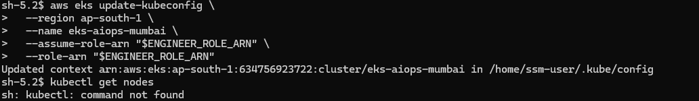

### 步驟 3：在 Bastion 安裝 kubectl

Bastion 預設沒有 `kubectl`，請安裝到 `$HOME/bin`，避免寫入目前目錄或 `/usr/local/bin` 時碰到權限問題。

```bash
curl -LO "https://dl.k8s.io/release/v1.34.0/bin/linux/amd64/kubectl"
chmod +x kubectl
mkdir -p $HOME/bin
mv kubectl $HOME/bin/kubectl
export PATH=$HOME/bin:$PATH
kubectl version --client
```

若一開始直接下載到不可寫目錄，會看到 `Permission denied`，改放 `$HOME/bin` 即可。

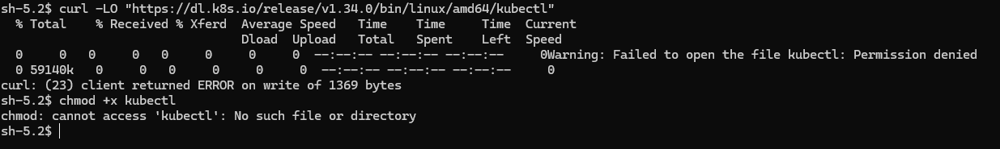

驗證節點：

```bash
kubectl get nodes
```

若出現 `Forbidden ... cannot list resource "nodes"`，代表 EngineerRole 目前只有命名空間權限，無法列出 cluster-scope 的 Node。部署期間可在 EKS Access Entries 中暫時給 EngineerRole `AmazonEKSClusterAdminPolicy`，完成後再收斂權限；或者只使用命名空間內的驗證指令。

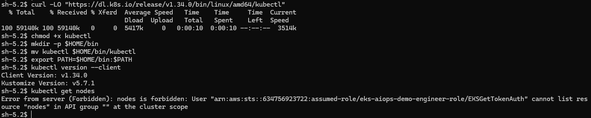

### 步驟 4：在 Bastion 安裝 Helm

```bash
cd /tmp
curl -fsSL https://raw.githubusercontent.com/helm/helm/main/scripts/get-helm-3 -o get_helm.sh
chmod +x get_helm.sh
./get_helm.sh
helm version
```

安裝過程若提示 `Could not find git`，可忽略，Helm 主程式仍會安裝到 `/usr/local/bin/helm`。

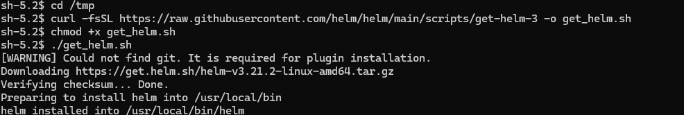

### 步驟 5：安裝 AWS Load Balancer Controller

web-demo Ingress 需要 AWS Load Balancer Controller 才會建立 ALB。先新增 Helm repo：

```bash
helm repo add eks https://aws.github.io/eks-charts
helm repo update
```

從 Stack 01 Outputs 複製 `VpcId`，或在有權限的環境查詢 VPC ID，然後安裝 controller：

```bash
VPC_ID=<Stack01VpcId>

helm install aws-load-balancer-controller eks/aws-load-balancer-controller \
  -n kube-system \
  --set clusterName=eks-aiops-mumbai \
  --set region=ap-south-1 \
  --set vpcId=$VPC_ID \
  --set serviceAccount.create=true \
  --set serviceAccount.name=aws-load-balancer-controller
```

驗證：

```bash
kubectl get deployment -n kube-system aws-load-balancer-controller
kubectl get pods -n kube-system | grep load-balancer
```

若部署 web-demo 後 `kubectl get ingress -n web-prod` 沒有 `ADDRESS`，且 `aws-load-balancer-controller` deployment 找不到，代表 controller 尚未安裝。

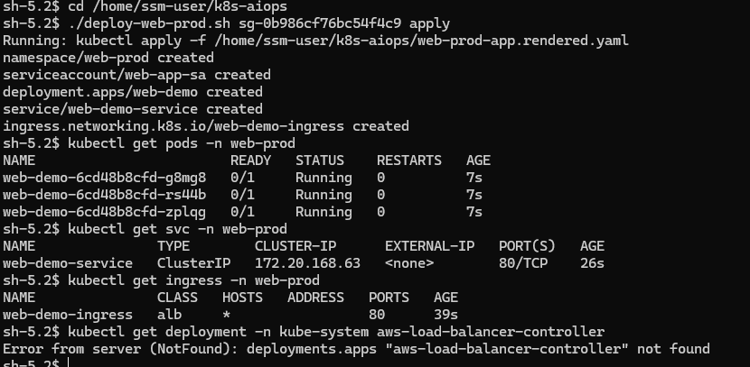

安裝成功後，Ingress 會取得 ALB DNS。


### 步驟 6：部署 web-demo 測試網站

在 Bastion 建立工作目錄，將 `Kubernetes/web-prod-app.yaml` 與 `Kubernetes/deploy-web-prod.sh` 放在同一目錄。從 Stack 02 Outputs 取得 `AlbSecurityGroupId` 後部署：

```bash
cd /home/ssm-user/k8s-aiops
chmod +x deploy-web-prod.sh
./deploy-web-prod.sh <AlbSecurityGroupId> apply
```

驗證：

```bash
kubectl get pods -n web-prod
kubectl get svc -n web-prod
kubectl get ingress -n web-prod
```

取得 `ADDRESS` 後，用瀏覽器開啟 `http://<ALB-DNS>`。看到 nginx 首頁代表 ALB、Ingress、Service、Pod 連線成功。


### 步驟 7：安裝 K8sGPT Operator

```bash
helm repo add k8sgpt https://charts.k8sgpt.ai/
helm repo update

helm install k8sgpt-operator k8sgpt/k8sgpt-operator \
  --namespace aiops \
  --create-namespace
```

驗證 operator：

```bash
kubectl get pods -n aiops
```

應看到 `k8sgpt-operator-controller-manager` 為 `2/2 Running`。

### 步驟 8：套用 K8sGPT 設定與 Webhook Sink

先到 Stack 08 Outputs 複製 `ApiEndpoint`，再修改 `Kubernetes/k8sgpt-operator-config.yaml` 的 Secret URL。

```yaml
url: "https://<YOUR_API_GATEWAY_ENDPOINT>/webhook?token=eks-aiops-webhook-secret-token"
```

最新版設定重點如下：

- 使用 Bedrock backend：`amazonbedrock`
- 模型：`anthropic.claude-3-haiku-20240307-v1:0`
- 區域：`ap-south-1`
- 明確指定 image：`ghcr.io/k8sgpt-ai/k8sgpt:v0.4.32`
- Sink 使用 `cloudevents`
- 不使用 `spec.serviceAccountName`，因目前 K8sGPT CRD 不支援此欄位

套用：

```bash
kubectl apply -f k8sgpt-operator-config.yaml
kubectl get pods -n aiops
kubectl describe k8sgpt -n aiops k8sgpt-aiops
```

若出現 `strict decoding error: unknown field "spec.serviceAccountName"`，請移除 `serviceAccountName` 欄位後重新 apply。

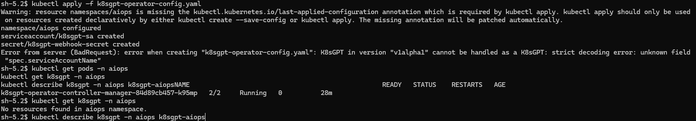

### 步驟 9：確認 K8sGPT Pod Identity 權限

若 K8sGPT log 出現 `AccessDeniedException ... eks-node-role ... bedrock:InvokeModel`，代表 Pod 沒有拿到 K8sGPT 專用 IAM Role，而是退回使用 EKS Node Role。

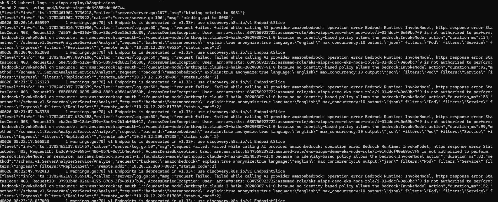

先在 Bastion 查 K8sGPT deployment 實際使用的 ServiceAccount：

```bash
SA=$(kubectl get deploy k8sgpt-aiops -n aiops -o jsonpath='{.spec.template.spec.serviceAccountName}')
[ -z "$SA" ] && SA=default
echo $SA
```

本次實作結果為 `k8sgpt-aiops`。


若 Stack07 尚未使用最新版，請在本機 PowerShell 建立 association：

```powershell
$profile = "nkc201-17-sso"
$region = "ap-south-1"
$cluster = "eks-aiops-mumbai"
$sa = "k8sgpt-aiops"

$roleArn = aws cloudformation describe-stacks `
  --stack-name nkc201-17-03-iam-stack `
  --region $region `
  --profile $profile `
  --query "Stacks[0].Outputs[?OutputKey=='K8sGptRoleArn'].OutputValue" `
  --output text

aws eks create-pod-identity-association `
  --cluster-name $cluster `
  --namespace aiops `
  --service-account $sa `
  --role-arn $roleArn `
  --region $region `
  --profile $profile
```

最新版 `CloudFormation/nkc201-17-07-access-stack.yaml` 已將 K8sGPT Pod Identity 綁定到 `aiops/k8sgpt-aiops`。

### 步驟 10：修正 K8sGPT image 版本

若新 Pod 一直重建，狀態是 `InvalidImageName`，代表 K8sGPT CR 產生的 image 缺少 tag。請確認 CR 中有 `repository` 與 `version`。

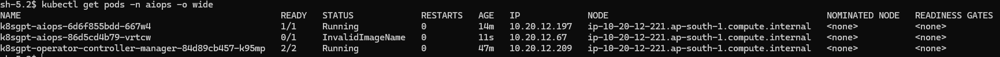

可在 Bastion 直接 patch 現場資源：

```bash
kubectl patch k8sgpt k8sgpt-aiops -n aiops --type=merge \
  -p '{"spec":{"repository":"ghcr.io/k8sgpt-ai/k8sgpt","version":"v0.4.32"}}'

kubectl get deploy k8sgpt-aiops -n aiops \
  -o jsonpath='{range .spec.template.spec.containers[*]}{.name}{" => "}{.image}{"\n"}{end}'
```

正常應顯示：

```text
k8sgpt => ghcr.io/k8sgpt-ai/k8sgpt:v0.4.32
```

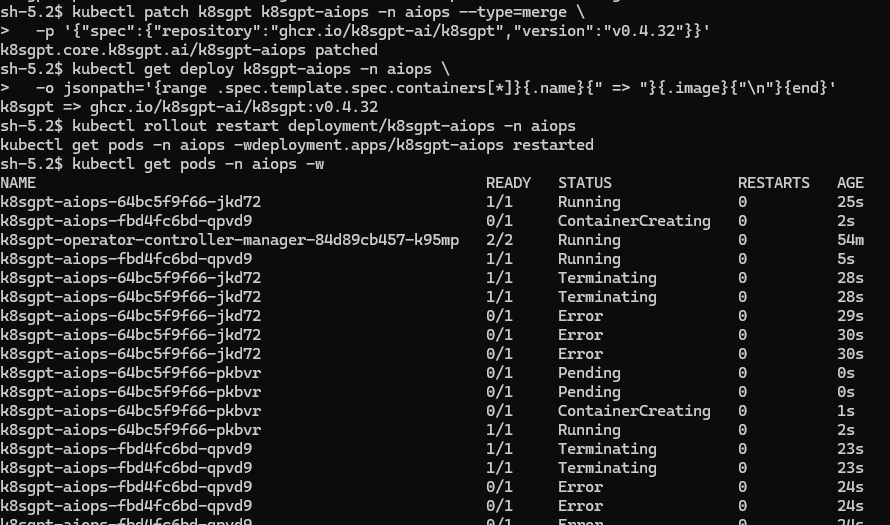

### 步驟 11：啟用 Bedrock Anthropic Claude 3 Haiku

若 log 出現 `Model use case details have not been submitted for this account`，代表 AWS 帳號尚未完成 Anthropic 模型使用案例表單。

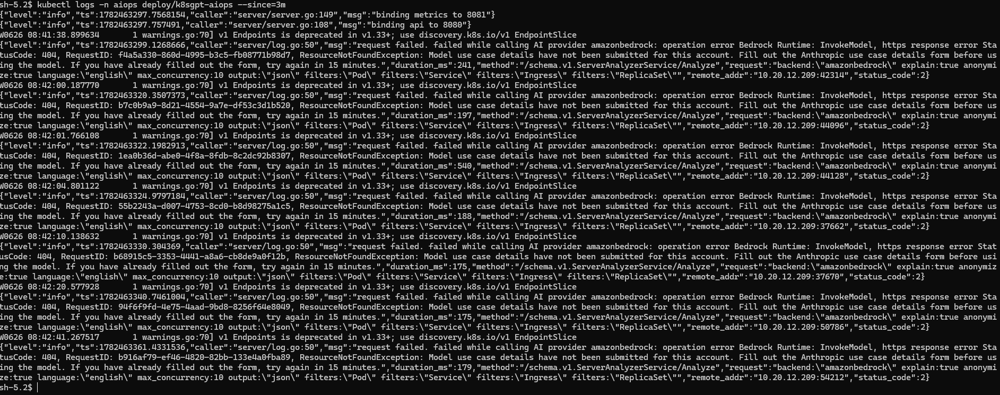

到 AWS Console 切到 `ap-south-1`，進入 **Amazon Bedrock**，開啟 **Claude 3 Haiku**，按 **Submit use case details**。

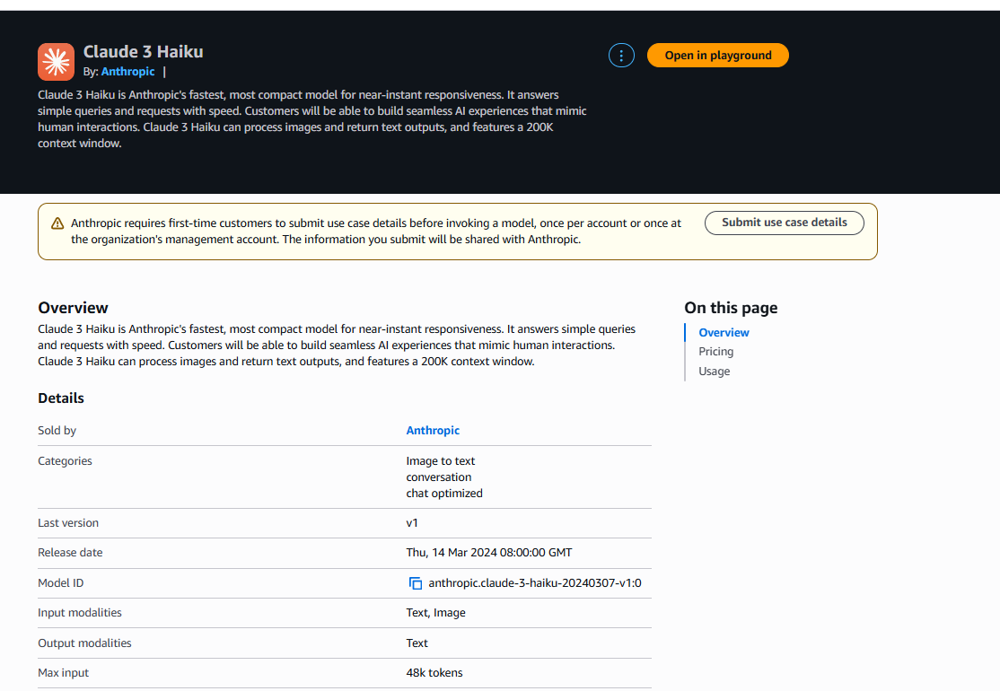

表單可填：

```text
Company name:
NKC201-17 Cloud Engineering Project

Industry:
Education

Intended users:
Internal users

Use case:
Using Claude 3 Haiku on Amazon Bedrock for a student cloud engineering capstone project. The use case is EKS AIOps: analyzing Kubernetes alerts, diagnosing pod, service, and ingress issues, and generating Traditional Chinese remediation suggestions for internal learning and demonstration.
```

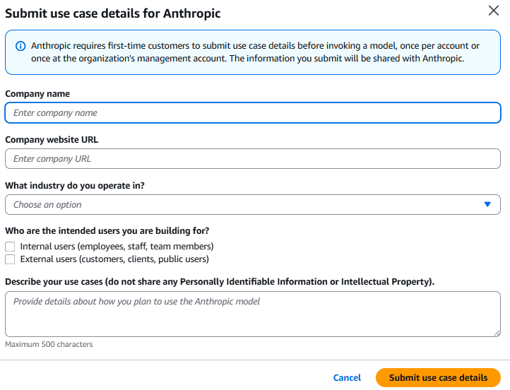

送出後等 2 到 15 分鐘，再回 Bastion 重啟 K8sGPT：

```bash
kubectl rollout restart deployment/k8sgpt-aiops -n aiops
kubectl rollout status deployment/k8sgpt-aiops -n aiops
kubectl logs -n aiops deploy/k8sgpt-aiops --since=3m
```

### 步驟 12：避免在本機 PowerShell 直接跑 kubectl

若在本機 PowerShell 執行 `kubectl` 時看到 HTML、`Authentication required`、`/login?from=%2Fapi`，代表本機 kubeconfig 沒有正確連到 EKS。這些 Kubernetes 指令請回到 Bastion 的 `sh-5.2$` 執行。

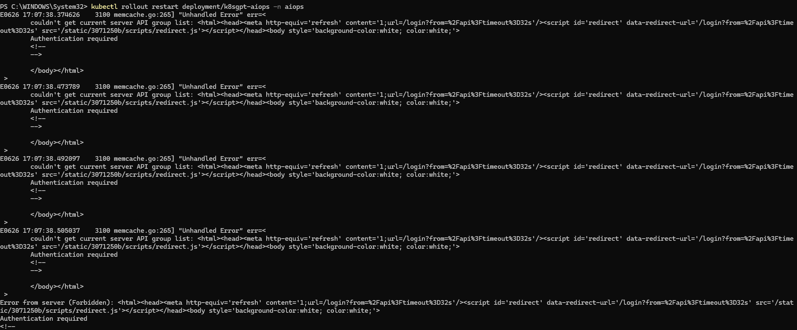

### 步驟 13：確認 K8sGPT 已產出診斷結果

在 Bastion 執行：

```bash
kubectl rollout restart deployment/k8sgpt-aiops -n aiops
kubectl rollout status deployment/k8sgpt-aiops -n aiops
kubectl logs -n aiops deploy/k8sgpt-aiops --since=3m
kubectl get results -n aiops
```

本次成功產出：

```text
NAME                    KIND      BACKEND
webprodwebdemoingress   Ingress   amazonbedrock
```

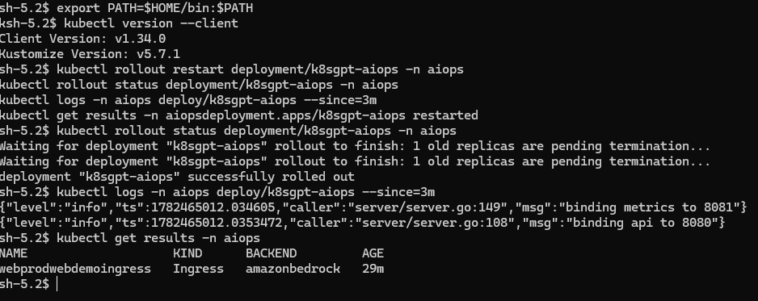

查看內容：

```bash
kubectl describe result -n aiops webprodwebdemoingress
```

### 步驟 14：修正 IngressClass 診斷結果

K8sGPT 診斷指出 `Ingress uses the ingress class alb which does not exist`。原因是 `web-demo-ingress` 使用 `ingressClassName: alb`，但叢集沒有正式建立 `IngressClass` 物件。

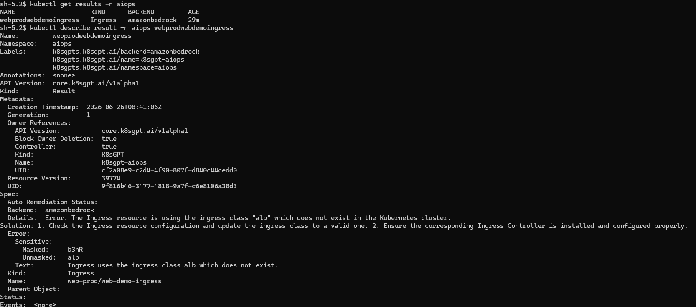

在 Bastion 補上：

```bash
kubectl apply -f - <<'EOF'
apiVersion: networking.k8s.io/v1
kind: IngressClass
metadata:
  name: alb
spec:
  controller: ingress.k8s.aws/alb
EOF
```

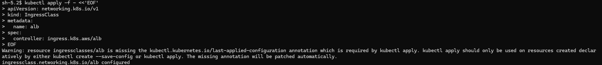

刪掉舊 result，讓 K8sGPT 重新掃描：

```bash
kubectl delete result -n aiops webprodwebdemoingress
kubectl rollout restart deployment/k8sgpt-aiops -n aiops
kubectl rollout status deployment/k8sgpt-aiops -n aiops
kubectl get results -n aiops
```

若顯示 `No resources found in aiops namespace.`，代表該問題已修復。

### 最終驗證清單

```bash
kubectl get pods -n aiops
kubectl get pods -n web-prod
kubectl get ingress -n web-prod
kubectl logs -n aiops deploy/k8sgpt-aiops --since=5m
kubectl get results -n aiops
```

通過標準：

- `k8sgpt-aiops` 為 `1/1 Running`
- `k8sgpt-operator-controller-manager` 為 `2/2 Running`
- `web-prod` 內 3 個 `web-demo` Pod 皆為 `1/1 Running`
- `web-demo-ingress` 有 ALB DNS
- K8sGPT log 沒有 `AccessDenied`、`InvalidImageName`、`Model use case details`
- `kubectl get results -n aiops` 無新異常，或只有預期中的測試異常

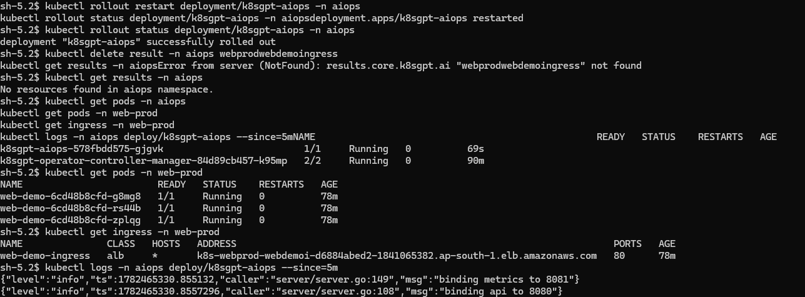

### 本次除錯摘要

| 問題 | 看到的現象 | 根因 | 處理方式 |
|---|---|---|---|
| SSM 連不上 | `TargetNotConnected` | CLI 指到錯誤區域或錯誤帳號 | `aws ssm start-session` 加上 `--region ap-south-1 --profile nkc201-17-sso` |
| kubectl 不存在 | `sh: kubectl: command not found` | Bastion 預設沒有 kubectl | 下載 kubectl 到 `$HOME/bin` 並 `export PATH=$HOME/bin:$PATH` |
| kubectl 權限不足 | `cannot list resource "nodes"` | EngineerRole 只有命名空間權限 | 部署期間暫時加 EKS ClusterAdmin 或改用命名空間驗證 |
| ALB DNS 不出現 | Ingress 無 `ADDRESS` | AWS Load Balancer Controller 未安裝 | 使用 Helm 安裝 `aws-load-balancer-controller` |
| K8sGPT CR 套用失敗 | `unknown field "spec.serviceAccountName"` | K8sGPT CRD 不支援該欄位 | 移除 `serviceAccountName`，使用 Pod Identity association 綁實際 ServiceAccount |
| Bedrock AccessDenied | log 顯示使用 `eks-node-role` 呼叫 Bedrock | Pod Identity 綁錯 ServiceAccount | 將 K8sGPT Pod Identity 綁到 `aiops/k8sgpt-aiops` |
| K8sGPT Pod 無法啟動 | `InvalidImageName` | K8sGPT image 缺少 tag | 在 CR 加上 `repository` 與 `version: v0.4.32` |
| Bedrock 模型不可用 | `Model use case details have not been submitted` | Anthropic use case form 尚未提交 | 到 Bedrock Claude 3 Haiku 頁面提交 use case details |
| 本機 kubectl 顯示 HTML | `Authentication required` | 本機 kubeconfig 未配好 | Kubernetes 操作改在 Bastion 執行 |
| K8sGPT 報 IngressClass | `ingress class alb does not exist` | 缺少 `IngressClass/alb` 物件 | 建立 `IngressClass`，controller 為 `ingress.k8s.aws/alb` |

