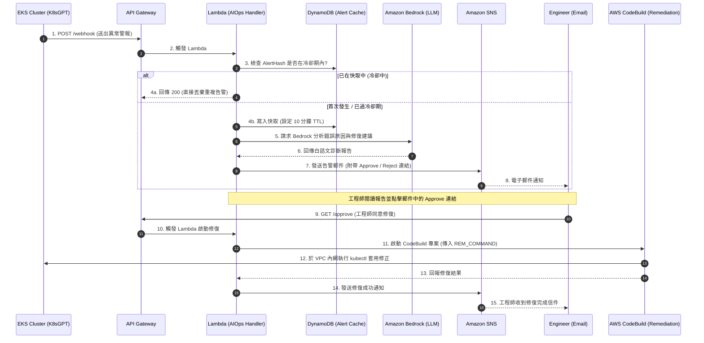

# 08 AIOps Stack - 智能維運與自動化告警建置計畫

本計畫紀錄了 EKS 智能維運專題中「AIOps 智能維運與自動化告警系統（Stack 08）」的建置規劃、核心元件設計與自動修復工作流。我們將透過結合 AWS Lambda、API Gateway、Amazon Bedrock、DynamoDB 快取、SNS 告警與 CodeBuild，實現「異常偵測 -> AI 診斷 -> 工程師審批 -> 自動修復」的完整閉環。

---

## 💡 費曼學習法：大樓警報、大腦調度員與維修機器人

當我們的 EKS 叢集運作時，就像是一棟繁忙的**電商百貨大樓**。如果突然有店家失火或水管漏水（Pod 異常），我們要如何讓大樓管理處即時反應，又不會引發混亂？

### 1. 📡 Amazon SNS (大樓廣播與警報器)
* **比喻**：**大樓的緊急廣播喇叭。**
* **用途**：當系統發生問題時，它負責第一時間向指定的工程師信箱（`james810526@gmail.com`）發送通知，就像廣播大聲呼叫：「維運工程師請注意，二樓發生漏水！」

### 2. 🗄️ DynamoDB 告警快取表 (重複通知過濾器)
* **比喻**：**值班室的「重複便條紙過濾器」。**
* **用途**：如果水管在 1 分鐘內噴水 100 次，現場路過的人會拼命打電話報警。如果沒有過濾，值班室的電話會被打爆，工程師也會收到 100 封垃圾簡訊（告警風暴）。
* **機制**：DynamoDB 當作快取登記簿。當第一個警報進來時，我們登記「水管漏水，有效期 10 分鐘（TTL）」。在接下來的 10 分鐘內，所有重複的「水管漏水」警報都會被直接過濾丟棄，讓工程師能專注於修復，而不是被通知淹沒。

### 3. 🧠 AWS Lambda (值班室的智能大腦)
* **比喻**：**大樓值班室的主任（調度員）。**
* **用途**：它是整個系統的核心。當它收到警報通知後：
  1. 它會把凌亂的警報拿去給**高級顧問**（Amazon Bedrock AI）翻譯。
  2. 生成附帶「核准（Approve）」與「拒絕（Reject）」網址連結的電子郵件，透過廣播器（SNS）發給工程師。
  3. 收到工程師的核准指令後，對**維修機器人**（CodeBuild）下達修復命令。

### 4. 📖 Amazon Bedrock (資深顧問)
* **比喻**：**值班室外聘的「外籍資深工程顧問」。**
* **用途**：Kubernetes 報錯時常是密密麻麻的英文代碼（例如：`CrashLoopBackOff: back-off 5m0s restarting failed container`）。這位 AI 顧問會將這些生硬的錯誤轉換成**白話中文**：「報告工程師，這是因為資料庫連線超時，請檢查密碼與網路設定。」並提供具體的修復指南。

### 5. 🚪 Amazon API Gateway (值班室的對外櫃檯)
* **比喻**：**值班室的「感應大門與對外收發櫃檯」。**
* **用途**：EKS 叢集內部的診斷工具（K8sGPT）可以把警報送到這個櫃檯（`/webhook`），工程師也可以透過手機點選信中的核准按鈕（`/approve`）來回傳指令給 Lambda 大腦。

### 6. 🤖 AWS CodeBuild (維修機器人)
* **比喻**：**值班室的「自動維修機器人」。**
* **用途**：為了保障安全，我們的電商大樓內部通道（EKS API Server）完全是封閉的（Private Control Plane）。這台維修機器人因為被安置在**大樓內部網段**（VPC Private Subnet）中，所以能安全地使用 `kubectl` 工具進入叢集執行修復，例如重新啟動 Pod 或更新設定檔。

---

## 🏗️ AIOps 智能維運工作流 (Workflow)



---

## 🛠️ 完整的 CloudFormation 藍圖

已寫入：`CloudFromation/nkc201-17-08-aiops-stack.yaml`

---

## 💻 部署與驗證步驟

### 1. 執行 CloudFormation 部署

請在您的專題資料夾下開啟 **PowerShell** 執行以下指令進行部署：

```powershell
# 1. 鎖定登入 Profile
$env:AWS_PROFILE="nkc201-17-sso"

# 2. 部署 AIOps Stack (Stack 08)
aws cloudformation deploy `
  --template-file CloudFromation/nkc201-17-08-aiops-stack.yaml `
  --stack-name nkc201-17-08-aiops-stack `
  --parameter-overrides `
      VpcId=$(aws cloudformation describe-stacks --stack-name nkc201-17-01-network-stack --query "Stacks[0].Outputs[?OutputKey=='VpcId'].OutputValue" --output text) `
      PrivateSubnetIds=$(aws cloudformation describe-stacks --stack-name nkc201-17-01-network-stack --query "Stacks[0].Outputs[?OutputKey=='PrivateSubnets'].OutputValue" --output text) `
      EngineerEmail="james810526@gmail.com" `
  --capabilities CAPABILITY_NAMED_IAM `
  --region ap-south-1
```

### 2. 驗證步驟與測試流程

> [!IMPORTANT]
> **步驟一：確認 SNS 訂閱**
> 部署完成後，AWS 會向 `james810526@gmail.com` 發送一封主旨為 `AWS Notification - Subscription Confirmation` 的郵件。請務必打開並點擊 **"Confirm subscription"** 連結。

> [!IMPORTANT]
> **步驟二：確認 Amazon Bedrock 模型存取權**
> 本專題之 Lambda 將在 `ap-south-1` 區域調用 Bedrock 模型。因 AWS 目前在孟買區已自動開放 Bedrock 基礎模型存取（無須再手動點選橘色按鈕申請），Lambda 可直接調用。請確保您的 AWS 帳戶無組織層級的 Service Control Policies (SCP) 阻擋 Bedrock 服務。

#### 🧪 測試 Webhook 與 AI 診斷
您可以透過跳板機或本機使用 `curl` 模擬 K8sGPT 發送錯誤：
```powershell
# 1. 獲取 API Gateway 網址
$ApiUrl = aws cloudformation describe-stacks --stack-name nkc201-17-08-aiops-stack --query "Stacks[0].Outputs[?OutputKey=='ApiEndpoint'].OutputValue" --output text

# 2. 發送模擬 Pod 異常 (ImagePullBackOff) 到 Webhook
curl -X POST "$ApiUrl/webhook" `
  -H "Content-Type: application/json" `
  -d '{"name": "nginx-web", "namespace": "web-prod", "error": "ImagePullBackOff: Failed to pull image nginx:1.999"}'
```

---

## 🔒 安全設計與爆炸半徑收斂 (Security Design & Radius Mitigation)

1. **網路完全隔離 (VPC Private Subnet)**：自動修復 CodeBuild 與執行診斷的 Lambda 皆部署於 VPC 的 Private Subnet 中，無公網 Public IP，與網際網路隔離，並使用與 Node Group 相同的 Security Group，安全存取 EKS 控制面。
2. **Lambda 最小 IAM 權限**：Lambda 權限僅限於向指定的 SNS Topic 發送訊息、讀寫唯一的 DynamoDB 告警表、以及呼叫特定的 CodeBuild 項目。
3. **防止告警風暴**：利用 DynamoDB TTL 欄位，設定 10 分鐘冷卻期。同個 Pod 的相同錯誤，在 10 分鐘內只會發送一次 Email，避免工程師郵箱過載。
