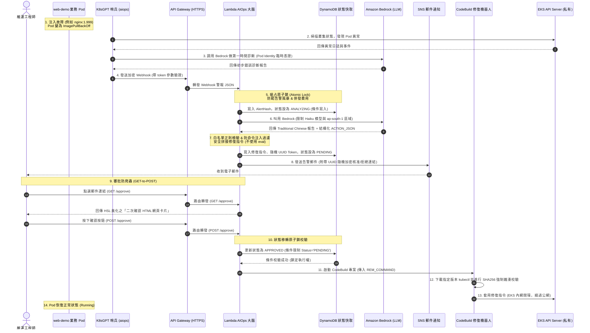

# EKS AIOps 專題核心設計與 DevSecOps 安全架構指南 (Presentation & Architecture Guide)

本指南旨在為您全面解析本專題 **「基於 EKS、Amazon Bedrock 與 CodeBuild 的 AI 智能自癒維運系統 (AIOps)」** 的詳細建置思路、各模組間的交互作用機制，以及本專題引以為傲的 **DevSecOps 生產級安全防護設計**。本指南將幫助您徹底理解專題的每一處配置，以便在專題審查、口試或面試中做出專業、自信的解說。

---

## 🗺️ 專題架構圖與流程全景



---

## 🛠️ 第一部分：詳細建構思路（由淺入深的架構演進）

本專題之所以如此劃分 8 個 Stacks，是遵循雲端基礎設施部署的 **「依賴關係最小化」** 與 **「環境重建靈活性」**。

```
基礎網路層 (Stack 01) ➔ 網絡隔離 border
   ↓
安全防護與 IAM (Stack 02 & 03) ➔ 零信任與權限鎖定
   ↓
EKS 核心叢集 (Stack 04 & 05) ➔ 運算引擎與節點組
   ↓
資料與快取鎖 (Stack 06) ➔ DynamoDB 鎖定機制
   ↓
內部接入與 AIOps 大腦 (Stack 07 & 08) ➔ Lambda, APIGW, VPC Endpoints
   ↓
業務 Pod & K8sGPT 哨兵 ➔ 最終監控對接
```

### 1. VPC 網路層的設計思路 (Stack 01)
* **目的**：打下安全的基礎網路地基。
* **配置重點**：劃分 Public Subnet（對外暴露負載平衡器）與 Private Subnet（工作節點、Lambda 與 CodeBuild 的安全藏身處，無公網 IP）。
* **考量細節**：
  * **NAT Gateway 的取捨**：使用 Single NAT Gateway 是為了在**展示環境**中節省 AWS 每小時固定帳單費用；而在生產環境中，為了避免 NAT 故障導致整棟大樓斷網，則必須配置 Multi-AZ 備援。
  * **巢狀依賴鎖死防範**：我們在網路層 Outputs 中**沒有**使用 CloudFormation 的 `Export` 導出，這是為了避免未來刪除或修改網路層時，被後面引用的 Stack 卡死（巢狀依賴鎖），改以手動參數傳入，大幅提昇專題開發與清理環境的效率。

### 2. 安全防護與身分授權 (Stack 02 & 03)
* **目的**：建立 EKS 與 AWS 資源之間的最小權限邊界。
* **配置重點**：
  * **SG 規則循環依賴解決**：EKS 控制面（經理室）與工作節點（員工區）需要雙向溝通。若在同一個 Stack 中互相引用對方的 Security Group ID 會造成循環相依錯誤。因此，我們在 Stack 02 先建立空的 SG 殼，再於下方使用獨立的 `SecurityGroupIngress` 動態插入規則，完美解決此難題。
  * **IAM 權限最小化**：CodeBuild 的角色僅被授予在 VPC 內建立 ENI 以與 EKS 內網通訊的權限，不給予多餘的 EC2 管理權限。

### 3. EKS 叢集與 Node Group (Stack 04 & 05)
* **目的**：搭建完全私有化（Private Control Plane）的 Kubernetes 叢集。
* **配置重點**：
  * **控制面完全私有（Private Access Only）**：EKS API Server 的端點不對公網開放。這意味著外網的任何人（包含駭客）都無法嘗試掃描或破解叢集，所有維運指令必須通過 SSM 跳板機或內網運作的 CodeBuild 進行。
  * **SSM 跳板機免 Port 22 防護**：跳板機 EC2 部署在 Private Subnet，沒有公網 IP，且安全群組不開任何 Ingress 端口（關閉 Port 22）。工程師完全是透過 AWS Systems Manager Session Manager（基於 AWS Web API 與 IAM 授權）建立通道登入，防止了暴力破解與網絡暴露。

### 4. DynamoDB 快取與 AIOps 大腦 (Stack 06 & 08)
* **目的**：實作告警的「防暴冷卻」、「AI 診斷」與「審批控制」。
* **配置重點**：
  * **DynamoDB 快取表**：以告警特徵的 SHA256 雜湊值 `AlertHash` 為 Key，設定 TTL 生效時間為 10 分鐘，作為阻擋告警風暴的第一道防護鎖。
  * **AWS Lambda**：置於 VPC 內，並透過 VPC Endpoint 直連 STS、Amazon Bedrock 與 CloudWatch，做到完全不經公網的內網維運閉環。

---

## 🏢 第二部分：各個建置的相互作用機制（費曼學習法比喻）

為了便於解說，我們可以將整個專題系統比喻為一棟 **「高度安全防護的百貨大樓」**：

| 本專題組件 | 百貨大樓角色 | 相互作用與協調機制 |
| :--- | :--- | :--- |
| **VPC 網路層 (Stack 01)** | **大樓的物理圍牆與區域規劃** | 將大樓劃分為「前廳公眾區（Public Subnets）」與「後台管制區（Private Subnets）」，並規劃單向出站的安全防護門（NAT Gateway）。 |
| **安全群組 (Stack 02)** | **大樓內部的感應門禁卡系統** | 限制誰能去哪裡。例如，後勤人員（Node SG）只接受來自前台服務生（ALB SG）的業務導引（NodePort 及 Port 80），以及經理室（EKS 控制面）的調度。 |
| **IAM 角色與 Policy (Stack 03)** | **各級員工的身分證與權限指紋** | 控制每個人能動用什麼工具。例如：維運工程師（EngineerRole）才能核准修復；修復機器人（CodeBuildRole）只能拿修復用鑰匙。 |
| **EKS Cluster (Stack 04)** | **大樓的中央行政管理處** | 管理所有的店家與櫃位（Pod / Namespace）。行政處的辦公室是完全隱蔽的（私有控制面），外人無法直接進入。 |
| **Node Group (Stack 05)** | **大樓出租的實體櫃位空間** | 提供業務運作的物理場地。櫃位空間與行政管理處直接連線，且依附在門禁卡系統中。 |
| **SSM 跳板機 (Stack 05)** | **後台專用的安全員工防盜通道** | 不開公網大門（關閉 Port 22/無公網 IP），工程師必須出示有效員工證（IAM & Session Manager），才能透過專屬的暗道（SSM Tunnel）登入櫃位進行管理。 |
| **DynamoDB 快取表 (Stack 06)** | **大樓前台的「異常登記簿」** | 記錄大樓內所有異常事件的處理進度。用來防範同一個櫃位在短時間內狂打電話報警（去重鎖與狀態登記）。 |
| **AIOps Lambda 大腦 (Stack 08)** | **大樓的智慧值班警衛隊長** | 負責接收前台的報警電話（Webhook），向總公司智囊團（Amazon Bedrock）諮詢修復方案，並撰寫診斷報告。負責寄信給總經理（工程師）審查。 |
| **AWS CodeBuild (Stack 08)** | **攜帶標準工具的專業維修工程兵** | 當警衛隊長收到總經理簽字核准（Approve POST）後，工程兵便在後台管制區攜帶經過 SHA256 強制驗證的標準板手（標準版 kubectl），執行具體維修。 |
| **K8sGPT 掃描器 (Kubernetes)** | **在各櫃位巡邏的保安巡查員** | 不斷在 EKS 大樓內掃描，一發現有櫃位漏水（Pod 崩潰），就借用行政處發給他的臨時通行證（Pod Identity），打給 Bedrock 諮詢，並向警衛隊長（Lambda）通報。 |
| **web-demo (Kubernetes)** | **被監控的電商商家** | 專題中的業務主體。我們故意往這家店注入火災（ImagePullBackOff 故障），以驗證整套自癒系統的運作。 |

---

## 🔒 第三部分：DevSecOps 生產級安全加固實踐（答辯與解說精華）

本專題的精華在於 **「如何把一個簡單的自動化脚本，升級為企業生產級（Enterprise-Grade）的 DevSecOps 架構」**。以下是您可以重點解說的安全亮點：

### 1. 杜絕遠端命令注入 (eval Remote Code Execution)
* **傳統痛點**：許多 AIOps 系統會直接用 `eval "$REM_COMMAND"` 執行 AI 生成的 Shell 指令。一旦 AI 遭受 **Prompt Injection（提示詞注入攻擊）** 生成了惡意指令（如 `rm -rf /` 或建立後門），系統將被徹底劫持。
* **本專題解決方案**：
  1. **結構化限制**：我們限制 Bedrock 只能輸出固定的 JSON 結構（`ACTION_JSON`），不可輸出 raw 命令行。
  2. **白名單與正則查驗**：Lambda 收到 JSON 後，會用嚴格的正則表達式檢驗資源名稱（僅能是英數字、橫線與點），且限制 Namespace 僅能為 `web-prod` 與 `aiops`，動作僅限 `restart_deployment`、`scale_deployment` 與 `delete_pod` 三種。
  3. **安全範本拼接**：Lambda 在內建的安全代碼中，將經過驗證的變數填入寫死的模板字串，最後才交由 CodeBuild 直接執行，**絕不使用 `eval`**，從根本上免疫了 RCE 漏洞。

### 2. Webhook 密鑰認證與預留並發防護 (Cost & DoS Protection)
* **傳統痛點**：APIGW 的 `/webhook` 是對外公開的。惡意駭客可以用自動化工具不斷灌入假告警，導致 Lambda 頻繁調用 Amazon Bedrock，產生高昂的 AI 服務費用。
* **本專題解決方案**：
  1. **查詢 Token 認證**：Webhook 必須附帶密鑰 `token=eks-aiops-webhook-secret-token`，否則 Lambda 在第一行即拋出 `401 Unauthorized`，拒絕調用 Bedrock。
  2. **預留並發限制 (`ReservedConcurrentExecutions: 2`)**：在 CloudFormation 中限制 Lambda 最大並發數為 2。即使攻擊者繞過 Token，Lambda 也會因為並發限制直接進行 Throttling（限流），有效隔離告警風暴，保護 AWS 帳單安全。

### 3. 審批連結防爬蟲（GET-to-POST 二次確認）
* **傳統痛點**：許多郵件閘道（如 Outlook, Corporate Mail Gateways）會自動爬取郵件中的連結（Prefetching/Crawling）以檢測是否為釣魚網站。如果審批連結是簡單的 GET 請求，郵件收到的瞬間就會被安全軟體「自動誤觸核准」。
* **本專題解決方案**：
  1. **ANY 路由分離**：API Gateway 的 `/approve` 與 `/reject` 設定為 `ANY` 模式。
  2. **GET 請求只給卡片**：當點選郵件連結（GET 請求）時，Lambda 僅回傳一個美觀的「二次確認 HTML 網頁卡片」。爬蟲抓到此卡片後便會停止。
  3. **POST 請求才執行**：確認卡片中的按鈕採用 **HTML Form POST** 表單提交。只有當工程師親自點擊按鈕、瀏覽器送出 `POST /approve` 請求時，Lambda 才會核准執行，徹底阻絕爬蟲誤觸。

### 4. DynamoDB 狀態原子鎖 (Race Condition Prevention)
* **傳統痛點**：工程師如果因為網路卡頓，對郵件的核准按鈕「連點兩下（Double-click）」，或者同時有兩名工程師進行審查，會導致 CodeBuild 被重複啟動兩次，造成叢集資源震盪。
* **本專題解決方案**：
  在進行狀態更新時，利用 DynamoDB 的強一致性條件更新：
  `ConditionExpression="Status = :pending"`。
  第一個請求到達時，狀態會立刻轉變為 `APPROVED`；第二個請求到達時，會因為狀態已非 `PENDING` 而觸發 `ConditionalCheckFailedException` 被 Lambda 優雅攔截，達成幂等性（Idempotency）防護。

### 5. CodeBuild 工具鏈供應鏈防投毒 (Supply Chain Security)
* **傳統痛點**：CodeBuild 執行修復時，若每次都從公網下載 `latest` 版的 `kubectl`，一旦 Kubernetes 官方倉庫被供應鏈投毒，或者下載過程中遭遇中間人攻擊（MITM），CodeBuild 將下載到惡意程序。
* **本專題解決方案**：
  1. **版本與雜湊鎖定**：我們將 `kubectl` 版本寫死為與叢集版本一致的 `v1.34.0`。
  2. **SHA256 強制驗證**：在 CodeBuild 啟動時，會同時拉取官方的 `.sha256` 雜湊校驗檔，並在 Linux 本地端執行 `sha256sum -c` 強制雜湊校驗。校驗失敗則立刻中斷建置，保障執行期工具鏈的絕對純淨。

### 6. VPC Endpoints 網絡防範與 SG 收斂
* **傳統痛點**：以往 Lambda 需要繞到公網才能與 Amazon Bedrock, STS 通訊，且 VPC 端點安全群組對外開放 `0.0.0.0/0`，網路邊界不夠嚴密。
* **本專題解決方案**：
  1. **內網閉環 (AWS PrivateLink)**：透過專屬的 VPC Endpoint，使維運流量完全保留在 AWS 的私有骨幹網中，防止流量暴露於 Internet。
  2. **SG 收緊至 `VpcCidr`**：VPC Endpoint 的安全群組 Ingress 來源精確限制為 VPC CIDR `10.20.0.0/16`。
  3. **ALB ➔ Node SG 收斂**：工作節點的安全群組僅放行 `30000-32767` (NodePort) 以及業務埠 `80` (配合 target-type: ip 路由)，其他全數關閉，確保節點網路安全性。

---

## 💬 第四部分：常見口試與面試問題 FAQ

### Q1: 為什麼將自動修復指令放在 AWS CodeBuild 執行，而不是直接在 Lambda 執行？
* **專業回答**：
  1. **網路邊界與控制面私有化**：EKS 控制面（API Server）是完全私有的。要與其通訊，執行端必須位於 VPC 私有子網路內，且具備與 EKS 安全群組相容的網絡介面。CodeBuild 原生支援強大的 VPC 整合，可藉由掛載 ENI 與私有控制面安全通訊。
  2. **IAM 身分隔離與權限限縮**：Lambda 主要扮演「決策大腦」（需要 Bedrock 呼叫與 SNS 寄信權限）；CodeBuild 扮演「執行手腳」（需要與 K8s 通訊的 kubectl 執行權限）。將「決策」與「執行」在 IAM 級別徹底隔離，符合最小特權原則（Least Privilege），即使 Lambda 遭入侵，駭客也拿不到 K8s 叢集的管理憑證。
  3. **執行環境純淨度**：Lambda 不利於預裝 kubectl 及各類維運工具鏈（需要配置龐大的 Lambda Layers 且啟動慢）。CodeBuild 可以使用官方容器鏡像，在每次執行時動態、乾淨地拉取指定版本並進行 SHA256 驗證，提供安全且完全隔離的拋棄式（Ephemerel）執行環境。

### Q2: 為什麼 Stack 之間不使用 CloudFormation 官方推薦的 `Fn::ImportValue`，而是手動傳入 Parameters？
* **專業回答**：
  1. **防止「巢狀依賴鎖死」（Dependency Locking）**：
     AWS 規定：*只要有任何後置 Stack 引用了某個 Export 的資源，前置 Stack 就絕對不允許被修改或刪除。*
     在開發與維運階段，我們經常需要重建網路層（Stack 01）或修改安全群組。如果使用 `ImportValue` 強耦合，當我們要重建網路層時，會被強制卡死，必須按照 `08 ➔ ... ➔ 01` 的反向順序手動刪除所有 Stack，極易導致開發停滯與除錯困難。
  2. **架構決策**：手動傳參雖然在主控台部署時需要手動輸入 VPC/Subnet ID，稍微繁瑣，但釋放了 Stack 之間的依賴限制，具備極高的容錯率與維運彈性，是實務上進行多 Stack 基礎設施管理的最佳權衡。

### Q3: 使用 EKS Pod Identity 與傳統的 AWS IAM Access Key/Secret Key 有何不同？安全優勢在哪？
* **專業回答**：
  1. **憑證不落地原則**：傳統做法是將長期有效的 Access Key 寫入 K8s `Secret` 或程式設定檔中。一旦 Kubernetes 被入侵或鏡像外洩，AWS 憑證將完全暴露。EKS Pod Identity 採用 **OIDC 聯邦身分認證**，Pod 在啟動時會自動掛載一個動態更新的臨時 token 檔案，並向 AWS STS 換取只有數小時效期且自動輪轉的臨時金鑰，憑證絕對不落地。
  2. **極簡權限管理**：Pod Identity 不需要像以前的 IRSA (IAM Roles for Service Accounts) 一樣，在 IAM 角色信賴關係中手動填入繁瑣的 OIDC Provider ARN 與名稱，而是直接透過 EKS Pod Identity Agent 在叢集層面綁定 ServiceAccount 與 IAM Role，維運複雜度大幅降低，符合雲原生安全最佳實踐。
