**AWS EKS 智能維運告警系統實作**

以電商促銷高流量情境為核心，整合 EKS、K8sGPT、Amazon Bedrock、SNS、DynamoDB 與 CodeBuild 的 AIOps 維運閉環。

| **項目**  | **內容**        |
| ------- | ------------- |
| 班級 / 類別 | Tibame 雲端工程師  |
| 學員      | NKC201-17 何政遠 |
| 指導老師    | 周廷諺           |


<figure>
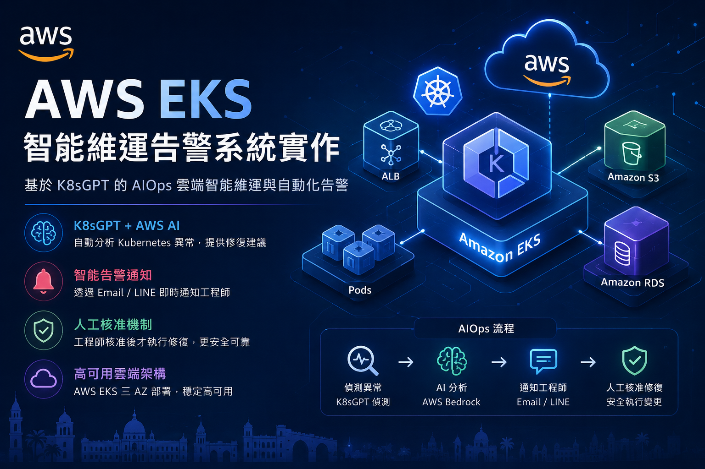
<figcaption><p><em>AWS EKS AIOps 智能維運專題</em></p></figcaption>
</figure>

# 目錄

- 1\. 專題摘要

- 2\. 故事背景與問題定義

- 3\. 系統目標與製作範圍

- 4\. 整體系統架構

- 5\. CloudFormation 章節式建置設計

- 6\. Kubernetes 與 AIOps 工作流

- 7\. DevSecOps 與安全設計

- 8\. Live Demo 與驗收設計

- 9\. 故障排除紀錄與設計反思

- 10\. 結論與未來擴充

- 附錄 A. 檔案與成果清單

- 附錄 B. 建置與刪除索引

- 附錄 C. 部署前清理與完整刪除指令

- 附錄 D. 資料來源網址

# 1. 專題摘要

本專題以電商網站在限時促銷活動中遭遇瞬間高流量與 Kubernetes 服務異常為情境，設計並實作一套部署於 AWS EKS 的智能維運告警系統。系統透過 CloudFormation 建立網路、安全群組、IAM、EKS、資料層與 AIOps 資源，再以 Kubernetes YAML 與 Helm 部署網站服務、AWS Load Balancer Controller 與 K8sGPT Operator。

維運流程導入 K8sGPT 與 Amazon Bedrock：當叢集發生 Pod 重啟、Image 拉取失敗、Service 無 Endpoint、資源不足等異常時，系統會將事件整理成可理解的診斷資訊，透過 SNS Email 通知工程師，並在人工核准後由 CodeBuild 執行受控修復動作。整體目標是把傳統黑箱式除錯流程轉換為可觀測、可審批、可追蹤的 AIOps 維運閉環。

<table>
<colgroup>
<col style="width: 100%" />
</colgroup>
<thead>
<tr>
<th><p><strong>專題核心價值</strong></p>
<p>讓 Kubernetes 新手值班工程師在高壓事故中，也能快速理解異常原因、掌握影響範圍、取得修復建議，並在安全控管下完成修復。</p></th>
</tr>
</thead>
<tbody>
</tbody>
</table>

| **成果面向** | **整合內容** |
|----|----|
| 基礎建設 | 以 8 個 CloudFormation Stack 建立 VPC、Security Group、IAM、EKS、Node Group、資料層、存取控制與 AIOps 資源。 |
| 應用部署 | 在 EKS 上部署 web-prod 命名空間、web-demo Deployment、Service、Ingress 與 ALB 對外入口。 |
| 智能維運 | K8sGPT 偵測 Kubernetes 異常，Amazon Bedrock 產生白話根因分析與修復建議。 |
| 告警與修復 | SNS Email 通知工程師，DynamoDB 快取與狀態機避免告警風暴，CodeBuild 負責受控修復。 |
| 展示驗證 | 以 ImagePullBackOff、Service Selector 不匹配、ConfigMap 缺失等情境展示端到端流程。 |

# 2. 故事背景與問題定義

某電商網站於晚間 20:00 舉辦限時促銷活動，大量消費者同時湧入網站進行搶購與結帳。活動開始後，網站突然變慢，部分使用者無法開啟頁面或完成結帳。值班的是剛入職、Kubernetes 經驗不足的工程師；面對 CrashLoopBackOff、ImagePullBackOff、Pending、OOMKilled、Readiness probe failed 等訊息，他很難立即判斷問題是應用程式錯誤、資源不足、節點容量不足，還是流量暴增造成。

本專題以這個情境作為問題主軸：雲端架構不只要能部署成功，也要能在異常發生時提供可操作的維運路徑。因此，系統設計從一開始就同時考慮高可用、觀測、告警、人工審批與安全修復。

| **痛點** | **說明** | **本專題對應解方** |
|----|----|----|
| 高流量造成系統壓力 | 促銷活動瞬間流量暴增，可能造成 Pod 或節點資源不足。 | 以 EKS、Managed Node Group、HPA 擴充方向建立可延展架構。 |
| Kubernetes 錯誤難以理解 | 新手工程師不易判斷 CrashLoopBackOff、Pending、OOMKilled 等根因。 | 導入 K8sGPT 與 Bedrock 產生白話診斷與修復建議。 |
| 告警容易淹沒值班者 | 重複異常可能短時間內產生大量通知。 | 以 DynamoDB 快取、TTL 與條件寫入降低告警風暴。 |
| 自動修復有誤改風險 | 若 AI 直接執行命令，可能造成更大的正式環境事故。 | 採用 Human-in-the-loop 審批與白名單 Action JSON。 |
| 維運通道需兼顧安全 | 開 SSH 或公網 API 會擴大攻擊面。 | 以私有 EKS API、SSM Session Manager、PrivateLink 收斂網路路徑。 |

<figure>
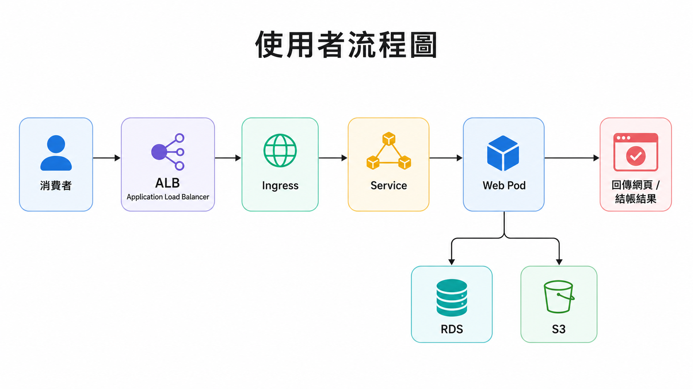
<figcaption><p><em>圖 1：電商促銷故障情境與維運流程示意</em></p></figcaption>
</figure>

# 3. 系統目標與製作範圍

## 3.1 專題核心目標

- 建立可重複部署的 AWS EKS 雲端基礎架構，並以 CloudFormation 管理主要資源。

- 提供一個可對外存取的電商 Web App 測試場景，用於承載故障注入與維運展示。

- 導入 K8sGPT 與 Amazon Bedrock，讓 Kubernetes 異常可以被轉譯成白話原因與修復建議。

- 以 SNS Email 建立通知管道，讓工程師能快速接收告警與審批連結。

- 以 DynamoDB、Token、狀態機與 CodeBuild 建立安全可控的修復閉環。

## 3.2 MVP 與加分項目

| **階段** | **應完成內容** | **定位** |
|----|----|----|
| MVP | CloudFormation 建立 Network、Security、IAM、EKS、Node Group；EKS Node 跨 3 AZ Ready。 | 基礎可運作 |
| MVP | AWS Load Balancer Controller 安裝成功，Web App 部署成功並可透過 ALB 存取。 | 服務可展示 |
| MVP | K8sGPT 可偵測 ImagePullBackOff，Bedrock 可產生白話修復建議，SNS Email 可通知工程師。 | AIOps 核心閉環 |
| 加分 | Approve / Reject、CodeBuild 自動修復、DynamoDB 去重冷卻與狀態鎖。 | 安全修復流程 |
| 加分 | HPA 壓測展示、Cluster Autoscaler / Karpenter、LINE 通知、更多故障情境。 | 可靠度與展示深度 |

# 4. 整體系統架構

整體架構分為使用者流量路徑、AWS 基礎建設路徑、Kubernetes 應用路徑與 AIOps 維運路徑。使用者透過 Internet-facing ALB 進入 EKS 內部服務；工程師不直接開 SSH，而是透過 SSM Session Manager 進入私有跳板機操作。K8sGPT 監控叢集異常，將事件送至 API Gateway / Lambda，再由 Bedrock 分析並觸發通知與審批流程。

<figure>
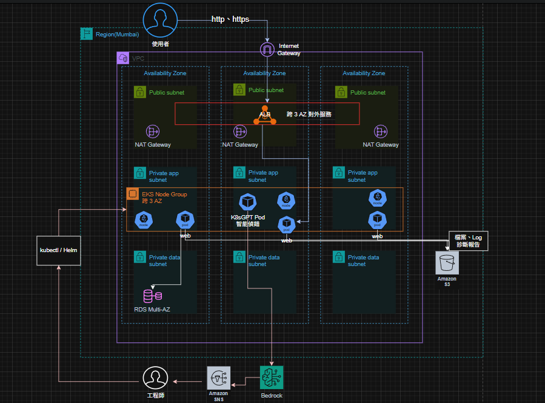
<figcaption><p><em>圖 2：AWS EKS AIOps 整體架構圖</em></p></figcaption>
</figure>

## 4.1 架構層級

| **層級** | **主要服務** | **設計重點** |
|----|----|----|
| 網路層 | VPC、Public Subnet、Private App Subnet、Private Data Subnet、NAT Gateway | Public / Private 分層，保留對外入口與內部隔離。 |
| 安全層 | Security Groups、IAM Roles、EKS Access Entry、Pod Identity | 以最小權限與工作負載身份隔離降低橫向移動風險。 |
| 運算層 | EKS Cluster、Managed Node Group、EC2 Launch Template | 私有工作節點承載 Web App 與 AIOps 元件。 |
| 資料層 | S3、RDS MySQL、Secrets Manager | 資料與密碼分離，避免明文密碼落入程式碼或部署檔。 |
| AIOps 層 | K8sGPT、API Gateway、Lambda、Bedrock、SNS、DynamoDB、CodeBuild | 偵測、分析、通知、審批、修復串成閉環。 |

# 5. CloudFormation 章節式建置設計

AWS 資源以 8 個 CloudFormation Stack 拆分，讓建置流程可以分階段驗證。這種拆法雖然需要手動傳入前一個 Stack 的 Outputs，但對專題展示很有幫助：每一章都能清楚說明該層資源存在的原因、依賴關係與驗收方式。

| **Stack** | **主題** | **主要資源** | **驗收重點** |
|----|----|----|----|
| 01 | Network | VPC、9 個 Subnet、IGW、NAT Gateway、Route Tables | 網段與 EKS Subnet Tags 正確。 |
| 02 | Security | ALB、Node、Cluster、RDS Security Groups | 安全群組來源與方向符合最小開放。 |
| 03 | IAM | EKS、Node、ALB Controller、App、K8sGPT、Engineer、CodeBuild Roles | 角色權限可支援後續叢集與 AIOps 操作。 |
| 04 | EKS Cluster | 私有 EKS Cluster、Core Add-ons | Cluster Active，控制面 Logs 與 Add-ons 正常。 |
| 05 | Node Group | Launch Template、Managed Node Group、SSM Bastion | 節點 Ready，SSM 可進入跳板機。 |
| 06 | Data | S3、Secrets Manager、RDS MySQL | 資料層可建立，密碼透過 Secret 管理。 |
| 07 | Access | EKS Access Entry、Pod Identity Associations | Engineer、CodeBuild 與 Pod 身份可被 EKS 辨識。 |
| 08 | AIOps | SNS、DynamoDB、Lambda、API Gateway、CodeBuild、VPC Endpoints | Webhook、通知、AI 分析與修復流程可測。 |

## 5.1 8 大 Stacks 順序部署實作

部署時採用 `01 → 02 → 03 → 04 → 05 → 06 → 07 → 08` 的順序。每個 Stack 建立完成後，應先確認 CloudFormation 狀態為 `CREATE_COMPLETE`，再複製 Outputs 給下一個 Stack 使用。

### Stack 01：Network Stack

範本檔案：`CloudFormation/nkc201-17-01-network-stack.yaml`

主要建立 VPC、Public Subnet、Private App Subnet、Private Data Subnet、Internet Gateway、NAT Gateway 與 Route Tables。`NatGatewayMode` 在專題測試中使用 `Single`，兼顧私有節點對外下載套件與成本控制。

驗收方式：Stack 狀態為 `CREATE_COMPLETE`，並在 Outputs 取得 `VpcId`、各子網路 ID 與後續 Stack 需要的輸出值。


### Stack 02：Security Stack

範本檔案：`CloudFormation/nkc201-17-02-security-stack.yaml`

主要建立 ALB、EKS Cluster、EKS Node、RDS 等安全群組。此 Stack 需要貼上 Stack 01 Outputs 的 `VpcId`。

驗收方式：確認各 Security Group 已建立，後續 Stack 可取得 `AlbSecurityGroupId`、`EksClusterSecurityGroupId`、`NodeSecurityGroupId` 與 `RdsSecurityGroupId`。


### Stack 03：IAM Stack

範本檔案：`CloudFormation/nkc201-17-03-iam-stack.yaml`

主要建立 EKS Cluster Role、Node Role、Engineer Role、CodeBuild Role、ALB Controller Role、K8sGPT Role 與應用程式角色。由於會建立具自訂名稱的 IAM 資源，送出前必須勾選 CloudFormation 的 IAM acknowledge。

驗收方式：Stack 狀態為 `CREATE_COMPLETE`，Outputs 可取得 `EksClusterRoleArn`、`EksNodeRoleArn`、`EngineerRoleArn`、`CodeBuildRoleArn` 與 K8sGPT 相關 Role ARN。


### Stack 04：EKS Cluster Stack

範本檔案：`CloudFormation/nkc201-17-04-eks-cluster-stack.yaml`

主要建立 EKS 控制面與必要 add-ons。此 Stack 需要帶入 Stack 03 的 `EksClusterRoleArn`、Stack 02 的 `EksClusterSecurityGroupId`，以及 Stack 01 的三個 Private App Subnet ID。

驗收方式：EKS Cluster 狀態為 `Active`，CloudFormation 為 `CREATE_COMPLETE`。EKS 控制面建立時間通常約 10 至 15 分鐘。


### Stack 05：Node Group Stack

範本檔案：`CloudFormation/nkc201-17-05-nodegroup-stack.yaml`

主要建立 Managed Node Group、Launch Template 與 SSM Bastion。節點預設使用 `t3.medium`，Desired Size 為 `2`，同時 Bastion 會透過 UserData 預先安裝 `kubectl v1.34.0` 與 Helm，供後續部署 Kubernetes 資源。

驗收方式：Node Group 建立完成後，能透過 SSM Session Manager 進入 Bastion，且 EKS 節點可進入 `Ready` 狀態。


### Stack 06：Data Stack

範本檔案：`CloudFormation/nkc201-17-06-data-stack.yaml`

主要建立資料層資源，包含 S3、Secrets Manager 與 RDS MySQL。RDS 放在 Private Data Subnets，密碼透過 Secrets Manager 管理，避免明文密碼寫入部署檔。

驗收方式：Stack 完成後確認 RDS、Secret 與 S3 bucket 已建立，且 RDS Security Group 僅允許必要來源存取。


### Stack 07：Access Stack

範本檔案：`CloudFormation/nkc201-17-07-access-stack.yaml`

主要建立 EKS Access Entry 與 Pod Identity Association，讓 Engineer Role、CodeBuild Role 以及 K8sGPT / web app 的 ServiceAccount 能透過受控身份存取 EKS 或 AWS 服務。

驗收方式：Stack 參數只需保留 `ClusterStackName`、`IamStackName`、`ProjectName` 的預設值。完成後，Bastion 以 Engineer Role 更新 kubeconfig 時，可以被 EKS 正確授權。

後續在 K8sGPT 驗證中，可看到 K8sGPT deployment 使用 `k8sgpt-aiops` ServiceAccount，這是 Stack 07 Pod Identity 對接能否生效的關鍵檢查點。

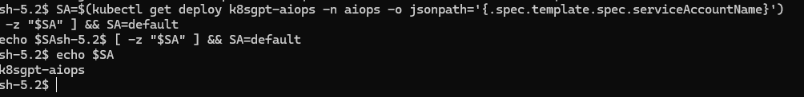

### Stack 08：AIOps Stack

範本檔案：`CloudFormation/nkc201-17-08-aiops-stack.yaml`

主要建立 API Gateway、Lambda、DynamoDB、SNS、CodeBuild、Bedrock 相關權限與 VPC Endpoints。此 Stack 需要 Stack 01 的 `VpcId`、Private App Subnets，以及工程師 Email 作為 SNS 收件人。

部署完成後，要到信箱點選 SNS 的 `Confirm subscription`，否則告警信不會送達。Stack 08 Outputs 的 `ApiEndpoint` 是後續 K8sGPT webhook、Approve 與 Reject 連結的基礎網址。

驗收方式：SNS 訂閱完成、API Gateway endpoint 存在、Lambda 與 DynamoDB 建立成功。若遇到 `ReservedConcurrentExecutions ... below its minimum value of [10]`，代表帳號 Lambda 保留併發額度不足，最新版 Stack 08 已移除該設定。

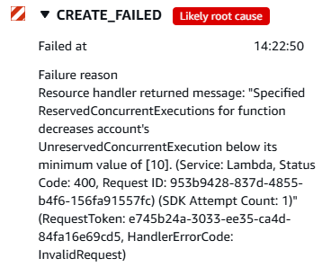

# 6. Kubernetes 與 AIOps 工作流

<figure>
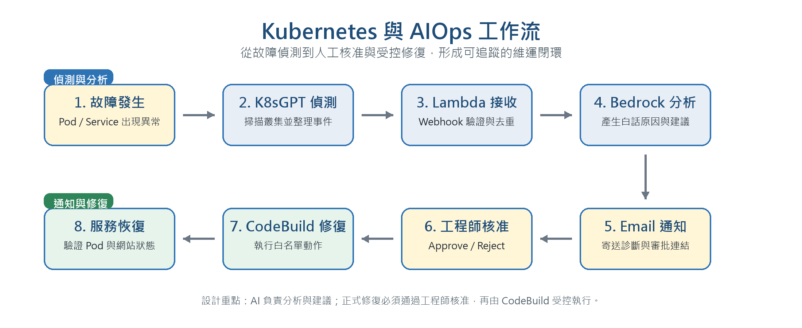
<figcaption><p><em>圖 3：Kubernetes 與 AIOps 簡化工作流圖</em></p></figcaption>
</figure>

## 6.1 Kubernetes 內部資源

| **資源** | **命名空間** | **用途** |
|----|----|----|
| Namespace | web-prod | 承載專題展示用電商 Web App。 |
| ServiceAccount | web-prod | 搭配 Pod Identity 讓應用程式取得受控 AWS 權限。 |
| Deployment | web-prod | 部署 web-demo 容器，作為故障注入與服務展示目標。 |
| Service | web-prod | 將 Pod 暴露為 ClusterIP 服務，供 Ingress 導流。 |
| Ingress | web-prod | 透過 AWS Load Balancer Controller 建立 ALB 對外入口。 |
| K8sGPT | aiops | 監控叢集異常並透過 webhook 對接 AIOps 後端。 |

## 6.2 連線 Bastion 並配對 EKS kubeconfig

Kubernetes 指令集中在 Bastion 內執行，避免本機 kubeconfig 與私有 EKS API 無法連線。先從本機 PowerShell 透過 SSM 進入 Bastion：

```powershell
aws ssm start-session `
  --target <BastionInstanceId> `
  --region ap-south-1 `
  --profile nkc201-17-sso
```

成功後會進入 `sh-5.2$` 的 shell。

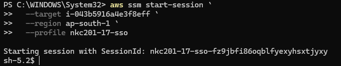

在 Bastion 內組出 Engineer Role ARN，並更新 kubeconfig：

```bash
ACCOUNT_ID=$(aws sts get-caller-identity --query Account --output text)
ENGINEER_ROLE_ARN="arn:aws:iam::${ACCOUNT_ID}:role/eks-aiops-demo-engineer-role"

aws eks update-kubeconfig \
  --region ap-south-1 \
  --name eks-aiops-mumbai \
  --assume-role-arn "$ENGINEER_ROLE_ARN" \
  --role-arn "$ENGINEER_ROLE_ARN"
```

`ACCOUNT_ID` 是目前 AWS 帳號 ID，不是另外手動設定的專題參數。`ENGINEER_ROLE_ARN` 則是用帳號 ID 組出 Stack 03 建立的工程師角色 ARN。

## 6.3 確認 kubectl 與 Helm

最新版 Stack 05 會在 Bastion UserData 預先安裝 `kubectl v1.34.0` 與 Helm。進入 Bastion 後先確認工具是否存在：

```bash
export PATH=/usr/local/bin:/usr/bin:$HOME/bin:$PATH
kubectl version --client
helm version
cat /opt/eks-aiops-bootstrap.log
```

若 `kubectl: command not found`，先檢查是 PATH 問題還是 UserData 下載失敗：

```bash
echo "$PATH"
command -v kubectl || true
ls -l /usr/local/bin/kubectl /usr/bin/kubectl /usr/local/bin/helm /usr/bin/helm 2>/dev/null || true
sudo tail -n 120 /var/log/eks-aiops-bastion-bootstrap.log
sudo tail -n 120 /var/log/cloud-init-output.log
```

本次實作曾遇到 Amazon Linux 2023 的 `curl-minimal` 與 `curl` 套件衝突，導致 UserData 中斷。修正版 Stack 05 已改為只安裝 `tar/gzip`，沿用系統內建 `curl-minimal`，並建立 `/usr/bin/kubectl`、`/usr/bin/helm` 符號連結，降低 SSM shell 找不到工具的機率。

## 6.4 安裝 AWS Load Balancer Controller 與建立 IngressClass

web-demo 的 Ingress 需要 AWS Load Balancer Controller 才能建立 ALB。先新增 Helm repo：

```bash
helm repo add eks https://aws.github.io/eks-charts
helm repo update
```

從 Stack 01 Outputs 複製 `VpcId` 後安裝 controller：

```bash
VPC_ID=<Stack01VpcId>

helm install aws-load-balancer-controller eks/aws-load-balancer-controller \
  -n kube-system \
  --set clusterName=eks-aiops-mumbai \
  --set region=ap-south-1 \
  --set vpcId=$VPC_ID \
  --set serviceAccount.create=true \
  --set serviceAccount.name=aws-load-balancer-controller
```

建立 `IngressClass`，讓 `ingressClassName: alb` 有對應的 Kubernetes 物件：

```bash
kubectl apply -f - <<'EOF'
apiVersion: networking.k8s.io/v1
kind: IngressClass
metadata:
  name: alb
spec:
  controller: ingress.k8s.aws/alb
EOF
```

驗證：

```bash
kubectl get deployment -n kube-system aws-load-balancer-controller
kubectl get pods -n kube-system | grep load-balancer
kubectl get ingressclass alb
```

安裝成功後，Ingress 會取得 ALB DNS。

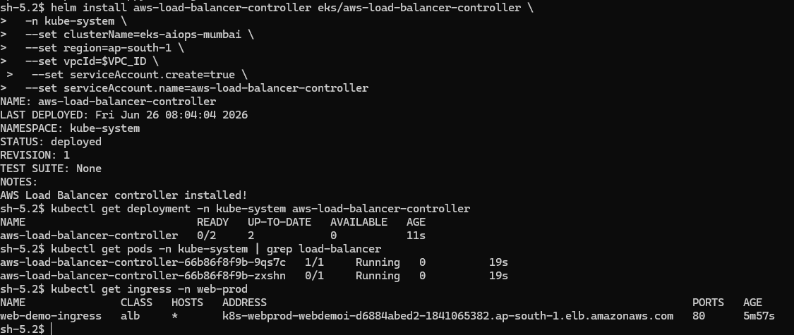

## 6.5 部署 web-demo 測試網站

在 Bastion 建立工作目錄，將 `Kubernetes/web-prod-app.yaml` 與 `Kubernetes/deploy-web-prod.sh` 放在同一目錄。從 Stack 02 Outputs 取得 `AlbSecurityGroupId` 後部署：

```bash
cd /home/ssm-user/k8s-aiops
chmod +x deploy-web-prod.sh
./deploy-web-prod.sh <AlbSecurityGroupId> apply
```

驗證：

```bash
kubectl get pods -n web-prod
kubectl get svc -n web-prod
kubectl get ingress -n web-prod
```

取得 `ADDRESS` 後，用瀏覽器開啟 `http://<ALB-DNS>`。看到 nginx 首頁代表 ALB、Ingress、Service、Pod 連線成功，這張圖是本專題最重要的部署完成證據之一。

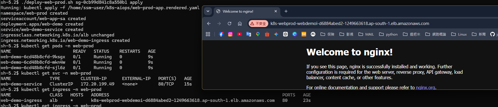

## 6.6 安裝 K8sGPT Operator

```bash
helm repo add k8sgpt https://charts.k8sgpt.ai/
helm repo update

helm install k8sgpt-operator k8sgpt/k8sgpt-operator \
  --namespace aiops \
  --create-namespace
```

驗證 operator：

```bash
kubectl get pods -n aiops
```

應看到 `k8sgpt-operator-controller-manager` 為 `2/2 Running`。

## 6.7 套用 K8sGPT 設定與 Webhook Sink

先到 Stack 08 Outputs 複製 `ApiEndpoint`，再修改 `Kubernetes/k8sgpt-operator-config.yaml` 中的 `sink.webhook` URL。設定重點如下：

- backend 使用 `amazonbedrock`
- model 使用 `anthropic.claude-3-haiku-20240307-v1:0`
- region 使用 `ap-south-1`
- filters 包含 `Pod`、`Deployment`、`Service`、`Ingress`、`ReplicaSet`
- repository 固定為 `ghcr.io/k8sgpt-ai/k8sgpt`
- version 固定為 `v0.4.32`
- sink 使用 `cloudevents` 並指向 API Gateway webhook

```bash
kubectl apply -f k8sgpt-operator-config.yaml
kubectl get k8sgpt -n aiops
kubectl describe k8sgpt -n aiops k8sgpt-aiops
```

確認 K8sGPT image 與 log：

```bash
kubectl get deploy k8sgpt-aiops -n aiops \
  -o jsonpath='{range .spec.template.spec.containers[*]}{.name}{" => "}{.image}{"\n"}{end}'

kubectl rollout restart deployment/k8sgpt-aiops -n aiops
kubectl rollout status deployment/k8sgpt-aiops -n aiops
kubectl logs -n aiops deploy/k8sgpt-aiops --since=3m
```

## 6.8 Email 通知、去重與自動修復審批

K8sGPT 偵測到異常後，會透過 webhook 打到 API Gateway。Lambda 會驗證 token、解析 CloudEvents、呼叫 Bedrock 產生診斷摘要，再透過 SNS 寄出 Email。

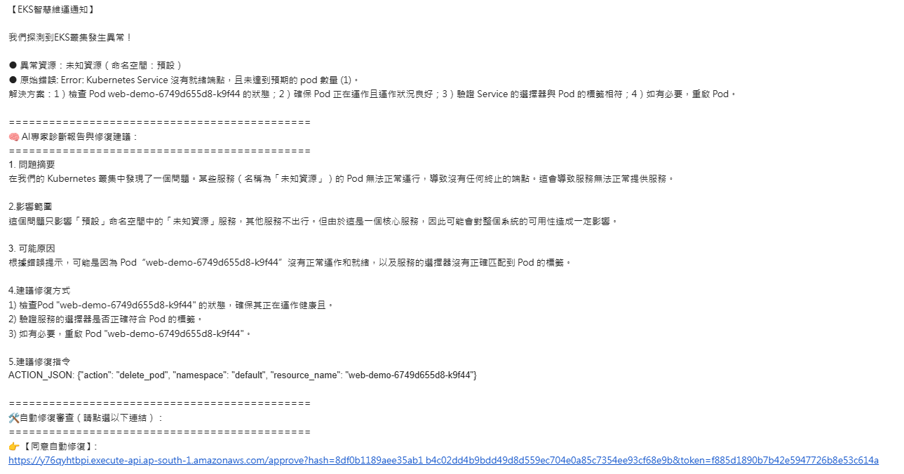

本次測試曾發現同一個故障會被 K8sGPT 拆成多個 Result，例如 Pod 映像拉取失敗、Service 沒有 endpoints、IngressClass 不存在。修正版 Lambda 已改為事故級去重：使用 `namespace + workload_key` 作為主要去重鍵，同一工作負載在 10 分鐘 TTL 內只寄第一封，其餘事件會在 Lambda log 顯示 `Alert ... throttled`。

自動修復採 Human-in-the-loop：信件會附上 Approve / Reject 連結，但工程師按下 Approve 前，必須先確認 `ACTION_JSON` 的 namespace、資源名稱與 action 是否合理。系統允許的修復動作限定在白名單，例如 `restart_deployment`、`scale_deployment`、`delete_pod`，避免 AI 建議直接變成任意 shell 指令。

## 6.9 端到端 AIOps 流程

1.  K8sGPT 掃描 Kubernetes 叢集，偵測 Pod、Service、Deployment 或資源狀態異常。

2.  異常事件透過 webhook 送至 API Gateway，再由 Lambda 驗證 token 與事件格式。

3.  Lambda 寫入 DynamoDB 快取與狀態資料，避免同一事件重複觸發告警。

4.  事件內容交由 Amazon Bedrock 分析，產生白話原因、影響範圍與受控 Action JSON。

5.  SNS Email 通知工程師，信件中附上摘要、建議與 Approve / Reject 連結。

6.  工程師核准後，Lambda 觸發 CodeBuild 在 VPC 內執行修復命令。

7.  修復後再以 kubectl、K8sGPT 與 ALB 服務狀態驗證故障是否解除。

# 7. DevSecOps 與安全設計

AIOps 的難點不只在於讓 AI 看懂錯誤，更在於避免 AI 或自動化流程誤改正式環境。因此本專題的安全設計重點是：網路私有化、身份最小權限、審批狀態可追蹤、修復動作白名單化。

| **安全機制** | **設計內容** | **降低的風險** |
|----|----|----|
| 私有 EKS API | EKS API Server 關閉公網存取，由 SSM 跳板機進行維運。 | 降低控制面暴露面。 |
| SSM Session Manager | 不開 SSH Port 22，不使用 Key Pair 進入 Bastion。 | 減少金鑰外洩與掃描攻擊。 |
| EKS Pod Identity | Pod 以受控身份存取 AWS，不在程式碼內放 Access Key。 | 降低長期憑證外洩風險。 |
| 一次性 Token | Approve / Reject 連結具隨機 token，並在狀態變更後失效。 | 避免重複點擊或未授權觸發。 |
| DynamoDB 原子鎖 | 使用條件寫入與 TTL 管理事件狀態與冷卻時間。 | 降低告警風暴與 race condition。 |
| Action JSON 白名單 | Bedrock 只能輸出結構化修復動作，Lambda 驗證 namespace 與命令類型。 | 防止命令注入與任意 shell 執行。 |
| CodeBuild 版本鎖定 | kubectl 版本鎖定並做 SHA256 驗證後才執行。 | 降低供應鏈污染風險。 |
| PrivateLink | Lambda 與 Bedrock、STS、Logs 等服務透過 VPC Endpoint 通訊。 | 降低敏感流量經公網傳輸的風險。 |

## 7.1 為什麼修復放在 CodeBuild，而不是 Lambda 直接執行

Lambda 適合處理短時間事件、驗證、狀態轉換與通知，但不適合承載較長、需要安裝 kubectl 或進行叢集操作的修復流程。CodeBuild 則可以在 VPC 內執行具版本鎖定的工具鏈，並保留完整執行紀錄。這樣設計能把 AI 分析、人工審批、受控修復三個責任分開。

# 8. Live Demo 與驗收設計

Demo 不建議從 AWS 資源建立開始講到結束，而應聚焦在一條清楚故事線：正常服務 -> 注入故障 -> AI 診斷 -> Email 通知 -> 工程師審核 -> 修復 -> 驗證恢復。

<figure>
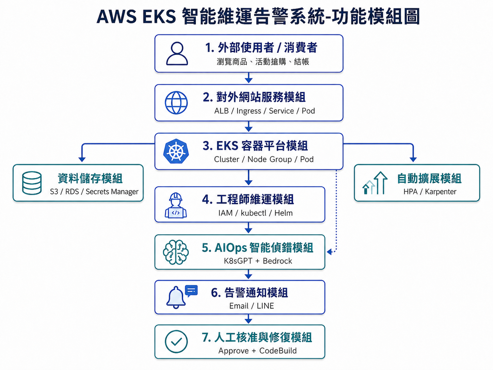
<figcaption><p><em>圖 5：系統功能模組圖</em></p></figcaption>
</figure>

## 8.1 Demo 主流程

| **步驟** | **展示內容** | **評審應看到的證據** |
|----|----|----|
| 1 | 展示 Web App 正常狀態與 ALB 可連線。 | 瀏覽器可開啟 nginx 成功頁，kubectl pods 狀態正常。 |
| 2 | 注入 Kubernetes 故障，例如錯誤 image tag 或錯誤 Service selector。 | Pod 出現 ImagePullBackOff，或 Service endpoints 清空。 |
| 3 | K8sGPT 偵測並觸發 webhook。 | K8sGPT Result、Lambda / API Gateway / CloudWatch Logs 可看到事件。 |
| 4 | Bedrock 產生白話診斷與修復建議。 | Email 內容包含根因、影響範圍、修復建議與 ACTION_JSON。 |
| 5 | 工程師審核是否執行自動修復。 | Email 內有 Approve 連結，但需判斷 AI 建議是否適合。 |
| 6 | 修復並驗證。 | Pod 回到 Running、Service endpoints 回復，網站重新可用。 |

## 8.2 正常服務驗收

部署 web-demo 後，先以 `kubectl get pods -n web-prod`、`kubectl get svc -n web-prod`、`kubectl get ingress -n web-prod` 確認 Kubernetes 資源正常，再用瀏覽器開啟 `http://<ALB-DNS>`。看到 nginx 成功頁代表 ALB、Ingress、Service 與 Pod 已完成串接。


## 8.3 成果展示案例一：錯誤映像版本造成 ImagePullBackOff

故障注入方式：

```bash
kubectl set image deployment/web-demo web-demo=nginx:1.999 -n web-prod
kubectl get pods -n web-prod -w
```

`nginx:1.999` 並不存在，因此新的 Pod 會進入 `ErrImagePull` 或 `ImagePullBackOff`。此時舊 Pod 可能暫時仍在 Running，但 Deployment 的新 ReplicaSet 無法成功拉取映像。

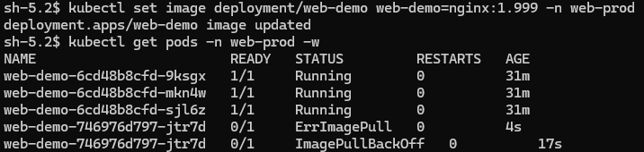

K8sGPT 成功辨識 Pod 映像拉取失敗，SNS Email 指出 `docker.io/library/nginx:1.999` 或 `nginx:1.999` 找不到，影響範圍為 `web-prod` 命名空間中的 `web-demo` 工作負載。

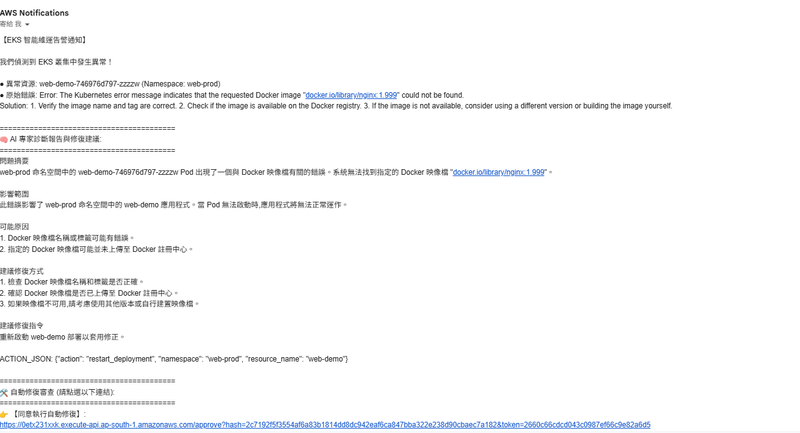

此案例可用來說明 AI 建議仍需人工判斷：若建議只是刪除 Pod 或重啟 Deployment，可能無法根治問題；真正原因是 image tag 錯誤，因此應改回有效版本。

```bash
kubectl set image deployment/web-demo web-demo=nginx:latest -n web-prod
kubectl rollout status deployment/web-demo -n web-prod
kubectl get pods -n web-prod
```

修復後 `web-demo` Pod 回到 `1/1 Running`。

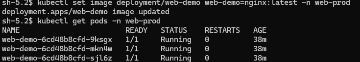

## 8.4 成果展示案例二：Service selector 錯誤造成 endpoints 清空

故障注入前，`web-demo-service` selector 為 `app=web-prod`，endpoints 會正確指向三個後端 Pod。

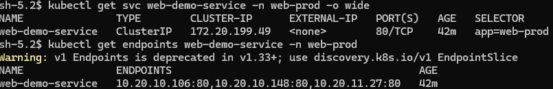

故障注入方式：

```bash
kubectl patch svc web-demo-service -n web-prod -p '{"spec":{"selector":{"app":"web-wrong"}}}'
kubectl get svc web-demo-service -n web-prod -o wide
kubectl get endpoints web-demo-service -n web-prod
kubectl get pods -n web-prod --show-labels
```

Service selector 被改成 `app=web-wrong` 後，Pod 仍然是 `1/1 Running`，但實際 Pod label 是 `app=web-prod`，因此 Service 找不到任何 endpoints。

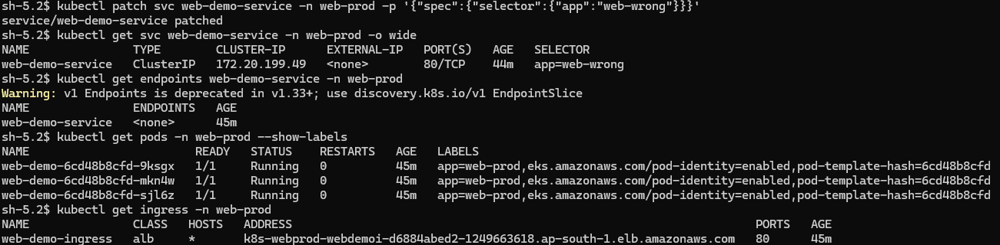

當 Service 沒有後端 endpoints 時，ALB 無法把流量導向 Pod，瀏覽器會看到 `503 Service Temporarily Unavailable`。同時 K8sGPT 產生 `Service` 類型的 Result。

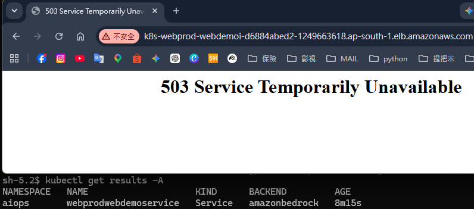

SNS 告警指出 `web-demo-service has no endpoints`，並列出預期 selector `app=web-wrong`。這代表系統成功定位到 Service 與 Pod label 不匹配，而不是容器本身異常。

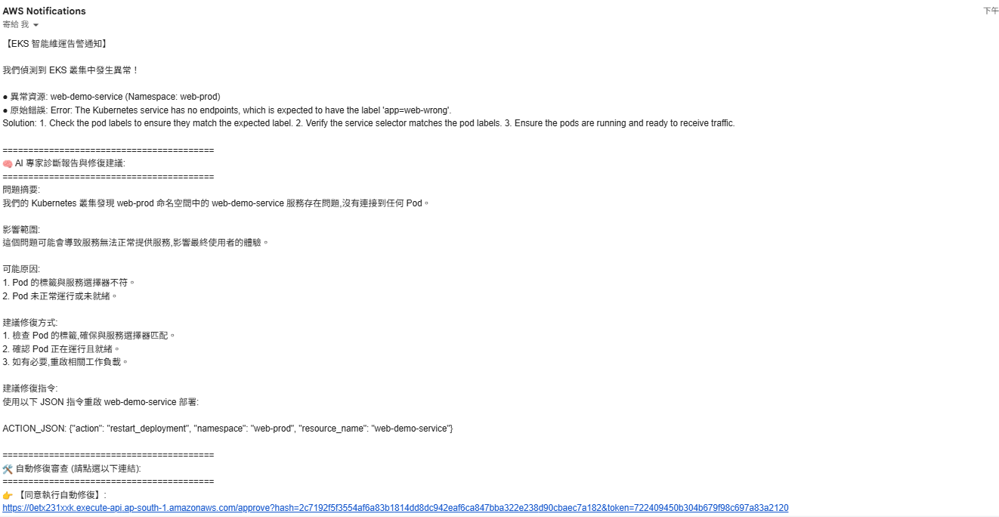

此案例再次說明 AI 診斷與自動修復需要分層治理：AI 能指出 Service selector 問題，但若 ACTION_JSON 只建議重啟 Deployment，仍無法修復 selector 設定。正確修復是把 Service selector 改回 `app=web-prod`。

```bash
kubectl patch svc web-demo-service -n web-prod -p '{"spec":{"selector":{"app":"web-prod"}}}'
kubectl get endpoints web-demo-service -n web-prod
kubectl get svc web-demo-service -n web-prod -o wide
```

修復後 endpoints 回復，ALB 網頁重新顯示 nginx 成功頁。

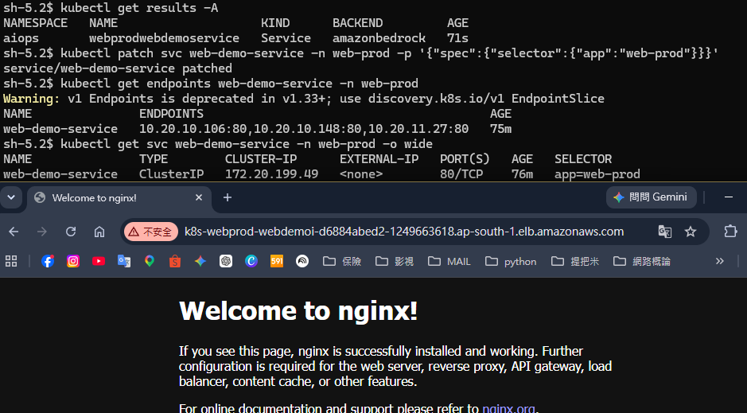

## 8.5 展示結論

兩個案例共同驗證：本系統能從 Kubernetes 異常事件中整理出可讀的告警內容，並將根因、影響範圍與修復方向寄給工程師。不過 AI 的修復建議不等於可以無條件自動執行，正式環境仍需要白名單、審批與可追蹤執行紀錄，這也是本專題把自動修復放在 CodeBuild 並加入 Approve / Reject 的原因。

# 9. 故障排除紀錄與設計反思

專題過程中已整理多個建置故障與安全修正點。這些紀錄不應只放在補充文件，而應在答辯時轉化成「我知道為什麼這樣設計」的證據。

| **問題** | **原因** | **修正與學習** |
|----|----|----|
| Lambda AccessDenied | AIOps Stack 權限未完整覆蓋 SNS、DynamoDB 或 Bedrock 呼叫。 | 回到 IAM 最小權限模型，逐一補上必要 action。 |
| CodeBuild VPC 啟動失敗 | 私有網路內缺少必要路由、Endpoint 或 Security Group 規則。 | 確認 CodeBuild 在 VPC 中仍可取得 STS、Logs 與 EKS 所需路徑。 |
| Ingress ALB 未建立 | Subnet tag 或 ALB Controller 權限/版本不一致。 | 補齊 EKS/ELB subnet tag，並鎖定 ALB Controller policy 與 chart 版本。 |
| Node Group 未掛上自訂 SG | Launch Template 與 Node SG 對接不完整。 | 將 Node 安全群組納入節點啟動流程，確保叢集通訊正常。 |
| Webhook 未授權風險 | 公開 webhook 若無 token，可能被濫用觸發 AI 成本。 | 加入 webhook token 驗證、狀態機與冷卻機制。 |

<table>
<colgroup>
<col style="width: 100%" />
</colgroup>
<thead>
<tr>
<th><p><strong>答辯可強調的反思</strong></p>
<p>本專題不是只把服務部署上雲，而是把可靠度、資安、維運流程、成本與展示驗證一起考慮，這正是雲端工程專題最有價值的地方。</p></th>
</tr>
</thead>
<tbody>
</tbody>
</table>

# 10. 結論與未來擴充

本專題完成一套以 AWS EKS 為核心的智能維運告警架構，能在 Kubernetes 服務異常時提供偵測、分析、通知、人工審批與受控修復流程。相較於傳統由工程師手動查 log、搜尋錯誤、猜測修復命令的方式，本系統將故障處理流程標準化，也讓新手工程師能更快理解問題。

## 10.1 未來擴充方向

- 整合 HPA、Cluster Autoscaler 或 Karpenter，讓促銷尖峰流量能自動擴充 Pod 與節點。

- 加入 LINE Notify 或 Slack 通知，提升即時性與團隊協作。

- 補上 CloudWatch Dashboard、Prometheus / Grafana 或 Container Insights，讓觀測資料更完整。

- 擴充更多 Kubernetes 故障類型，例如 OOMKilled、NodePressure、PVC 掛載失敗與 DNS 解析異常。

- 將修復動作分級：低風險自動修復，中高風險維持人工核准。

# 附錄 A. 檔案與成果清單

| **類型** | **檔案** | **用途** |
|----|----|----|
| 原始總文件 | 專題總文件.docx | 原始故事背景、痛點解法與圖像素材來源；本次未修改。 |
| 整合報告 | 專題總文件_整合版.md | 本次整合後的正式專題總文件，可由 Markdown 匯出 PDF。 |
| 規格書 | aws_eks_aiops_project_spec.md | 完整設計規格、MVP、擴充項目與面試摘要。 |
| 部署手冊 | AWS主控台部署指南.md | AWS Console 章節式建置、驗證、故障排除與刪除流程。 |
| Demo 指南 | 展示流程.md | Live Demo 故事線、故障注入場景與技術亮點。 |
| 安全指南 | 專題核心設計與安全架構指南.md | DevSecOps、安全設計與口試 FAQ。 |
| 故障排除 | 故障排除與安全更新指南.md | 建置故障紀錄、安全漏洞修正與架構權衡。 |
| CloudFormation | CloudFormation/\*.yaml | 8 個 AWS 基礎設施 Stack。 |
| Kubernetes | Kubernetes/\*.yaml, deploy-web-prod.sh | Web App、K8sGPT 設定與部署腳本。 |
| 成果截圖 | manual-assets/screenshots/\*.png | web-demo 成功畫面、AIOps 告警、故障展示與修復結果。 |

# 附錄 B. 建置與刪除索引

完整建置與刪除步驟以 `AWS主控台部署指南.md` 為準。報告正文保留設計脈絡、重點指令與成果截圖，方便輸出成正式 PDF。

| **流程** | **參考位置** | **說明** |
|----|----|----|
| 建置前準備 | AWS主控台部署指南.md 部署前準備工作 | Region、SSO profile、Bedrock 模型申請與 CloudFormation 範本確認。 |
| Stack 01-08 | AWS主控台部署指南.md「8 大 Stacks 順序部署指引」 | 依序建立網路、安全、IAM、EKS、節點、資料、存取與 AIOps。 |
| EKS 內部部署 | AWS主控台部署指南.md「EKS 內部資源與 K8sGPT 監控對接」 | 透過 SSM 部署 ALB Controller、web-prod 與 K8sGPT。 |
| 端到端測試 | 本文件第 8 章、展示流程.md | Webhook、Email、Approve / Reject、故障注入與恢復驗收。 |
| 故障排除 | AWS主控台部署指南.md 後段與故障排除指南 | 常見錯誤、權限與網路問題定位。 |
| 完整刪除 | 本文件附錄 C | 先清 Kubernetes 外部資源，再反向刪除 CloudFormation Stacks。 |

# 附錄 C. 部署前清理與完整刪除指令

若要刪除整套系統，建議先清理 Kubernetes 中會建立外部 AWS 資源的物件，再刪 CloudFormation。這樣可以降低 ALB、Target Group、Endpoint 或 Controller 殘留的機率。

## C.1 刪除 CloudFormation 前先清理 Kubernetes 資源

在 Bastion 內執行：

```bash
kubectl delete namespace web-prod --ignore-not-found
kubectl delete k8sgpt k8sgpt-aiops -n aiops --ignore-not-found
helm uninstall k8sgpt-operator -n aiops
helm uninstall aws-load-balancer-controller -n kube-system
```

本次清理成功畫面如下：

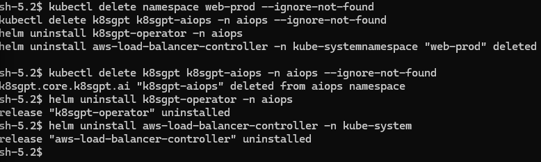

## C.2 反向刪除 CloudFormation Stacks

Kubernetes 內部資源清掉後，再回到 AWS CloudFormation 主控台，依相依性由後往前刪除：

```text
08 AIOps Stack
07 Access Stack
06 Data Stack
05 Node Group Stack
04 EKS Cluster Stack
03 IAM Stack
02 Security Stack
01 Network Stack
```

刪除順序可以簡寫為：

```text
08 → 07 → 06 → 05 → 04 → 03 → 02 → 01
```

若 Stack 08 刪除時 Lambda 或 VPC ENI 相關資源停在 `DELETE_IN_PROGRESS`，通常是 AWS 釋放網路介面或相依資源需要時間，先等待 CloudFormation 完成。若超過合理時間仍失敗，再檢查 Lambda、CodeBuild、VPC Endpoint、Security Group 與 ENI 是否仍有殘留相依。

# 附錄 D. 資料來源網址

| **主題** | **來源** | **專題引用重點** |
|----|----|----|
| VPC 設計 | [Amazon VPC User Guide](https://docs.aws.amazon.com/vpc/latest/userguide/what-is-amazon-vpc.html) | 3-Tier 子網路隔離設計。 |
| NAT Gateway 成本 | [AWS NAT Gateway Pricing & Cost Optimization](https://aws.amazon.com/blogs/aws-cost-management/demystifying-data-transfer-costs-for-nat-gateway-and-firewalls/) | 專題測試採 Single NAT Gateway 降低成本。 |
| CloudFormation | [AWS CloudFormation User Guide](https://docs.aws.amazon.com/AWSCloudFormation/latest/UserGuide/Welcome.html) | 8 大 Stacks 與動態參數管理。 |
| EKS 安全 | [AWS EKS Best Practices Guide for Security](https://aws.github.io/aws-eks-best-practices/security/docs/) | 私有 EKS API 與容器安全設計。 |
| EKS Access Entry | [EKS Access Entries Developer Guide](https://docs.aws.amazon.com/eks/latest/userguide/access-entries.html) | 使用 Access Entry 取代傳統 aws-auth 管理方式。 |
| EKS Pod Identity | [Amazon EKS Pod Identity User Guide](https://docs.aws.amazon.com/eks/latest/userguide/pod-identities.html) | K8sGPT 與 web app 以 ServiceAccount 取得 AWS 臨時權限。 |
| SSM Session Manager | [AWS Systems Manager Session Manager](https://docs.aws.amazon.com/systems-manager/latest/userguide/session-manager.html) | Bastion 不開 SSH Port 22，改用 SSM 進入私有環境。 |
| Secrets Manager 動態參照 | [AWS CloudFormation Dynamic References](https://docs.aws.amazon.com/AWSCloudFormation/latest/UserGuide/dynamic-references.html) | RDS 密碼不落地。 |
| RDS 加密 | [Encrypting Amazon RDS Resources](https://docs.aws.amazon.com/AmazonRDS/latest/UserGuide/Overview.Encryption.html) | RDS 儲存加密與資料保護。 |
| K8sGPT | [K8sGPT Official Docs](https://k8sgpt.ai/) | Kubernetes 異常診斷。 |
| K8sGPT Operator | [K8sGPT Operator GitHub Repository](https://github.com/k8sgpt-ai/k8sgpt-operator) | 以 Operator 部署 K8sGPT 並使用 webhook sink。 |
| Amazon Bedrock | [Amazon Bedrock User Guide](https://docs.aws.amazon.com/bedrock/latest/userguide/what-is-bedrock.html) | 使用 Claude 3 Haiku 產生診斷摘要與修復建議。 |
| Lambda VPC | [Configuring a Lambda function to access resources in a VPC](https://docs.aws.amazon.com/lambda/latest/dg/configuration-vpc.html) | Lambda 私有網路與 VPC Endpoint 設計。 |
| CodeBuild VPC | [Use CodeBuild with Amazon Virtual Private Cloud](https://docs.aws.amazon.com/codebuild/latest/userguide/vpc-support.html) | CodeBuild 在 VPC 內執行 kubectl 修復流程。 |
| 命令注入防護 | [OWASP OS Command Injection Defense](https://cheatsheetseries.owasp.org/cheatsheets/OS_Command_Injection_Defense_Cheat_Sheet.html) | Action JSON 白名單與避免任意命令執行。 |
| kubectl 安裝 | [Kubernetes kubectl Installation Official Guide](https://kubernetes.io/docs/tasks/tools/install-kubectl-linux/) | kubectl 版本鎖定與 SHA256 驗證。 |
| ALB Controller | [AWS Load Balancer Controller User Guide](https://kubernetes-sigs.github.io/aws-load-balancer-controller/) | EKS Ingress 對接 ALB。 |
| Metrics Server | [Kubernetes Metrics Server GitHub](https://github.com/kubernetes-sigs/metrics-server) | HPA 指標來源。 |
| HPA | [Kubernetes HPA Documentation](https://kubernetes.io/docs/tasks/run-application/horizontal-pod-autoscale/) | 壓測時觀察 Pod 自動擴展。 |
